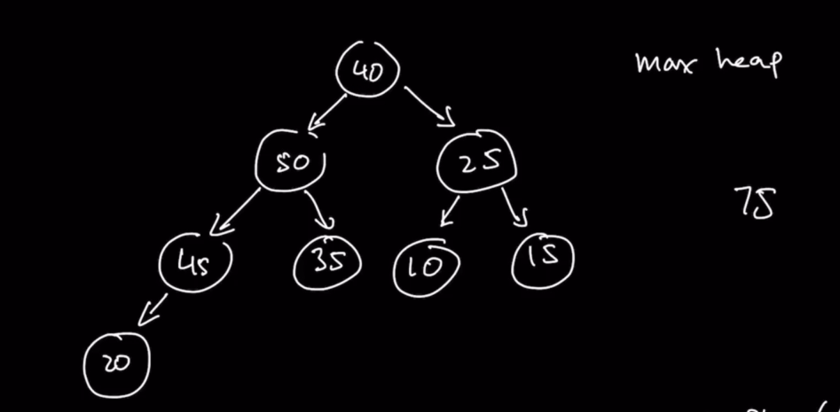

# Section 10 - Heaps and Priority Queues

## Introducing Heaps

**Heaps** is a data structure that resembles a **complete binary tree**, where every level is full, except for the last level, which can be full or not. However, if there are nodes in the last level, they must be pushed as much as possible to the left.


There are two variations of **heaps**:

### Max Heaps


A **max heap** has values in it in such way that, at every single node, all of the children of that node have a value smaller than it. As such, the **root** is always the node with **the greatest value**.

Notice that this doesn't guarantee that, for example, the second and third nodes will be the second and third greatest values:


In the example above, we have a node with value of `35` under the node with `40`, while the third node has value `25`, which is less.

### Min Heaps

**Min heaps** are nodes with exactly the reverse rule as **max heaps**: at every single node, all of its children have a value **greater than it**. Therefore, the **root** is always the node with **the minimum value** in the heap.

Now we need to understand how we can add values to our heaps. Let's start with a **max heap** as an example:


First of all, **how do we represent a heap inside of code?**

Up to now, we have been using a tree structure using `node` objects that nestedly point to each other.

For **heaps** we will represent its data using **arrays**, combined with a **BSF approach**:


```py
[50, 40, 25, 20, 35, 10, 15]
```

One **important different** between this array-type of representation of a heap, and the tree with nodes representation that we've seen before is that for array **we need to figure out mathematical formulas tht help to bind the relationship between nodes that we had with our node objects before**.

Before, we could access a node's children directly with their pointers to `left` and `right`, but that doesn't exist with arrays.

So what we want to do now is to think of these relationships relative to the indeces of the elements in our array:

```py
  parent of a node =      floor((index - 1) / 2)
  left child of a node =  index * 2 + 1 
  right child of a node =  index * 2 + 2 
```

Let's look at a couple of examples:

```py
[50, 40, 25, 20, 35, 10, 15]
  0   1   2   3   4   5   6
```

If we want to get the parent node of the node with value `10`:
```
  index of node with value 10 = 5
  parent index = floor((index - 1) / 2 ) = floor((5 - 1) / 2) = floor(2) = 2
  array[2] = 25
```

If we want to get the left child of the node with value `40`:
```
  index of node with value 40 = 1
  left child index = index * 2 + 1 = 1 * 2 + 1 = 3
  array[3] = 20
```

If we want to get the right child of the node with value `25`:
```
  index of node with value 25 = 2
  right child index = index * 2 + 2 = 2 * 2 + 2 = 6
  array[6] = 15
```

## Insertion in Heaps - Understanding Sift Up

Let's learn **how to insert values in a max heap.**

### Conceptual version as a complete binary tree

If we want to insert the value `45` into the heap, what should happen?


Since a **heap** behaves like a **complete binary tree**, we can only insert it at the last available spot following a **BSF** approach:


But once we have inserted our `45` we take a look at the **heap** and ask ourselves: is it still a valid **max heap**?

And in this case, it's not because `45` should be in a higher level.

So the first step is taking `45` and comparing it to its parent. If `45` is greater than the value of its parent (in this case `20`), then **we swap the values** in the nodes:


Once again, we need to compare this node against its parent. So we ask: if `45` greater than `40` (the value of it parent)?

Since it is, we swap their values:


And then we compare again: is the value in our node greater than its parent (in this case, the value in the `root` node)?

No it isn't. So in this case we don't switch the value of the nodes:


And now `45` is in the correct place in the **max heap**:


### Version as an array

The first step to add a new value into a **max heap** in its array representation is to **push it/append it** as the last place in the array:


```py
[50, 40, 25, 20, 35, 10, 15]
  0   1   2   3   4   5   6

[50, 40, 25, 20, 35, 10, 15, 45]
  0   1   2   3   4   5   6,  7
```

But now we need to keep comparing the node's value to the value of it parent to see if it should be switched up.

So first, we take `45` with its index of `7` and try to find its parent:

```py
 parent of index 7 = floor((7 - 1) / 2) = 3
```

Now we can compare the values:

```py
  array[node] >? array[parent] 
  array[7] >? array[3] ===> 45 >? 20  ===> True
```

Since the value at element 7 is greater than the value at element 3, we swap their values:

```py
[50, 40, 25, 45, 35, 10, 15, 20]
  0   1   2   3   4   5   6,  7
```

No we compare again, but now using the index `3`:

```py
  parent of index 3 = floor((3 - 1) / 2) = 1

  array[node] >? array[parent] 
  array[3] >? array[1] ===> 45 >? 40  ===> True
```

Since this condition is true again, we swap our values again:

```py
[50, 45, 25, 40, 35, 10, 15, 20]
  0   1   2   3   4   5   6,  7
```

And we do one more comparison, using index `1`:

```py
  parent of index 1 = floor((1 - 1) / 2) = 0

  array[node] >? array[parent] 
  array[1] >? array[0] ===> 45 >? 50  ===> False
```

And since the codition proves `False`, **we don't need to swap the values, and we stop comparing.**

## Difference in the algorithm between max heap and min heap

The algorithm for **inserting** new values in a **heaps** is exactly the same, except for one main difference.

On insertion, values are added on the last available place and then compared to their parents up the tree (or array). 

The difference is that, while in a **max heap** the values are switched if the inserted value is **greater than the value of its parent**, in a **min heap** the values are switched if the inserted values **is smaller than the value of its parent.**

## Deletion in Heaps - Understanding Sift Down

The reason why we implement a heap in the first place, particularly a max heap, is because we wanna say: "I'm gonna provide value to the max heap, and when I retrieve a value, it should be the greatest value previously provided to the heap". The same, but inverse, is also valid for min heaps.

So in a **max heap**, when we talk about removal or deletion, we are talking about retrieving (and deleting from the heap) **the greatest value in it**, which will be our **root value**.

Same for a **min heap**, when we talk about removal or deletion, we are talking about retrieving (and deleting from the heap) **the lowest value in it**, which will be our **root value**.

Let's see an example on how it's done:


If if want to retrieve the greatest value, at the **root**, with value `75`, I can easily retrieve it and return it.

But now we have to restructure our heap so that we can mantain the rules of a heap: that our value at the top is still the largest, that every node is greater than its children, and that the heap still has the shape of a complete binary try.

```py
[75, 50, 45, 25, 40, 35, 10, 15, 20]
  0   1   2   3   4   5   6   7   8
```

To do that, once `75` is retrieved, we take our last value (in the array representation) and use it to replace the value in the **root**:



From this moment we need to begin sifting the value down in order to keep with the max heap rules. So we check:

1. Of the children of the root, select the one of the two which has the greatest value. In our case, its the left child with value `50`.
2. Compare that value to our node's value. If our new node value is smaller than the value of the child, swap them.

3. Repeat the same process down the tree:

Switch `45` with `40`:


Finally, we compare `40` with `20` and see that our `40` is already in its right place, so the heap has been successfully reorganized.

## How to remove and retrieve values from a heap and reorganize the data structure


We start by retrieving and removing the `75` from position `0` in the array:


Next, we take the last value in the array and use it to replace the head of the array that we just removed:


Now we need to sift down the value that we just popped up the array "down the tree". So we use the same process: we find both of our root's children, take the largest of them, compare it with our new value and swap them if our new value is smaller than the biggest child.

```py
  left child of root = index * 2 + 1 = 0 + 1 = 1
  right child of root = index * 2 + 2 = 0 + 2 = 2

  maxChild = max(leftChild, rightChild) = max(array[1], array[2])
                                        = max(50, 25) = 50
```

So, is our `maxChild` greater than our new value in our root? `50` is greater than `40`, so we swap them in the array:


Now we continue with our steps:

```py
  left child of index 1 = index * 2 + 1 = 2 + 1 = 3
  right child of index 1 = index * 2 + 2 = 2 + 2 = 4

  maxChild = max(leftChild, rightChild) = max(array[3], array[4])
                                        = max(45, 35) = 45
```

Is our `maxChild` greater than our new value at index `1`? `45` is greater than `40`, so we swap them the values of index `1` and index `3`, where our `maxChild` is located:


And now we need to do the check one more time:

```py
  left child of index 3 = index * 2 + 1 = 6 + 1 = 7
  right child of index 3 = index * 2 + 2 = 6 + 2 = 8

  maxChild = max(leftChild, rightChild) = max(array[7], array[8])
                                        = max(20, None) = 20
```

We compare `20` to `40`. Since `40` is larger, we don't need to sift our value down and we end up with the following array:


```py
[50, 45, 25, 40, 35, 10, 15, 20]
  0   1   2   3   4   5   6   7 
```

In the case of **min heaps** there are two main differences for this whole process:

1. when choosing between the two children, to decide with which one of them to compare, the child to choose should be **the smallest of the two children**
2. when making the comparison between our actual value that is being sifted down and the minimum child, we should only switch them if the **new node's value is greater than our child's node value.**

### How does a priority queue relate to a heap?

A **priority queue** is a queue, with the difference that it always returns you the value with the greatest priority.

Imagine we insert into a priority queue four items, each with a priority number:


Our priority queue above should first return the item with prio `4`.

If we implement a **max heap** with the priority of the items as the value of our nodes, then we automatically have a prioirty queue.

## Time and Space Complexity

When both inserting and removing nodes, a maximum number of swaps is performed that is equal to the height of the tree. And as we know, the height of the tree is `log N`, so we can confidently say that the worst case time complexity is `O(log N)`.

