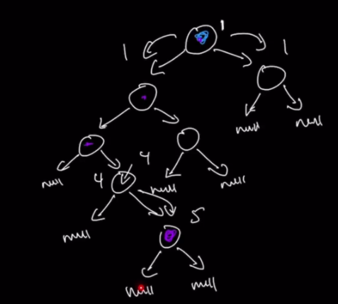
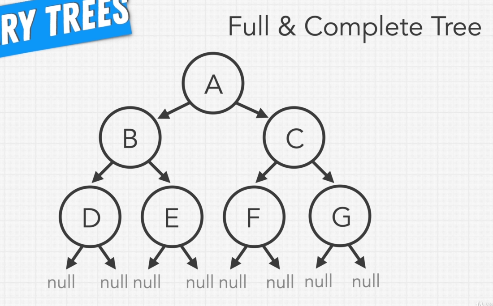
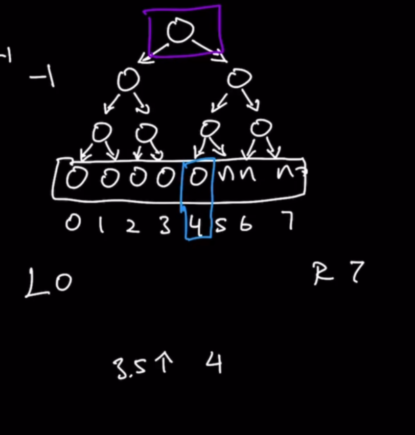
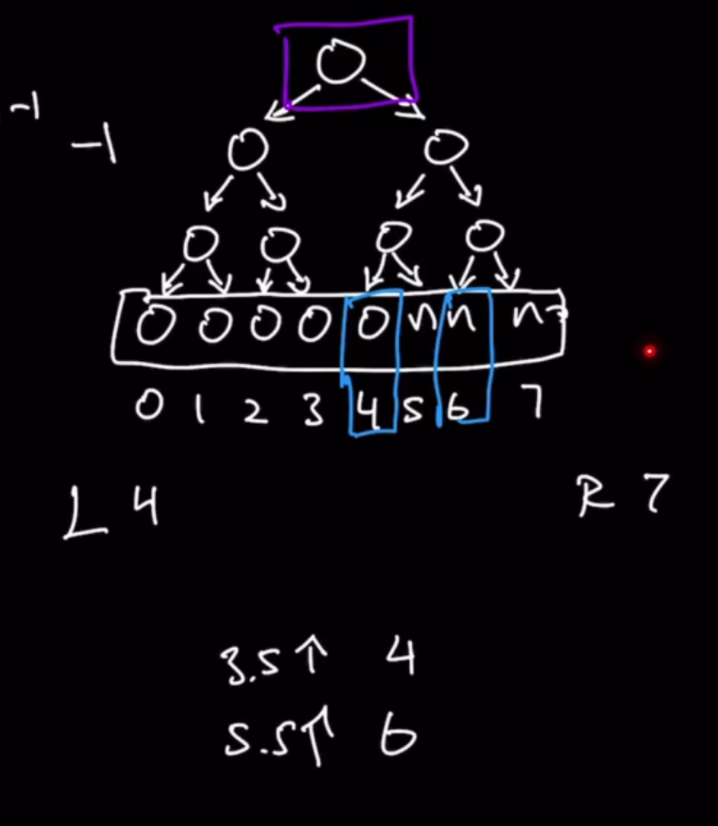
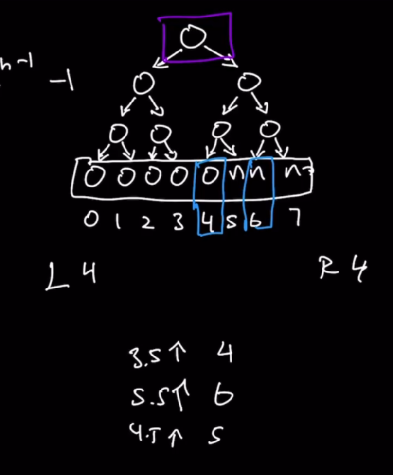

# Maximum Depth of Binary Tree (Easy)

Given a binary tree, find its maximum depth.

Maximum depth is the number of nodes along the longest path from the root node to the furthest leaf node.


## Step 1: Verify the Constraints

1. What do we return if the tree is empty?

Return 0

## Step 2: Write out some test cases


The above tree should return **5**


The above tree should return **0**


The above tree should return **1**

But, we should also consider a worst-case:

The above tree should return **5**, but this test case is important to make us realized that the time and space complexity of this solution will be **O(N)**. We'll take a look at why later.

## Learning the Process for Solving Binary Tree Problems

Let's take a look at the questions that one should ask when solving BT problems. Most BT questions have a lot overlap in the way you should approach them, so these questions are usually valid for a great majority of them.

1. **Should I traverse this tree?**

This question usually has a **YES** answer for most problems, but there are certain cases in which traversal is actually not needed.

In this specific problem, we DO need to traverse the tree, because we need to find the maximum depth of the tree and there's no other way to do that.

2. **How should I traverse this tree? (BFS or DFS)**

Knowing that I should traverse this tree, I can choose between BFS and DFS. Knowing that with BFS we attempt to find nodes that are closer rather than further to the root, and understanding that in this problem we need to find the node than is further away from the root, we can discard BFS as a technique and concentrate on DFS, which assumes the node that we are searching for is probably at the end of the path that it is searching.

It is still possible, in this exercise, that the node that we are looking for is found at the last path that DFS explores, but it is very likely that we will get one of this last nodes first thorught DFS rather than finding them through BFS.

Now that that we have chosen DFS, we should normally think about which Traversal Type to use (Preorder, Inorder, Post-order). However, since the traversal type relates to how we examine, store or use the values insides the nodes, and that in this case we don't care about the values of the nodes, we don't need to make a decision.

3. **Let's break down DFS**

DFS is recursive by nature. And when it comes to coming up with a recursive solution for a binary tree question, we want to think about the logical step you want to do in the recursion before writing code. It is easier to let the nature and anatomy of the recursion of the recursive function guide your logical solution, than trying to solve a logical solution without recursion. (Iterative solutions for BST questions are much more complicated. And recursive solutions are enough to pass.)

So: remember that a recursive function calls itself over and over until it hits a base case, which returns a value, and then, using all those accumulated values, comes up with a final answer.

The recursive call that we need for this DFS traversal **will always pass one of the current children** to itself, on the left or the right. So we know that the first argument that we are getting in the recursive function is a node.

The first node we are getting, in the first recursive call, will always be the root node (or null if there is no tree). The next one would be its left or right child.

Are there any additional arguments passed down to the recursive function? It is highly possible that there might be, so let's think about it taking a look at the pseudo code we have up to now:

```py
def recursive(node,   ):
  ...
```

What else is involved in a recursive call? We know we have **base cases**. It might be one or more, but its main goal is to say "i'm done calling the recursive function", I have an answer. This answer might not be the final or complete answer, but a part of an full and complete answer that you are working towards to.

```py
def recursive(node,   ):
  base case
```

The goal or answer in this case is to count the number of nodes that we have traversed, vertically. We are DF Searching, counting the nodes along the way, so we need to keep a **count** of the number of nodes that we've seen along the way. It will initially start at 0, but already in the first recursive call, corresponding to the root, it would need to step up to 1.

Now let's think about recursive calls. Since DFS involves passing down the current node's children to the recursive function, we know that we will pass either the left or the right nodes, (or both! we don't know yet) child, to the recursion:

```py
def recursive(node,   ):
  base case

  recursive(node.left)
  recursive(node.right)
```

To figure out whether we need to pass either the left, the right or both, let's think again: what's the goal that we want to achieve? We want to figure out how the maximum path down one of its children is going to be. But since at this point we don't know how the structure of the tree looks like, we need to extensively search all pathes to both the left and right of the current node, in order to be certain that we have explored all possible paths. So we now know we need to **both** recurse to the left **and** to the right.

```py
def recursive(node,   ):
  base case

  recursive(node.left) AND recursive(node.right)
```

But what are we doing, as we are recursing? We are trying to keep track of the number of nodes that we have been through by the time we have reached the current node. What that means is that **we want to pass down the count from the previous iteration**, both to the left and to the right:

```py
def recursive(node, count):
  base case

  recursive(node.left, count) AND recursive(node.right, count)
```

Now that we have figured out our recursive call, let's think about our base case: if we are doing DFS, we know that we are done searching when we reached a point in which there are no more node to traverse downwards down the tree. That means that whenever **the current node (that has been passed to the recursive function) is null, we have finished our recursive calling, i.e. found one of our base cases**.

If that's the case, what we want to say, is that: when the node that we get as parameter is equal to NULL, then what are we doing? We already know that the `count` that we get as parameter is **maximum number of nodes that we have seen UNTIL we reached this point**.

So for example, if we are currently on the node that is marked with an arrow in the following diagram, we know that the amount of nodes that we have previously seen is 3:


But sine the current place we are at is a node (and not null), then the current count should increase:


But now let's say we traverse to its left. We want to recursively go down the left path: and now we see that when we reach this point (passing down the non-existing node -or null- and passing down also the count which is 4), we shouldn't increase the count anymore, since there is no node. That means that **we just want to return the count that we have got this far, before increasing the count.** So 4 will be returned to its parent node:


Now, tha path on the right, does it has more to count? Yes. So when we recursively call the right child, we see that there is a node, so the count increases to 5. 



From this point, passing down the count to its children, we'll see that there's both a null on the left and right paths, so the 5 will get returned to its parent.


From here, what do we know? We know that both our recursion on the left and on the right have finished, and that we have now available the two values that have been returned, which represent the largest length of path that has been traversed, both on the right and on the left.

Since we want to return only the maximum length of the path, we should **return the maximum value that was returned by those two recursive calls**. And this is another base case:


As you can see also from the diagram above, that value of 5 gets returned to its parent node, and in that level the values of 4 and 5 (returned by the left and right paths, respectively) get compared to get the max value out of the two, and then the max value gets subsequently returned up the tree.


This logic is continued up the tree, until we are back at the root level and we compare the length of the tree that was calculated down its left and right paths.

Let's finish the code:

```py
def recursive(node, count):
  if node is None:
    return count

  count += 1
  return max(recursive(node.left, count), recursive(node.right, count))
```

## 4. Space and Time Complexity

In a worst case scenario, we can imagine that the tree that we have on the diagrams above is flipped, so that the longest path was on the right side, the last node (the deepest one in the tree), would be the last node that our DFS traversal would explore.

That would mean that we essentially **end up exploring every single node inside of the tree**. So in that case, our **time complexity is O(N)**, N being the total number of nodes in the tree,

What about Space Complexity?

**Space Complexity is going to be the size of our recursion:** in the example with this binary tree, our recursive call can get as large as five, because we have five levels of tree. So we can see this as a case where **the height of the tree is the size of the recursion**.

In a perfectly balanced tree, the **height of the tree is log N**, so the space complexity would be **O(log N)**.

But what about the worst case? If we have a fully unbalanced tree, like:


Then in this case, the **height of the tree is N**. So if we are recursively calling every single child of every single node, our recursive stack is the size of the tree, which will end up being N. 

So in **the worst-case scenario, space complexity will be O(N)**.

**Time Complexity: O(N)**
**Space Complexity: O(N)**

### Leetcode Solution:

https://leetcode.com/problems/maximum-depth-of-binary-tree/

```py
# Definition for a binary tree node.
# class TreeNode:
#     def __init__(self, val=0, left=None, right=None):
#         self.val = val
#         self.left = left
#         self.right = right

class Solution:
    def maxDepth(self, root: Optional[TreeNode]) -> int:
        return self.recursive(root, 0)
        
    def recursive(self, node, count):
        if node is None:
            return count
        
        count += 1
        return max(self.recursive(node.left, count), self.recursive(node.right, count))
```        
.

.

.

.

.

---
# Invert a Binary Tree

Given the root of a binary tree, invert the tree, and return its root.


Constraints:

```
The number of nodes in the tree is in the range [0, 100].
-100 <= Node.val <= 100
```

## My solution

```py
# Definition for a binary tree node.
# class TreeNode:
#     def __init__(self, val=0, left=None, right=None):
#         self.val = val
#         self.left = left
#         self.right = right
class Solution:
    def invertTree(self, root: Optional[TreeNode]) -> Optional[TreeNode]:
        self.recursive(root)
        return root
    
    def recursive(self, node):
        if node is None:
            return node
        
        self.recursive(node.left)
        self.recursive(node.right)
        
        left = node.left
        right = node.right
        node.left = right
        node.right = left
```
.

.

.

.

.

---

# Level Order Traversal of Binary Tree (Medium)

https://leetcode.com/problems/binary-tree-level-order-traversal/

Given a binary tree, return the *level order* traversal of the nodes' values, as an array. 

## Explanation

What is *level-order?* 

The question wants us to return an array, in which **each element is an array containing the values of the nodes of its respective level**:


## Step 1: Verify our constraints

What do we return if the tree is empty?

Return an empty array.

## Step 2: Write out some test cases

1. The tree with diagram:


Should return: 
```
[[3], [6, 1], [9, 2, 4], [5], [8]]
```


2. The tree with diagram:


Should return: 
```
[[3]]
```

3. The tree with diagram:

Should return:
```
[]
```

4. We should also consider, for space and time complexity reasons, a tree with the shape of:


## Walking through our solution

Let's tackle this question with the same approach as last problem.

1. Do we need to traverse this tree?

Yes, we need to accumulate the values in arrays within an array.

2. Do we want to use BFS or DFS?

Because of the order in which our data is asked, we should use BFS.

Now that we knoew that **BFS** is the apporach that we want to use, we have to think if it's enough to get to our solution or we have to modify it in some way: BFS would get us the data that we want in an array, but they wouldn't be split by level as the question requires us to do.

Because of this, we have to keep in mind the technical implementation of BFS (or of DFS, in the cases in which that is the approach to use), so that we can succesfully modify them to achieve the answers that we want.

Let's first of all remember the technical implementation of **BFS** in its recursive form, before getting into the details of how to modify it:

```py
def breadthFirstSeachIterative(root):
  res = []
  q = [root]
  while len(q) > 0:
    currentNode = q.pop(0)
    res.append(currentNode.val)
    if currentNode.left is not None:
      q.append(node.left)
    if currentNode.right is not None:
      q.append(node.right)
  return res
```

The above standard implementations of BSF would return us the following array:
```py
[3, 6, 1, 9, 2, 4, 5, 8]
```

As you can see, normal BSF does not care what level the node it is when it adds it to the array. Now we can think how to modify this traditional **BSF** in order to achieve our desired result that should be:
```py
[[3], [6, 1], [9, 2, 4], [5], [8]]
```

So we need to figure out a way to add that to our existing solution.

Instead of just appending the values to `res` we need to create an intermediate array on a per level basis, push the values to that array, and then append that array to res.

So there are three steps that need to be added to the normal BSF solution:

1. **Identify level of tree**
2. **Initialize our currentLevel array**
3. **Push currentLevel array into our global result**

So first, let's identify the level of tree. In order for us to know whether we are at some new level of the tree, we need to figure out whether we are done with the previous level of the tree.

Taking a look at the `while` loop in our code, we know that it's going to clear through the queue (q). But let's think what happens when we run BSF in the first place:

We start with `q` containing only our root node:

```py
q = [root]
```

Here we know that we are on the top level, which only contains the root. When we pop this root value, our while loop is just running through the first iteration; we check if there is a left or right child and we append it to the queue:

```py
q = [6 , 1]
res = [root]
```

At this point, our loop over the queue will just keep running, it doesn't know that we are on a new level. But we know that when, for example, we are done with the root level, we start a new level (which contains 6 and 1). How do we tell our queue that we are on a new level?

What we can say is that, perhaps, when our queue has processed the number of elements that it had when it started the loop, when it was the root value alone in q: 

```py
q = [root]
```

At this moment, what's the size of the queue? In this moment, the size of the queue is 1. So the moment that 1 value has been processed, we know that the first level has been completed. Every following value from the queue is technically the next level.

Let's try that logic:

```py
q = [root]

q.size = 1
```

After processing the root, the only one element in the size of the queue, we are done with the first level. When we process each level, we now know that the values that are processed in each level should be popped into a `currentLevel` array.

```py
q = []

q.size = 1   ---> Level 1

processedCounter = 1

currentLevel = [root]
```

So now we step forward, we check on the root's children, add them to the queue, so that no we have 6 and 1 in our queue, and the size is 2. So we keep a counter that keeps track of how many values from the queue we have processed:

```py
q = [6, 1]

q.size = 2 ---> Level 2

processedCounter = 0

currentLevel = []
```

Next, the 6 is popped into the while-loop, we increment the count by 1 and we add the 6's children to the queue:

```py
q = [1, 9, 2]

q.size = 2 ---> Level 2

processedCounter = 1

currentLevel = [6]
```

Now that we are done with the 6, we repeat for the next value in the queue, the 1, which still belong to level 2, adding its children to the queue (null is ignored, 4 is added):

```py
q = [9, 2, 4]

q.size = 2 ---> Level 2

processedCounter = 2

currentLevel = [6, 1]
```

At this point, our `processedCounter` is equal to the size of our `queue`, so that means that the `currentLevel` is full, and all following values in the `queue` correspond to the next level, and when those values are processed, they should be included into a brand new `currentLevel` array.

Let's continue:

```py
q = [9, 2, 4]

q.size = 3 ---> Level 3

processedCounter = 0

currentLevel = []
```

We first pop up the 9 into our `currentLevel` array, process it, increment our count by one, push its only child into the queue:

```py
q = [2, 4, 5]

q.size = 3 ---> Level 3

processedCounter = 1

currentLevel = [9]
```

We do the same now for the following two elements in the queue (2 elements before our `processedCounter` reaches `q.size`) - notice that none of the following have children, so nothing is added to the queue:

```py
q = [4, 5]

q.size = 3 ---> Level 3

processedCounter = 2

currentLevel = [9, 2]
```

And next:

```py
q = [5]

q.size = 3 ---> Level 3

processedCounter = 3

currentLevel = [9, 2, 4]
```

Now that `processedCounter` is equal to `q.size` we know we are at the end of the level, and our `currentLevel` array should be added to our final `res` array.

On the next step, we see that the size of our queue is equal to 1, which is exactly the amount of elements that we have on the next level:

```py
q = [5]

q.size = 1 ---> Level 4

processedCounter = 0

currentLevel = []
```

And after 1 loop of processing we are done with level 4:

```py
q = [8]

q.size = 1 ---> Level 4

processedCounter = 1

currentLevel = [5]
```

Notice that our `currentLevel` array should be initialized when we are at the start of a level, and that `currentLevel` should be added to our global result when we are at the end of that level. 

And we know that **we are at the start of a level when `processedCounter` is 0; and that we are at the end of a level when `processedCounter` is 1.**


### Coding out our solution

```py
# Definition for a binary tree node.
# class TreeNode:
#     def __init__(self, val=0, left=None, right=None):
#         self.val = val
#         self.left = left
#         self.right = right
class Solution:
    def levelOrder(self, root: Optional[TreeNode]) -> List[List[int]]:
        # Check for non-existing root and return base case
        if root is None:
            return []
        # Initialize result and queue with only root
        res = []
        q = [root]
        # Initialize variables needes for level detection and data collection
        queueSize = len(q)
        processedCounter = 0
        currentLevel = []
        while len(q) > 0:
            currentNode = q.pop(0)
            currentLevel.append(currentNode.val)
            processedCounter += 1

            if currentNode.left:
              q.append(currentNode.left)
            if currentNode.right:
              q.append(currentNode.right)
            
            # If queue size is reached, append currentLevel to res,
            # and reset currentLevel, processedCounter and queueSize
            if processedCounter == queueSize:
              res.append(currentLevel)
              processedCounter = 0
              currentLevel = []
              queueSize = len(q)
        return res
```

**Time complexity:**

We only touch our values once (multiple operations for each, but all constant), so time complexity is **O(N)**.

**Space Complexity:**

If we analize our data structure, we'll notice that our `res` variable can hold at max all our nodes, while our `queue` can hold maximally the amount of nodes in the bottom-most layer.

And remember that in a **binary tree, the bottom most level contains N/2 of the total amount of nodes in the tree.**

So this would be **N** for the nodes in `res` plus **N/2** for the nodes in `queue`, which is simplified to a space complexity of **O(N)**.

.

.

.

.

.

---
# Binary Tree Right Side View (Medium)

https://leetcode.com/problems/binary-tree-right-side-view/

Given the root of a binary tree, imagine yourself standing on the right side of it, return the values of the nodes you can see ordered from top to bottom.


**Example 1:**
Input: root = [1,2,3,null,5,null,4]
Output: [1,3,4]

**Example 2:**
Input: root = [1,null,3]
Output: [1,3]

**Example 3:**
Input: root = []
Output: []

**Constraints:**
```
The number of nodes in the tree is in the range [0, 100].
-100 <= Node.val <= 100
```

## My solution

This problem can be solved as a variant of the previous problem. If in the last problem the end result was an array containing arrays, one for each level, we can simply get the same array of arrays and then simply push the last element of each level into a new array. And that would be the answer. Both time and space complexity would be the same:

```py
# Definition for a binary tree node.
# class TreeNode:
#     def __init__(self, val=0, left=None, right=None):
#         self.val = val
#         self.left = left
#         self.right = right
class Solution:
    def rightSideView(self, root: Optional[TreeNode]) -> List[int]:
        if root is None:
            return []
        res = []
        q = [root]
        currentLevel = []
        levelCounter = 0
        queueSize = len(q)
        while len(q) > 0:
            currentNode = q.pop(0)
            currentLevel.append(currentNode.val)
            levelCounter += 1
            
            if currentNode.left:
                q.append(currentNode.left)
            if currentNode.right:
                q.append(currentNode.right)
            
            if levelCounter == queueSize:
                res.append(currentLevel)
                queueSize = len(q)
                levelCounter = 0
                currentLevel = []
        rightSide = []
        for level in res:
            rightSide.append(level.pop())
        return rightSide
```

Or even more simply, we dont' need to create the intermediate array with the whole level: we can just push into `res` when we know that we are at the end of a level:

```py
# Definition for a binary tree node.
# class TreeNode:
#     def __init__(self, val=0, left=None, right=None):
#         self.val = val
#         self.left = left
#         self.right = right
class Solution:
    def rightSideView(self, root: Optional[TreeNode]) -> List[int]:
        if root is None:
            return []
        res = []
        q = [root]
        levelCounter = 0
        queueSize = len(q)
        while len(q) > 0:
            currentNode = q.pop(0)
            levelCounter += 1
            
            if currentNode.left:
                q.append(currentNode.left)
            if currentNode.right:
                q.append(currentNode.right)
            
            if levelCounter == queueSize:
                res.append(currentNode.val)
                queueSize = len(q)
                levelCounter = 0
        return res
```

## Another Solution with DSF and Traversal Types

While this problem can be solved like seen above, we'll solve it now using DSF and see how the different traversal types work and how we can incorporate them in our problem solving flow.

Let's take the following tree example:


### Step 1: Verify the constraints

- What if the tree is null?
  - Return an empty array: `[]`

### Step 2: Write out test cases

Let's use the tree seen in the image above, but there's two cases we need to consider in this problem when coming up with a test case:

- We need to include nodes that **are blocked from view by other nodes on the same level, but which are more to the right**.
- We need to include nodes that **are not on the right edge of the tree (maybe to the left edge even) but which we will see as they are not blocked by other nodes**.

## Depth First Search (DFS) Approach

This is the first time that we will include the 3 types of traversals into our process:

- **3 Types of Traversals:**
  1. Pre-Order Traversal
  2. In-Order Traversal
  3. Post-Order Traversal

//TODO TO-DO

Finish: https://www.udemy.com/course/master-the-coding-interview-big-tech-faang-interviews/learn/lecture/22363370#content

https://www.udemy.com/course/master-the-coding-interview-big-tech-faang-interviews/learn/lecture/22363374#content

https://www.udemy.com/course/master-the-coding-interview-big-tech-faang-interviews/learn/lecture/22363380#content

https://www.udemy.com/course/master-the-coding-interview-big-tech-faang-interviews/learn/lecture/22363386#content


.

.

.

.

.

---
# Full & Complete Binary Trees - Number of Nodes in Complete Tree (Medium)

Until now, we have only looked at "normal" binary trees, but sometimes interviewers will step up the complexity of an exercise by mentioning that the tree is full, or complete.

Let's analyze how taht would change a question.

But first let's take a look at the difference between a **full tree** and a **complete tree**.

## Full and Complete Trees

A **full tree** is a tree in which every node has either 0 or 2 children (but cannot have one):


A **complete tree** is a tree in which every level is completely full, with the exception of the last one, which can be incomplete. However, the nodes in the last level, if incomplete, must be pushed as leftwards as possible:


A tree can also be **full and complete**, where every level is filled with nodes, so all nodes will have two children each, except for those of the last level, which have 0 children:



There's more complexity and nuance in receiving a **complete** tree rather than a full one.

## Complete Tree Excercise

Given a complete binary tree, count the number of nodes.

The following complete tree has 15 nodes:


However, the following (also) complete binary trees have 12 and 8 nodes, respectively:


So when we think about our solution for these type of trees, we need to think about this as the main difference that the different complete trees that we receive can have.

### Step 1: Verify the constraints

If we receive an empty binary tree, return 0

### Step 2: Write out some test cases

Two conditional cases should jump out:

1. The last level is completely full
2. The last level has only one value


The remaining value represents any other intermediate value.

## Thinking about an approach

We have seen that botht **DFS** and **BFS** can be used to count the nodes of a binary tree trivially. However, we also know that both the time and the space complexity of these approaches is **O(N)**.

We should immediately let our interviewer know that we have this insight, but also knowing that we are dealing with a special kind of tree, a complete tree, that we know that there must be a more optimal solution. And there is.

The idea that we are dealing with a **complete binary tree** is the real point of this question, and we should analyze which insights we can derive from that idea to bring down the time or space complexity down from **O(N)**, to either **O(log N)**, or **O(1)**, which are the only two faster complexities.

What things do we know related to **O(log N)** that are also related to the structures of the trees we are seeing here?

1. The shape of a full and complete binary tree is similar to what we leverage in the divide and conquer approach.
2. The height of the tree is **log2(N)**. So for example, log2(15) =~ 4
3. The number of nodes in the last level is **Math.ceil(N/2)**

## Thinking deeply about a Full Binary Tree

### Do we need to traverse this tree?

No, we don't. This a clear case for an exercise in which we don't need to traverse the tree to solve it, but leverage our knowledge of full binary trees to do it. (If we traversed it, we would be solving it in linear time, which is not our objective).

 So, here, leveraging what we know about full trees, we should split our problem into two sections:

 1. **finding the number of layers that our tree has, in order to find out how many nodes we have in all full layers (all except the last)**
 2. **finding out how many nodes are in the last layer of our tree**

Knowing these two facts we can calculate the number of nodes for any full binary tree, since with the number of layers we can know the amount of nodes that there are on the tree up to the second to last layer, and then we can sum up to that the amount of trees in the last layer.


**How efficiently can we count the nodes in each of these two subproblems?**

First: remember that we want to achieve a time complexity of log(N) for each of these two parts, so that the final solution will be also log(N) in the worst case.

### Subproblem 1

Remembering that, until the second to last layer of full trees, all layers are full, we can use a little math to know how many nodes we have in the tree.


Knowing the height of the tree we can calculate the number of layers in the last layer (if it were full). In this example we see:

```
  Nodes in last layer = 2 ^ height = 2 ^ (4 - 1) = 2 ^ 3 = 8
```

But while this doesn't help us much because we don't know how many nodes we have in the last layer (that's the second subproblem), we can see that the max number of nodes in all the layers of a full tree, except for the last, is equal to the max amount of nodes in the last layer minus one. In the example above, we have 8 nodes in the last layer, and 7 in the rest of the tree. This relationship applies to all trees:

```
  Nodes in tree except for last layer = 2 ^ height - 1 = 2 ^ (4 - 1) - 1 = 2 ^ 3 - 1 = 8 - 1 = 7
```

So knowing the height of the tree wan can calculate the solution to subproblem 1 in constant time. 

But finding out the height of the tree will require us to traverse down the leftmost side of the tree until we reach the first level in which we don't have any more nodes. This will take **O(log N)** time, which makes the solution of the whole subproblem 1 to also have that time complexity. This is, however, within our expectations (still faster than linear time).

### Subproblem 2

Now we need to think how to find out how many nodes are in the last level of the tree. Remembering that in a full binary tree all nodes in the last layer are pushed to the left, if we can find out which is the last node in the layer then it is trivial to know how many nodes there are in the level.

So, we know that **the minimum number of nodes in the last layer has to be 1** (since it can't be empty.)

The **maximum is equal to:** `2 ^ (h - 1)`. In this case, we have 2 ^ (4 - 1) = 8.

Knowing the min and max we could apply indices to the possible places for nodes in the last layer:


If we do binary search, and are able to find that, for example, in index 4 there is a node, we know that there are at least 5 nodes in the last layer (4 + 1 = 5, cause we have 0 indexing). If with binary search we can find the most rightward node, we can know how many nodes there are in the bottom level.

The other thing that we have to think about is: when we start our function, we actually have no idea how many nodes are in the last level. We can tell the height of the tree, and we can know what the **maximum possible** amount of nodes in the last layer can be, but we don't actually know what the **actual number** of nodes in that last layer is.

So there are 2 things we need to solve:

1. we need to find an effective and efficient way to determine what that rightmost node is.
2. when searching a node (to see if it exists), traversing down the tree, how do we know when to turn left or right in order to reach a specific node position?

The solution for these two issues:

1. the only way we can do a search in **O(log N)** time is with binary search, as we have said. And here we have an order set of values, our indeces, that we know have a minimum of 0 (first position) and a maximum of `2 ^ h - 1` (last position).

Let's initialize our bounderies, with **left** to 0, our minimum, and **right** to 7, our maximum which comes out of `2 ^ 4 - 1`. 

If we take the half way point between the two, we get `3.5`, which we will round up to `4`.



So if we search and find a node at index `4`, we know that there are **at least 5 nodes** in the last layer: the one we just found, and all those to the left, that are guaranteed by definition to be there.

However, we do not know if that is **the last node** in the layer, as they could be more to the right. We should then continue our binary search, updating our left marker from `0` to `4`.


Normally, in binary search, you calculate a **mid value** and compare it to a specific value that you are searching for. Here, on the other side, we are just trying to find **if the value we are seaching exists** in the last layer of the tree. This means that this search is **inclusive**, which is why we round up instead of down.

So let's update our **mid** -which ends up at `6`- and continue:



We now find out that there's no node at position `6`, which means that **every node to it right, including itself** does not exist.

We therefore move the right value to **mid value minus 1**, because we are certain that the previous mid value does not have a node.


Now we do the search, find out that the index at `5` has no node, so we shift our **right** value again to the left, ending up in `4`.



Unlike traditional binary search, when **left** and **right** overlap, we don't need to perform another search (in normal BS, we would still need to see if that value coincides with our search value), because in the case the node is guaranteed to exists, and to be the most rightward node in the layer.

**So we have used binary search to find out that the last node in the last layer is in index 4.**

2. How to search down for specific node from the root, knowing exactly when to turn left or right?

Let's imagine we want to get to index `4` from the root.


To start with, how can we determine mathematically that the node we are trying to navigate to is on the left side or the right side of the tree? Because, knowing this we can make our first choice of navigating left or right from the root.

This is actually **solved with binary search again**:

We start by retaking our inital **left** and **right** indeces, which are `0` and `7`, and get the **mid value**, rounded up, which is `4`.


Remembering to consider that the search is **inclusive**, comparing the value which we are looking for, which is `4`, with the midpoint that we got, which is also `4`, we can safely assume that **our value is in the right hand side of the tree**, and that we can "throw away" the whole left branch, and start our traversal with a step to the **right**.

So, to sum up:
- if the value we are looking for **is greater or equal** than the midpoint that we calculated, then we **should go right**.
- if the value we are looking for **is less than** the midpoint we calculated, then **we should go left**.

So, now we move right, we update our left value to be our the **mid value** that we had calculated, that is `4`, and recalculate the midpoint, which in this step ends up as `6`, because `4 + 7 / 2 = 6` when rounded up.


Now, since `6` is greater than `4` (so the value we are looking for is less than our mid value), we know we can discard our right side, and **step down to the left**:


Now, when updating our **right** border, we need to take into account that the new limit is calculated as: **mid value - 1**:


Which is `5` and also leads us to a **mid value** of 5.

Since `5` is again less than our search value, we step down **to the left** and arrive at position 4.

Here, we can know that the traversal stop because the level at which we are is the height of the tree. So we have reached the position we were looking for, and in this case, affirmed that there was a node there in index 5. And we have done this **in O(log N) time**.

Now with **Subproblem 1** and **Subproblem 2** solved, we can determine which index is the last one to be occupied by a node, and thus how many nodes are present in the last layer of the tree.

So:

```
Number of nodes in the last layer = index + 1 = 4 + 1 = 5

Number of nodes in all the other layers = 2 ^ h - 1 = 2 ^ 4 - 1 = 7

TOTAL NUMBER OF NODES IN THE BINARY TREE = 7 + 5 = 12
```

And we have calculated this in **O(log N)** time, since all the subprocesses we did to reach to this number had that same time complexity.

## Coding out our solution

```py
# Definition for a binary tree node.
# class TreeNode:
#     def __init__(self, val=0, left=None, right=None):
#         self.val = val
#         self.left = left
#         self.right = right
class Solution:
    def countLevels(self, node, count):
      if node is None:
        return count
      
      count = count + 1
      return self.countLevels(node.left, count)
    
    def nodeAtIndexExists(self, indexToFind, height, root):
      node = root
      left = 0
      right = 2 ** height - 1
      for i in range(height):
        mid = ceil((left + right) / 2)
        if indexToFind >= mid:
          left = mid
          node = node.right
        else:
          right = mid - 1
          node = node.left
      return node is not None

    def countNodes(self, root: Optional[TreeNode]) -> int:
      if root is None:
        return 0
      
      height = self.countLevels(root, 0) - 1 ## Substract 1 to get 0-indexed levels
      if height == 0:
        return 1
      nodesBeforeLastLevel = 2 ** height - 1

      left = 0
      right = 2 ** height - 1

      # Search for mid to see if it exists
      while left < right:
        indexToFind = ceil((left + right) / 2)
        if self.nodeAtIndexExists(indexToFind, height, root):
          left = indexToFind
        else:
          right = indexToFind - 1

      nodesInLastLevel = left # Could also be right

      return nodesBeforeLastLevel + nodesInLastLevel + 1


```

.

.

.

.

.

---
# Validate Binary Search Tree (Medium)

When dealing with BST trees, most of the logic that applies for binary trees applies as well, but you have to add into consideration the logic that applies to how the nodes are placed and ordered in the tree.

## Question

**Given a binary search tree, determine if it is a valid search tree.**

Let's go over again what it means for a tree to be valid.


Every single node to the right of a value has to be **lesser**, while every single node to its right must be **greater**.


## Step 1: Validate our constraints

**Can there be duplicate values in the tree?**

Yes, but if you receive duplicate values, the tree is not a valid binary search tree.

> **IMPORTANT:** This is a very important question to ask in every Binary Search Tree question. If they are allowed, one should also ask what are the rules that govern them: do we put duplicate value to the left of their parent node, or to the right? 

## Step 2: Write out some test cases


**Should be valid**


**Should be valid**


**Should be valid**


**Should be invalid**


**Should be invalid**


**Should be invalid**


**Should be invalid**


## Thinking about our logical solution

Let's think about how to validate the following binary search tree:


Let's ask the first question:

**Should we navigate the tree, and does it matter how we do it?**

When we think about how we validate our tree, there are conidtions that every single node is governed by. There are conditions regarding its children and regarding it in relationship with its parent. So:

1. if a node is the **left child** of its parent, then it **must be smaller** than its parent.
2. if a node is the **right child** of its parent, then it **must be greater** than its parent.

Knowing this, let's think about how to traverse this tree, to establish this relationship between nodes. 

As usual we have two options:

1. **BSF:** Since it navigates level by level from left to right, we lose the relationship between parent and children, which we definitely need in this case.
2. **DFS:** Seems better suited for our use case.

Knowing that we need to do **DFS**, we need to consider the three possible **traversal types**:

1. **Pre-Order:** has a pattern of **NLR**, (node-left-right). Seems** to be the only possible traversal type for our use case.
2. **In-Order:** has a pattern of **LNR** (left-node-right). So if we start traversing, and go all the way to the left before getting the value of our node, we have lost the value of our parent, or of all the values that came before the node at the extreme left end (which is the one we retrieve first).
3. **Post-Order:** similar as before, has a **LRN** (left-right-node) pattern. So we start traversing, go all the way left, then right, and only then retrieve the value of the node. Again we lose the value of the respective parents, which we need.

**Why is Pre-Order (Node-Left-Right) the adequate traversal type?**

Because, by starting in the root, taking its value first, and only then traversing to the left (and then right), by the time we reach teh first child, we already know what the value of parent node (the root) is.

### Establishing a logical relationship between parent and children nodes

When we do our first step to the left, we expect the first child to have a relationship with the parent, which is that it should be **lesser** than the parent node. And that is it:


If we traverse to the left again, then the only condition that we care about is that this new child should have a value that **is less than it parent:**


However, when we traverse from the `7` to the right, we now care that it should be **lesser than 12 (the root)**, but **greater than 7 (its parent)**.

So now we can notice, that the **less than 12 ( < 12 )** condition persisted when **we navigated right** from the first child on the left. However, when **we navigated left** from the first child to the left (the `7`) the "less than 12" condition got replaced by **less than 7 ( < 7)**. So, only when we switch directions do we see that we have to add a **greater than 7** value, with that 7 being the actual value of the node from where we navigated from.

Up to know we are starting to see a little bit of the pattern, but let's continue to the right to see if we can fully decipher it.

When first going right, we only care that the value of the child **is greater than** `12`, the value of the parent. If we continue going right, we care that the new node **is greater than** `18`. If from the node with value `18` we traverse left, we still want it to **be greater than 12**, but **now we also want it to be less than 18**. 

So now we notice that **when we traverse from right to right, we replace our "greater than" value.** The "greater than" sign persists, but the acutal value than it should be greater than is updated. However, if we change directions, we **keep the previous "greater than" value, but we add a condition in which is must be "lesser than" 18**.

Here we are see a trend in our traversal, and can produce a couple of rules:

- if we go down the same direction, we **persist the previous "greater than" or "lesser than" sign**, but **we update the value** to which we are comparing to. This is because, if we reach a node from its parent, we assume that the parent has to be valid, otherwise we would have stopped traversing when checking for the validity of the parent.
- if we change directions, we: 
  - if we change directions from left to right, we **keep the previous "lesser than" value**
  - if we change directions from right to left, we **keep the previous "greater than" value**

However, we need to extend our tree in order to verify all the rules we need:


After going left, then right, now we go left (from the `9` to the `8`), we are changing directions from right to left, so we should, according to our rules above, **keep the previous "greater than" sign and value** (value of our node -`8`- should be greater than `7`), and **replace the "lesser than" 12 value** with the new value from the parent:


Now, going to the other side of the tree, first we go right, then left, and then changing directions from left to right, we should, according to our rules above, **keep the previous "lesser than" sign and value** (value of our node -`17`- should be lesser than `18`), and **replace the "greater than" 12 value** with the new value from the parent:


// TODO: I don't know if the rules posted above are enough. There' more stuff explanied but probably will need more re-recording and understanding. Skipping for now, trying to see if next videos makes it clearer.

However, we have one problem: there are certain traversal nodes in the beginning, if we keep going in the same direction, for whcih we don't have one of the sides of the boundary in which our value must be within.

How can we make our recursive function work without having the full boundary, for greater than and lesser than? We need the two sides of the boundary for traversing down the tree.

## Figuring out our boundaries

Let's start thinking about the left child of our root, which contains a `7`. We know that whenever we go left, we want to persist some value for what it must be greater than. When we make the first step, we don't care what it's greater than, the only condition is that it's lesser than `12`. 

So what' if I start by thinking, what if I set a very small number, starting for example with `-10000`?:


But since we have no idea how deep our tree can go, what if down the tree there's a node with `-10999`? Then when evaluating this node, we will say that it should be greater than `-10000` (and lesser than `7`), and it will fail when it should actually be a valid node.

So the value we want to actually use is `negative infinity`.


So on the first step to the left, we say our node should be **greater than -Infinity and lesser than 12**, and when we step further down left, **we keep the condition that our node should be greater than -Infinity, but now replace the value of our lesser than, to 7**.

The moment that we make a change and shift to the right, we want to replace the negative infinity: and it makes sense, because all we are saying is that, when we go right, the current value being greater than the value of negative infinity is not meaningful, but the current value being greater than its parent (in this case `9`) is. 

So when we go right, we **update the "greater than" value, if the value which we are updating -`7`- is greater than the previous value that we used to compare for "greater than", in this case `-Infinity`**.

When we go again to the right, from `9` to `11`, we see that the value of `9` is greater than the previous value that we used to compare for "greater than", which was `7`. So we update it accordingly, saying that `11` should be greater than `9`.

So here we have figured out a rule:

- **if we go left, keep the previous value to which we are "greater than"**
- **if we go right, update the value of "greater than" to the current's node value**

So now we have a rule for our **greater than** for all cases!

Now let's try to find an analogous rule for **lesser than**:

- **if we go left, update the value of "lesser than" to the current's node value**
- **if we go right, keep the previous value to which we are "lesser than"**

And now we have rules for all movements!

Remember that the root will have initially a condition of beign greater than `-Infinity` and lesser than `Infinity`:


## Coding out our solution

```py
# Definition for a binary tree node.
# class TreeNode:
#     def __init__(self, val=0, left=None, right=None):
#         self.val = val
#         self.left = left
#         self.right = right
import math
class Solution:
    def isValidBST(self, root: Optional[TreeNode]) -> bool:
      if not root:
        return True
      # First node: start with conditions greater than -Inf and lesser than Inf
      return self.traverse(root, -math.inf, math.inf)
      
    def traverse(self, node, greaterThan, lesserThan):
      # If we reach the end of a branch, then it is valid
      if node == None:
        return True
    
      # Test the current node, return False when conditions not met
      if not (node.val > greaterThan) or not (node.val < lesserThan):
        return False

      # Call the branches recursively and unite them with an AND: because using AND
      # short cirucuits a True (False beats a True, and that's what we need)
      # When going left, replace the lesserThan with the current value
      # When going right, replace the greaterThan with the current value
      return self.traverse(node.left, greaterThan, node.val) and self.traverse(node.right, node.val, lesserThan)
```

What about **time and space complexity**?

In the worst case, we still need to touch every single node, so **time complexity is O(N)**.

In the worst case, in which we have a fully unbalanced tree, with one single branch going all the way to the right or left, the recursion call stack will be the size of the amount of nodes (N), so **space complexity will also be O(N)**.

**T: O(N)**
**S: O(N)**


# Find Mode in Binary Search Tree (Easy)

Given the root of a binary search tree (BST) with duplicates, return all the mode(s) (i.e., the most frequently occurred element) in it.

If the tree has more than one mode, return them in any order.

Assume a BST is defined as follows:

The left subtree of a node contains only nodes with keys less than or equal to the node's key.
The right subtree of a node contains only nodes with keys greater than or equal to the node's key.
Both the left and right subtrees must also be binary search trees.
 

Example 1:


Input: root = [1,null,2,2]
Output: [2]
Example 2:

Input: root = [0]
Output: [0]
 

Constraints:

The number of nodes in the tree is in the range [1, 104].
-105 <= Node.val <= 105
 

Follow up: Could you do that without using any extra space? (Assume that the implicit stack space incurred due to recursion does not count).

```py
class Solution:
    def findMode(self, root: Optional[TreeNode]) -> List[int]:
        res = {}
        self.recursiveDFS(root, res)
        maxOcc = 0
        for k,v in res.items():
            if v > maxOcc:
                maxOcc = v
        return [k for k, v in res.items() if v == maxOcc]
        
    def recursiveDFS(self, node, res):
        if not node:
            return res
        if node.val not in res:
            res[node.val] = 1
        else:
            res[node.val] += 1
        self.recursiveDFS(node.left, res)
        self.recursiveDFS(node.right, res)
```