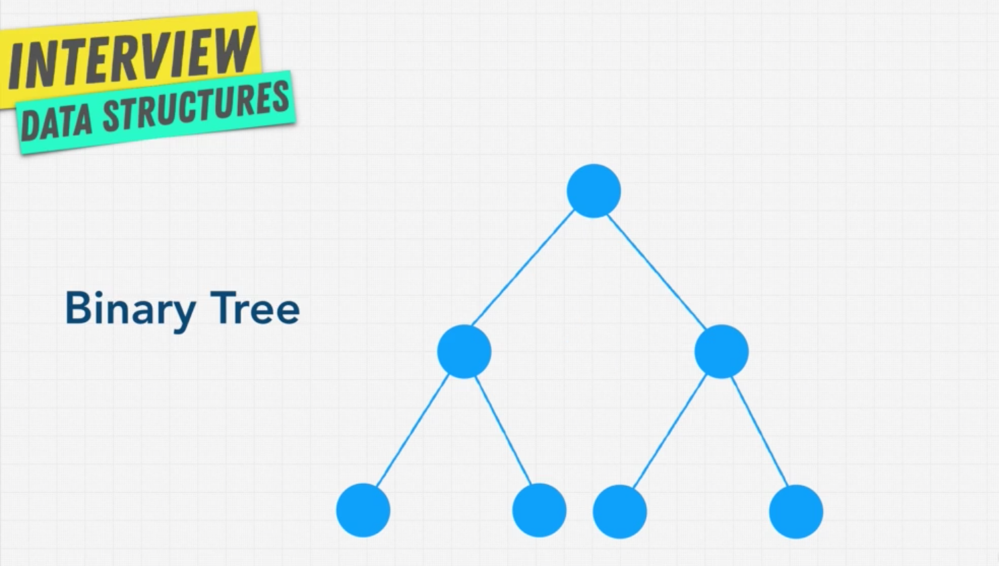
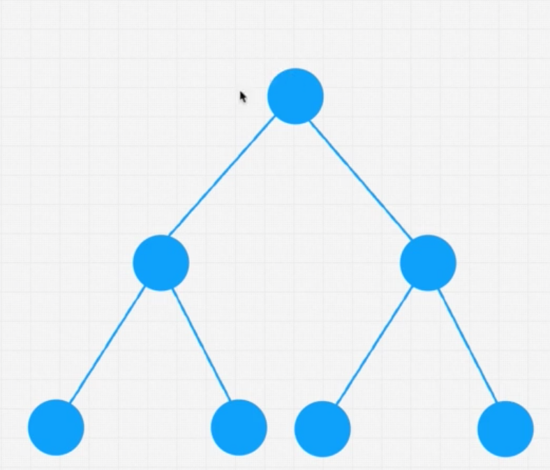

# Section 10 - Trees

## Introduction

Trees have a hierarchical structure, as opposed to linear data structures like linked lists and arrays.

A tree usually starts with a single root node and every node from the tree descends from that root node. But also: every child descends from one and only one other node. Trees are thus unidirectional and have **leaves** which are the very end of a tree.

Trees also have subtrees within them.

The beauty of trees is that, just like in linked lists, each node can contain any type of information (a linked list is actually a type of tree, which is completely linear).

There are many subtypes of trees; we'll go over the most important ones, and the ones that have more clearly defined use cases for the problem we'll see.

## Binary Trees



A binary tree is a subtype of tree, which has a few rules attached to it:

1. each node can either have 0, 1 or 2 nodes.
2. each child can have only one parent

We could simply create a binary tree node like:

```python
class BinaryTreeNode:
  def __init__(self, value):
    self.value = value
    self.left = None
    self.right = None
```

Let's take a look at a two subtypes of **binary trees**:


As you can see, in a **perfect binary tree**, the bottom layer of the tree is completely filled. In a **full binary tree**, each node has either 0 or 2 child nodes, but there's no need for the bottom layer to be complete.

This is important because this kind of trees have special efficiencies, which is desirable.

In the case of **perfect binary trees**:

1. The number of nodes in each layer **doubles** as we move down the tree
2. The number of nodes in the last layer is equal to the sum of nodes in all other levels, plus 1. (More than half of our nodes are in the last layer)

## O(log N)

Because of the way (perfect) binary trees are structured, there is an easy way of calculating how many nodes are in each level:

Number of nodes per level = 2 ^ (number of level, starting at 0)

```
Level 0 = 2 ^ 0 = 1
Level 1 = 2 ^ 1 = 2
Level 2 = 2 ^ 2 = 4
Level 3 = 2 ^ 3 = 8
Level 4 = 2 ^ 4 = 16
```

Based on the above rule, we can find the number of nodes in a tree by doing:

```
# nodes in a tree = 2 ^ height (starting at 1) - 1

which means:

log(nodes) = height
```

Notice that applying log() to both sides of the first formula, gives the second formula (the -1 can be insignificated).

If we take a look at the diagram again:



**log(N)** mean that the maximum number of decision that we are going to make to find a node (flowing downwards from the root) is **log(N)**.

Remember that **O(log N)** is extremely efficient, even faster that **O(N)**:


## Binary Search Tree

**Binary Search Trees** are a special kind of trees which are extremely efficient for searching and comparing things, as they preserve relationships between its nodes.

It has the following rules:

1. All child nodes to the right of the parent node must be greater than parent node. All child nodes to the left of the parent node must be less than the parent node.
2. All nodes can have up to two nodes.

The first rule guarantees that searching (lookup) of any node or value in the BST will have a time complexity of **O(log N)**, faster for example than an array, where we have to iterate through every single element and is this **O(N)**.

The same will be true for **inserting** and **deleting**, as we first have to find where to insert or find the node to delete and then perform constant time operations for each of those operations. (The time limiter still being log N).

## Balanced vs Unbalanced BST

What happens, however, if we keep adding nodes to the most rightside branch of our tree? We would end up with a tree like looks like this:


We can see that the tree quickly becomes unbalanced, with most nodes accumulating to the right, and that branch becoming linear in a way similar to a linked tree. This causes the tree to lose its capability to do operations at **O(log N)**, instead becoming linear. **(O(N))**

**This is why we don't want our trees to become unbalanced, and if they do, find a way to balance them again.**

Take a look at the time complexity of of **BST**s in the **worst case:**


That's what we want to avoid.

How do we balance a tree? Balancing a tree is rather complex, but there are algorithms and data structures that help us with that.

For example, we have **AVL** and **Red-Black** trees that help us ensure that our **Binary Search Tree** is balanced. Luckily for us, they are built-in in most programming languages.

Interviewers don't usually ask to balance a binary search tree because it's rather long and complex, but it's important to understand why it is important that our tree is balanced, and that there are ways to do it.

## BST Pros and Cons

**Pros**

1. Good time performance: **O(log N)** being better than **O(N)**
2. Ordered
3. Flexible size - because we can place a node in all parts of our tree (as long as we keep it ordered)

**Cons**

1. No **O(1)** operations: for any kind of operation we have to do some kind of traversal through the tree.

## Binary Search Tree Operations: Insert and Lookup 

Let's code a `BinarySearchTree` class that can hold the following nodes in an ordered way:
```
      9
  4      20
1   6   15  170
```

```python
class Node:
  def __init__(self, value):
    self.value = value
    self.left = None
    self.right = None

class BinarySearchTree:
  def __init__(self):
    self.root = None

  def insert(self, value):
    newNode = Node(value)
    if self.root == None:
      self.root = newNode
    else:
      current = self.root
      while True:
        if newNode.value >= current.value: # Go right
          if current.right == None:
            current.right = newNode
            return
          else:
            current = current.right
        else: # Go left
          if current.left == None:
            current.left = newNode
            return
          else:
            current = current.left
  
  def lookup(self, value):
    current = self.root
    while current != None and current.value != value:  
      if value >= current.value: # Go right
        current = current.right
      else: # Go left
        current = current.left
    return current
    

tree = BinarySearchTree()
print(tree.insert(1))
print(tree.insert(41))
print(tree.insert(33))
print(tree.insert(20))
print(tree.insert(15))
print(tree.insert(9))
print(tree.insert(22))
print(tree.lookup(15))
print(tree)
```

## Binary Search Tree Operations: Remove

TODO: Translate this JS code for node removal in BST to Python

```js
class Node {
  constructor(value){
    this.left = null;
    this.right = null;
    this.value = value;
  }
}

class BinarySearchTree {
  constructor(){
    this.root = null;
  }
  remove(value) {
    if (!this.root) {
      return false;
    }
    let currentNode = this.root;
    let parentNode = null;
    while(currentNode){
      if(value < currentNode.value){
        parentNode = currentNode;
        currentNode = currentNode.left;
      } else if(value > currentNode.value){
        parentNode = currentNode;
        currentNode = currentNode.right;
      } else if (currentNode.value === value) {
        //We have a match, get to work!
        
        //Option 1: No right child: 
        if (currentNode.right === null) {
          if (parentNode === null) {
            this.root = currentNode.left;
          } else {
            
            //if parent > current value, make current left child a child of parent
            if(currentNode.value < parentNode.value) {
              parentNode.left = currentNode.left;
            
            //if parent < current value, make left child a right child of parent
            } else if(currentNode.value > parentNode.value) {
              parentNode.right = currentNode.left;
            }
          }
        
        //Option 2: Right child which doesnt have a left child
        } else if (currentNode.right.left === null) {
          currentNode.right.left = currentNode.left;
          if(parentNode === null) {
            this.root = currentNode.right;
          } else {
            
            //if parent > current, make right child of the left the parent
            if(currentNode.value < parentNode.value) {
              parentNode.left = currentNode.right;
            
            //if parent < current, make right child a right child of the parent
            } else if (currentNode.value > parentNode.value) {
              parentNode.right = currentNode.right;
            }
          }
        
        //Option 3: Right child that has a left child
        } else {

          //find the Right child's left most child
          let leftmost = currentNode.right.left;
          let leftmostParent = currentNode.right;
          while(leftmost.left !== null) {
            leftmostParent = leftmost;
            leftmost = leftmost.left;
          }
          
          //Parent's left subtree is now leftmost's right subtree
          leftmostParent.left = leftmost.right;
          leftmost.left = currentNode.left;
          leftmost.right = currentNode.right;

          if(parentNode === null) {
            this.root = leftmost;
          } else {
            if(currentNode.value < parentNode.value) {
              parentNode.left = leftmost;
            } else if(currentNode.value > parentNode.value) {
              parentNode.right = leftmost;
            }
          }
        }
      return true;
      }
    }
  }
}

const tree = new BinarySearchTree();
tree.insert(9)
tree.insert(4)
tree.insert(6)
tree.insert(20)
tree.insert(170)
tree.insert(15)
tree.insert(1)
tree.remove(170)
JSON.stringify(traverse(tree.root))

//     9
//  4     20
//1  6  15  170

function traverse(node) {
  const tree = { value: node.value };
  tree.left = node.left === null ? null : traverse(node.left);
  tree.right = node.right === null ? null : traverse(node.right);
  return tree;
}
```

## AVL + Red/Black Trees

Usually, in production we want to have a **balanced** binary search tree. There are two popular kind of BSTs that automatically re-balance themselves:

1. **AVL Trees**
2. **Red/Black Trees**

The implementation of these trees is somewhat complex and most programming languages include an implementation for them, or at least a library.

To understand how these work let's take a look at a couple resources

TODO: Go through these resources and create summaries in these files for each type

**AVL Trees**

- [Animation](https://www.cs.usfca.edu/~galles/visualization/AVLtree.html)
- [How they work](https://medium.com/basecs/the-little-avl-tree-that-could-86a3cae410c7)

**Red/Black Trees**

- [Animation](https://www.cs.usfca.edu/~galles/visualization/RedBlack.html)
- [How they work](https://medium.com/basecs/painting-nodes-black-with-red-black-trees-60eacb2be9a5)

[Technical comparison between the two](https://stackoverflow.com/questions/13852870/red-black-tree-over-avl-tree)

## Binary Heaps

**Binary heaps** are a special kind of heap in which each node has a maximum of 2 nodes as children.

Why are binary heaps useful, and how are they different from binary trees?

In a **binary heap**, every child belongs to a parent that has a greater value (or priority).


You can see that in the second row, the children of the root node, with value 101, have values 72 and 33, both of which are lower than the value of the root node. At the same time, the children of each of those nodes has a lower value as their parent.

The example above is called a **max heap**: where the node with the **maximum** value is placed on top.

Conversely, in a **min heap**, the node with the **minimum** value is placed on the top.

A **heap** can be used in any algorithm in which **ordering is important**. As we'll see, it's commonly used when it comes to **priority queues**.

In arrays we had **random access**, which allowed us to directly access any element within them in constant time, using an index. In linked lists, we can shift the nodes dynamically, but accessing a node within the list requires a traversal of the whole list (in the worst case), time complexity of O(N).

Heaps are a little bit different: you cannot do **O(1)** random access like we did with arrays or hash tables. Like in trees, we have to do a traversal. But compared to binary search trees, in a heap, **lookup has a time complexity of O(N)**. And this is because it lacks the order that BST have: in BST, the direction of the children, left and right, have a meaning (the left is always left than the parent and the right always greater than the parent).

In a binary heap, **left and right can be any value as long as they are less than the parent value**. 

So for example, in the example above, if we are looking for 1, we need to check the root node, then, because 1 is less than 101, we need to check **both nodes underneath it**, and because 1 is still lower than 72 and 33, we need to check both children of both of those nodes. So we end up traversing through all the nodes, which makes the time complexity of this lookup **O(1)**.

So why would we ever want to create a **binary heap**?

Binary heaps are really great **at doing comparative operations**. For example, in the case above, if we wanted to grab only the nodes that have a value of 33 or above, we can just take the root node and the nodes in the second row, and we can safely discard the rest of the heap, knowing that all the rest of the nodes will have values less than 33.

That same operation would have a time complexity of **O(N)** in binary search trees.

Heap are used a lot in data storage, priority queues and sorting algorithms. 

Let's have a look at how they are implemented, visually;

[Visualgo](https://visualgo.net/en/heap?slide=1)

If we insert a value to a binary max heap, the worst case time complexity will be **O(log N)**, in the case that the new node has the max value in the whole heap, as the node is inserted below and then it bubbles to the top as it corrected.

In order to truly understand why we need something like a binary heap, and why it is useful, and how they are different from a BST, we need to talk about **priority queues.**


