# Section 11 - Graphs

## Graphs Introduction

**Graphs** are one of the most used data structures used in Computer Science to modle real life data.

A **graph** is a set of values, which are related in a pair-wise fashion.

In a graph, each item is called **a node (or vertex)**:

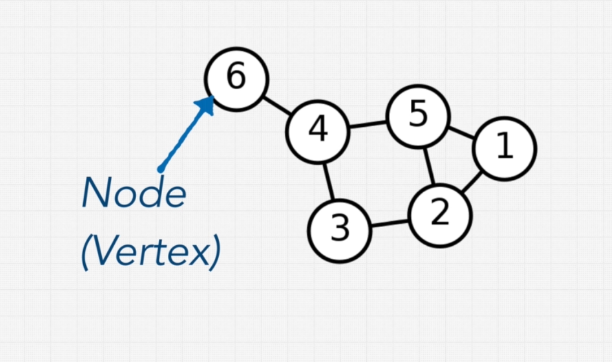

Nodes are connected among themselves trhough **edges**:

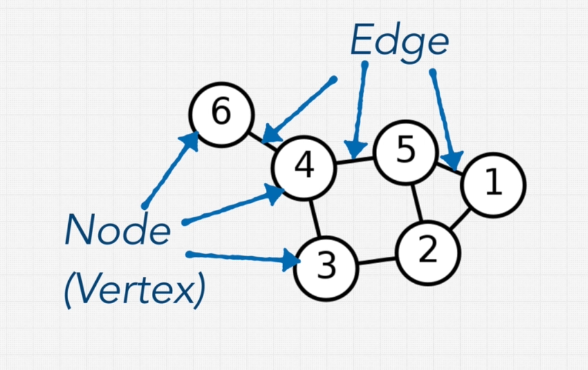

Graphs are great for modelling real life relationships, representing links, for example data connected among itself.

For example, graphs can be used to represent friendship networks, networks in the World Wide Web, or roads in a map.

Of course, **trees** and even **linked lists** are special types of graphs.

## Types of Graphs

### Directed vs Undirected

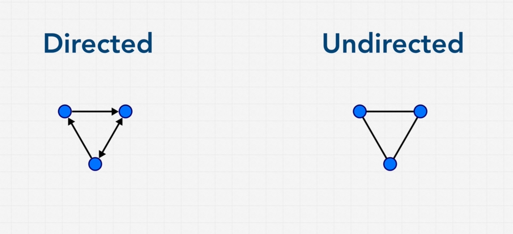

**Directed:** edges in a directed graph have a predefined direction (which can be one way, the other way, or the two ways).

**Undirected:** edges have no predefined direction and movement can happen in both ways.

### Weighted vs Unweighted

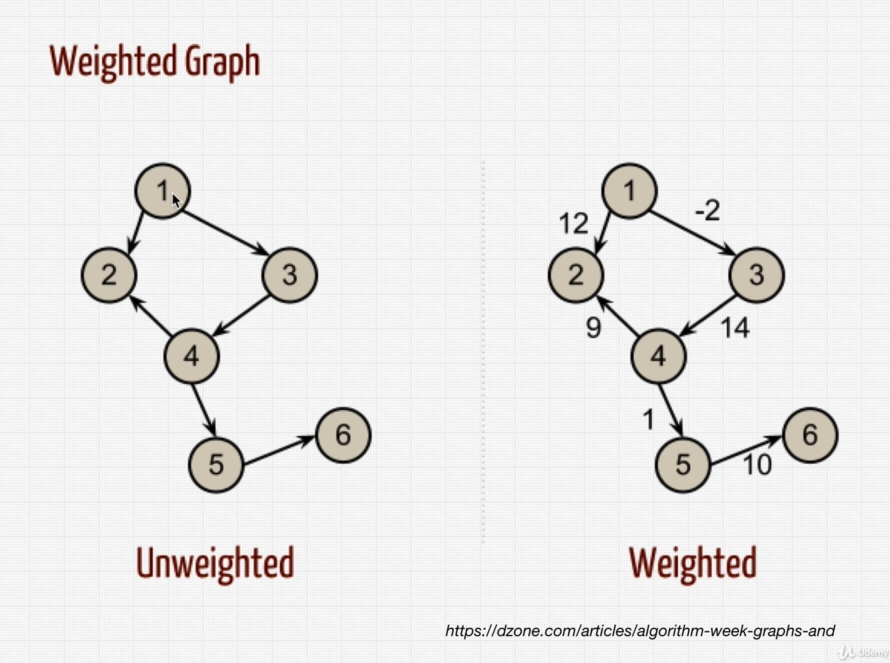 

**Weighted:** values can be applied to the edges of the graph, giving each "movement" across the edge a weight, cost, penalty, priority, etc.

**Unweighted:** values cannot be applied to the edges of the graph. 

### Cyclic vs Acyclic 

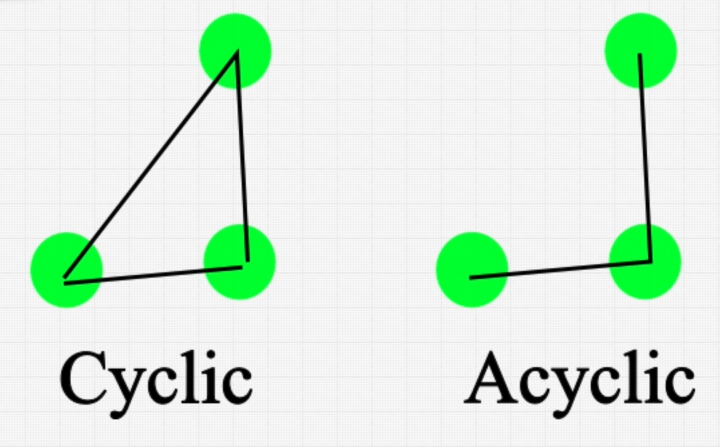

**Cyclic:** the graph has vertices connected in a circular fashion. That's a **cycle**. They are really common in **weighted** graphs, like the ones used in Google Maps.

**Let's now classify a couple of graphs:**

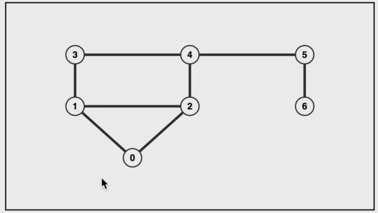

Undirected Cyclic Unweighted

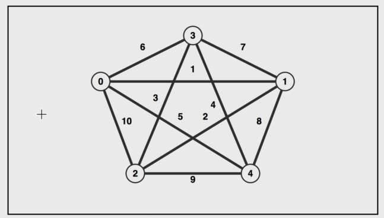

Undirected Cyclic Weighted

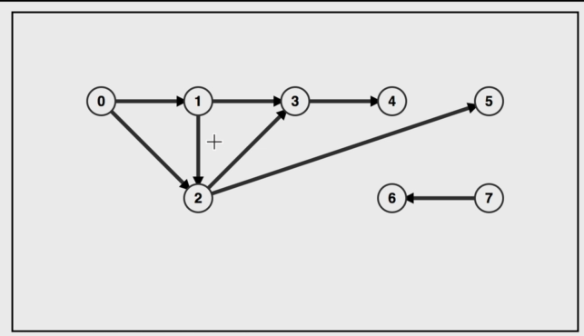

Directed Acyclic Unweighted

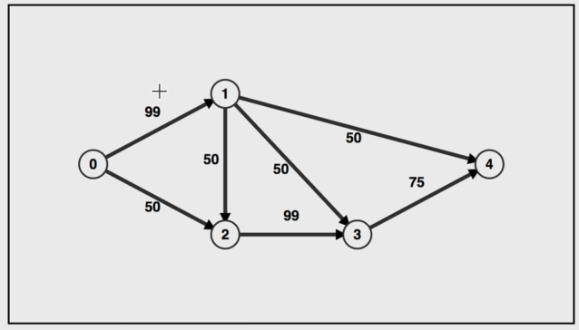

Direced Acyclic Weighted

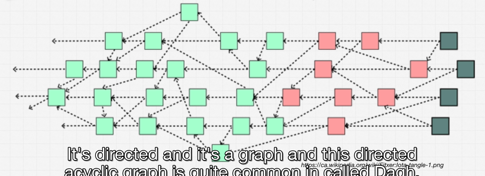

**Directed Acyclic Graph** (DAG) -- Also unweighted.

## Graph Data

We aleady know the tools to build graphs: we have built already **trees** and **linked lists**.

Let's attempt to build the following graph:

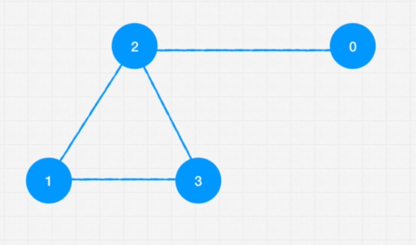

There are different ways in which you can build graphs:

### Edge List

Draws out the connections between nodes in a list:

```py

graph = [[0, 2], [2, 1], [2, 3], [1, 3]]

```

### Adjacency List

We create an array (or object) where the index is the node's value (in this case), and then we detail its connections:

```py
graph = [[2], [2, 3], [0, 1, 3], [1, 2]]

graph = {
  0: [2],
  1: [2, 3],
  2: [0, 1, 3],
  3: [1, 2]
}
```

### Adjacency Matrix

Uses a matrix to show which node is connected to which other node:

```py
graph = [
  [0, 0, 1, 0],
  [0, 0, 1, 1],
  [1, 1, 0, 1],
  [0, 1, 1, 0]
]

graph = {
  0: [0, 0, 1, 0],
  1: [0, 0, 1, 1],
  2: [1, 1, 0, 1],
  3: [0, 1, 1, 0]
}
```

All of these 3 types of representation can be seen in **VisuAlgo**:

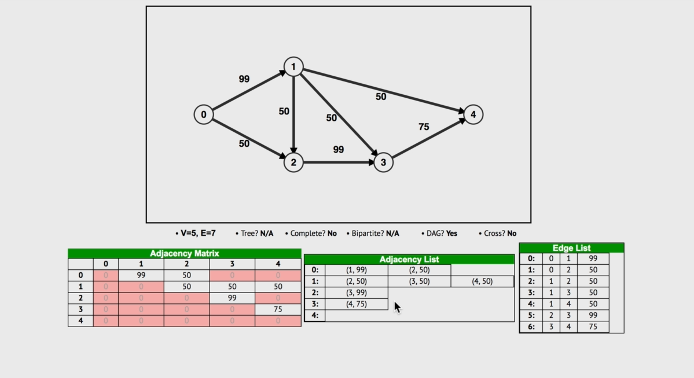

## Graph Implementation

```py
class Graph:
  def __init__(self):
    self.numberOfNodes = 0
    self.adjacencyList = {}

  def addVertex(self, node):
    pass

  def addEdge(self, node1, node2):
    pass

  # Provided helper function
  def showConnections(self):
    adjList = self.adjacencyList
    for key in adjList:
      nodeConnections = adjList[key]
      connections = ""
      for vertex of nodeConnections:
        connections += vertex + " "
      print(node + " --> " + connections)

graph = Graph()
graph.addVertex('0')
graph.addVertex('1')
graph.addVertex('2')
graph.addVertex('3')
graph.addVertex('4')
graph.addVertex('5')
graph.addVertex('6')
graph.addEdge('3', '1')
graph.addEdge('3', '4')
graph.addEdge('4', '2')
graph.addEdge('4', '5')
graph.addEdge('1', '2')
graph.addEdge('1', '0')
graph.addEdge('0', '2')
graph.addEdge('6', '5')
graph.showConnections()
```

Complete the `addVertex` and `addEdge` implementations:

```py
class Graph:
  def __init__(self):
    self.numberOfNodes = 0
    self.adjacencyList = {}

  def addVertex(self, node):
    self.numberOfNodes += 1
    self.adjacencyList[node] = []

  def addEdge(self, node1, node2):
    # Notice that this graph is undirected,
    #  so we need to link vertices in both ways
    self.adjacencyList[node1].push(node2)
    self.adjacencyList[node2].push(node1)

  # Provided helper function
  def showConnections(self):
    adjList = self.adjacencyList
    for key in adjList:
      nodeConnections = adjList[key]
      connections = ""
      for vertex of nodeConnections:
        connections += vertex + " "
      print(node + " --> " + connections)

graph = Graph()
graph.addVertex('0')
graph.addVertex('1')
graph.addVertex('2')
graph.addVertex('3')
graph.addVertex('4')
graph.addVertex('5')
graph.addVertex('6')
graph.addEdge('3', '1')
graph.addEdge('3', '4')
graph.addEdge('4', '2')
graph.addEdge('4', '5')
graph.addEdge('1', '2')
graph.addEdge('1', '0')
graph.addEdge('0', '2')
graph.addEdge('6', '5')
graph.showConnections()
```

## Graphs Complexity and Pros and Cons

**Pros**

- Good at mapping relationships between data
- Some data needs to be in graph form, and can't be represented in any other way

**Cons**

- Scaling is hard (lots of computing power, infrastructure)

Space and Time Complexity is difficult to define because there are so many different type of graphs.

## Graph Traversals

The type of traversals that we learned for trees -**BFS and DFS**- can also be used in **graphs**.

For example, if Amazon was building a book recommendation algorithm with a graph, they would **most surely use BFS** since we would be looking at what types of items are most closely related to the product we are about to buy now, or have already bought.

In a Linkedin graph, in order to know which distance I have in the connection with another user we might use **DFS**.

In **DFS for graphs**, we start by traversing one of the connection nodes to our starting point up to their ends (the connections of those initial connections first) before we continue with others.

In **BFS for graphs**, we first traverse all the connecting nodes from our starting point before diving deeper into the children nodes of the starting point's connections.

**Breadth First Search (BFS):** Used to find shortest path between nodes (closest friends on Facebook, similar books on Amazon)

**Depth First Search (DFS):** Used to check if a path between nodes exists, or if an objective node exists.

## BFS in Graphs

The unique aspect about **BFS in graphs** is that it lends itself really nicely to determining the shortest path between any nodes, especially to determining what's the closest node to a chosen node.

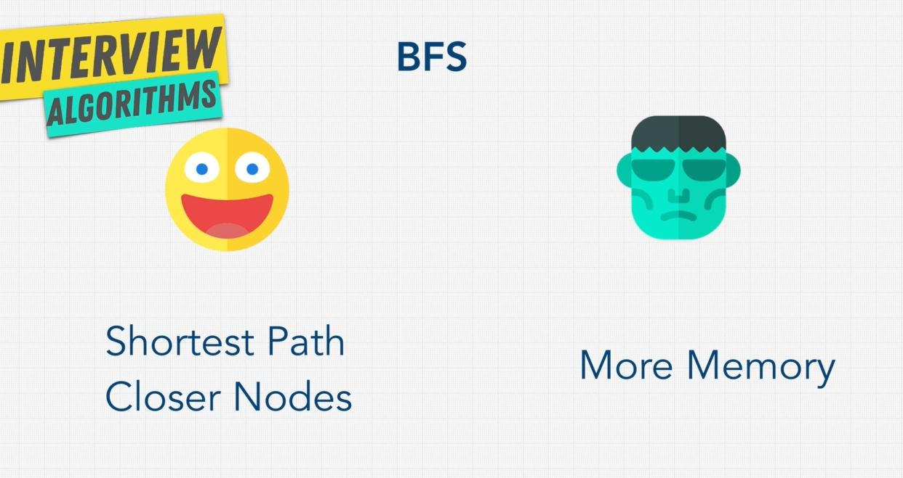

**Pros**

- Helps us easily determine the **shortest path** between nodes
- Better at finding a node **if we know it is close to a starting point node**

**Cons**

- Uses more memory to keep track of parent and children nodes
  
## DFS in Graphs

**DFS in graphs** is exactly like solving a maze: a program that attempts to find which path to take. The idea is **to go as deep as you can and when you hit a roadblock or a point where you can't go further, you backtrack and attempt to find a different route.** And then keep backtracking and searching for a different route until you find your objective node or exit the maze.

That's why **we use recursion for DFS:** it implements the idea of backtracking and attempting to find a different route, that is recursive.

**Pros**

- Helps us determine **does the path exist** between nodes. Doesn't tell us the shortest path, but wether it exists.
- Uses less memory than **BFS**.

**Cons**

- Can get slow with a very deep graph, as the recursive stack call can get pretty big.

## Dijkstra + Bellman-Ford Algorithms

The **Dijkstra** and the **Bellman-Ford** algorithms are used to solve the **shortest path problem**.

But why would we use them if we just said that **BSF** is used for finding the shortest path? 

These algorithms are used for a special case: yes, **BSF** is used to solve the shortest path problem, but there's one thing that it can't do: it cannot handle **weighted graphs**. (For example, graphs in Google Maps have values for edges representing traffic. A simple BSF cannot account for that.)

If in an interview someone asks about a problem like this, the solution should be implemented using **Djikstra** or **Bellman-Ford** algorithms. Both algorithms are quite complex and lengthy.

The main difference between them is that the **Bellman-Ford** algorithm can accomodate for **negative numbers** in the weight of the edges. **Dijkstra's** algorithm can't but it is still used because it is somewhat faster: **Bellman-Ford**'s algorithm **has a worst-case time complexity of O(N^2)**.

