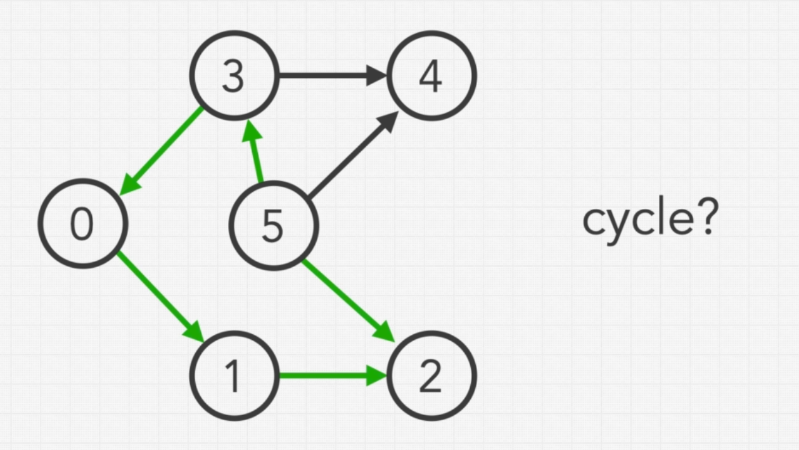
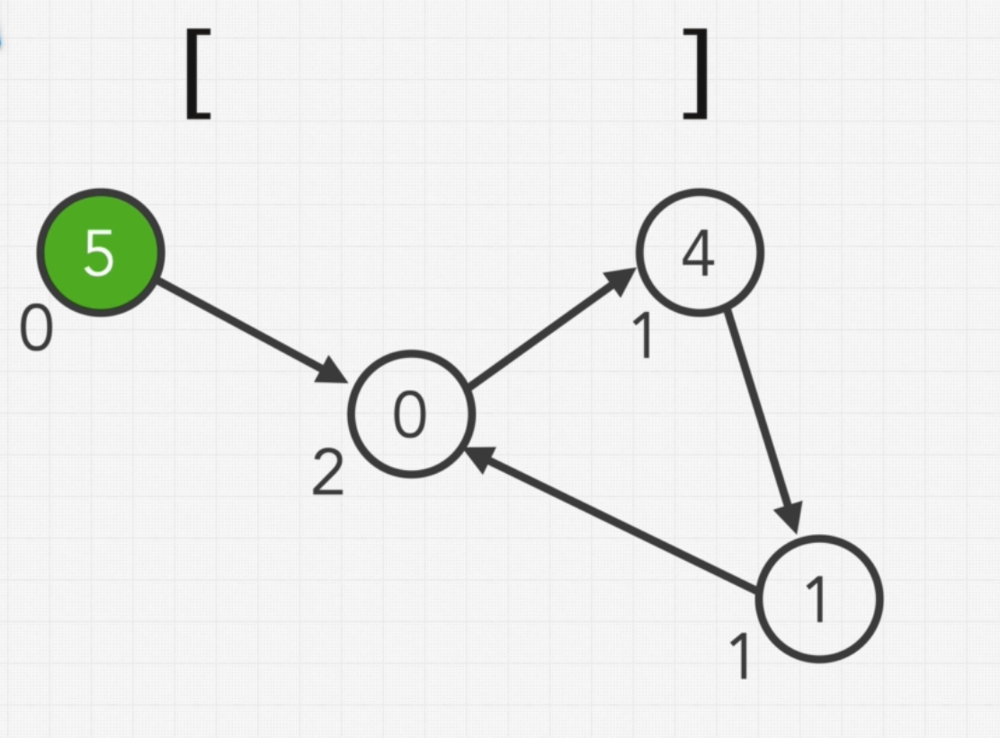
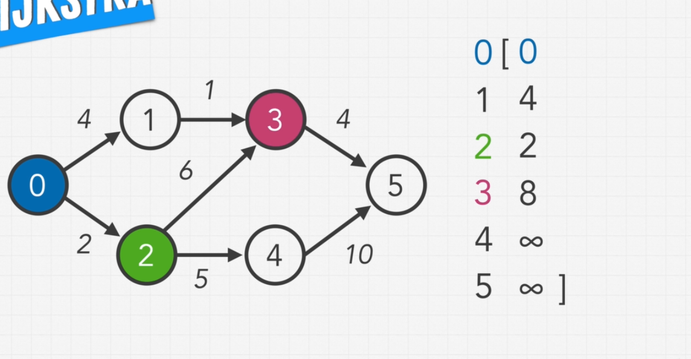
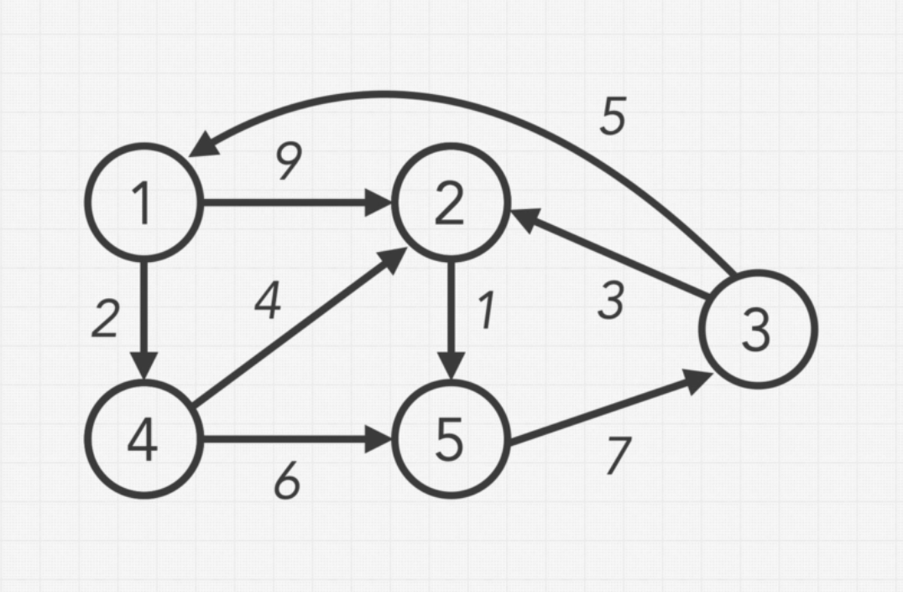
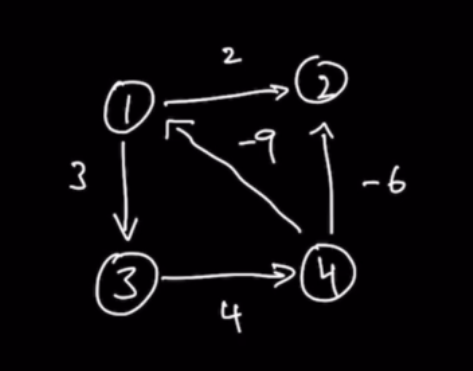

# Section 11 - Graphs

## Intro to Graphs - Representation & Traversal Algorithms

The complexity of **graphs** lies on the amount of variations of graphs that exist. We are going to learn some of the most important algorithms that are applied to the variations of graphs.

**Graphs** are basically collections of nodes, which are almost identical to the nodes we've used for binary trees, in which aech node has a value associated with it.

In a graph, each node can be connected with another node, and in graphs they are usually called **vertex**, or **vertices** for plural. The connection between nodes is called an **edge**:


**Vertices** can have multiple connection to multiple different nodes, and there's no limit to how many other nodes a vertix can be connected to.

**Vertices** can form a **cycle**: a way nodes can connect in which they form a circular connection, so that one can traverse from one node back to itself by passing through those connecting nodes.


Graphs that contain at least one cycle are called **cyclic**, while those with no cycles are called **acyclic**.

These types of graphs we've seen until now are called **undirected**: one can tranverse from one node to any of its connecting nodes in one direction and its opposite. This is because connections are not directed, the edges don't have a set direction which restricts movement from the connected node in that specific direction:


The case in which that indeed happens is in a **directed** graph, in which the direction that we can traverse is dictated by the direction that the edge permits (shown usually as an arrow in visual representations):


Another distinction that can be made for graphs is between **weighted** and **unweighted**. We have seen already all cases of unweighted ones; on the other hand, **weighted** graphs have **weights or costs** associated to their edges, and they usually represent the **"cost" of moving** along that edge.


**Remember**: any **undirected graph** can easily be transformed into a **directed graph** if we consider **all edges to allow movement in both directions.**

Another type of graph to take into account is **unconnected graphs:** these are graphs which have at least to groups of nodes that are not connected to each other by any of their nodes:


**Trees** and **2D-arrays** are very easily represented as graphs (trees are actually a special kind of graph).

In the case of 2D-arrays, a 2D-array can easily be visualized as a grid:

 => 

And each grid cell can easily be thought of as a vertex, which is connected to the other in the following way:


## Representing Our Graphs - Adjacency List and Adjacency Matrix

The two most common way of represnting our graps are the **adjacency list** and the **adjacency matrix**:

### Adjacency List

If I give each node an identifier, which is a numerical value starting from `0`, I can represent my graph as an array-shaped **adjacency list**, which has length that is equal to the amount of nodes in the graph, and every index points to the node that has that corresponding identifier:


The **value of each index** is going to be an **array** which will contain the **numerical identifier of any node** that is connected to the node represented by that index:


However, it's not always the case that we can use a numerical identifier starting with `0` to represent our nodes. What, for example, if we need to identify our nodes with **strings**?

In that case, we can **replace our use of an array with an object:**


**Adjacency list** allows for fast traversals, as we easily get the reference of a node's connection, and we can traverse down that connection in **O(1)** time, for both the array and the object variation.

### Adjacency Matrix

An **adjacency matrix** uses a 2D array or matrix. Each node is represented as the outer-array's indeces, and the inner array represents which nodes are connected to that specific node:


For example, when starting with node `0`, we see that it is connected only to `3`:


This means that in every position in the inner array, at the corresponding index, we are going to put a `0` if there is no connection, and a `1` if there is. That means that our inner array will be `[0, 0, 0, 1, 0, 0]`:


And we do exactly the same for the other nodes:


The **adjacency matrix** is a very dense data structure, in that it takes a lot of space to store: it will have a size of `N^2`, with `N` being the amount of nodes.

The size of an **adjaceny list** will vary in proportion top how many edges the graph has, but it ends to end up much smaller than the matrix representation.

## Breadth First Search in Graphs

To explain **BFS in graphs**, let's start with the following graph:


We most commonly start with the first node that shows up in our **adjacency list or matrix**, which in this case, is going to be the `0`.

Remember that in **BSF** we need to initialize two values:

- **queue**: for keeping pending nodes
- **answers (result) array**: which will hold all our values


The first step is **taking our first node and adding it to our queue:**


Once we have a value in our queue, we can start performing our traversal: so we take our `0` from the queue, push it into our `res` array, and add the node's neighbours to our queue:


The order in which those nodes are added to the queue follows the order in which they appear in the adjacency list.

So now, we move to our next value in our `queue`, the `1`. So we take it out of the queue, append it to `res`, and try to add its neighbours to the queue. However, we in this case, we notice that we have already explored the `0`, we don't want to go back to it:


So we simply don't add it.

Then we go to the next step: we take the `3`, push it into `res`, take `3`'s neighbours and push them into the `queue`, skipping the already-visited nodes:


Next step: we take the `4`, append it to `res`, take the node's neighbours (in this case, only `6`, since `3` is already visited) and append it to the `queue`:


Next step: we take the `5`, append it to `res`, try to take the nodes' neighbours, but we notice it only has `3` as neighbour, which has already been visited, so that's it:


Now we take `2`, append it to `res`, look for its non-visited neighbours (`8`), and append it to the queue:


We move on to `6`: append it to `res`, append its non-visited neighboures (`7`) to the queue:


Now we take `8`, append it to `res`, and have no non-visited nodes to attach to the queue:


Finally, we take `7`, append it to `res` and we have visited all nodes:


This is a very familiar pattern of traversal, since we have already done it with **trees** and **2D arrays**.

## Coding BFS

Let's first represent our graph as an **adjacency list**:

```py
graph = [
  [1, 3],
  [0],
  [3, 8],
  [0, 2, 4, 5],
  [3, 6],
  [3],
  [4, 7],
  [6],
  [2]
]
```

Now let's think how to code out our **BFS**.

Here, in the context of our **BFS** we are going to receive the **adjacency list** that represents our entire graph. So when we define our traversal function, we are going to have the **adjacency list** as a parameter:

## With Adjacency List
```py
  def traversalBFS(self, graph): # graph has the shape of our adj list
    # We first initialize our queue, with our initial value
    q = [0]
    # We also initialize our res array which will keep our values once processed
    res = []
    # We also need an object to keep track of the nodes that we have already
    # explored, so that we don't re-add them to the queue
    seen = {}

    # The while loop will drive our algorithm, with the usual condition of
    # looping while our queue has elements in it
    while len(q) > 0:
      # Pop the first value of the queue to begin processing it
      node = q.pop(0)
      # Add it to our res array
      res.append(node)
      # Track that we have already seen this node
      seen[node] = True

      # Get all nodes that are connected to our current node
      connections = graph[node]
      # Loop over each of them and add it to the queue if we haven't seen it before
      for n in connections:
        if n not in seen:
          q.append(n)
    
    # Return our res array
    return res
```

## With Adjacency Matrix
```py
  def traversalBFS(self, graph): # graph has the shape of our adj list
    # We first initialize our queue, with our initial value
    q = [0]
    # We also initialize our res array which will keep our values once processed
    res = []
    # We also need an object to keep track of the nodes that we have already
    # explored, so that we don't re-add them to the queue
    seen = {}

    # The while loop will drive our algorithm, with the usual condition of
    # looping while our queue has elements in it
    while len(q) > 0:
      # Pop the first value of the queue to begin processing it
      node = q.pop(0)
      # Add it to our res array
      res.append(node)
      # Track that we have already seen this node
      seen[node] = True

      # Get all nodes that are connected to our current node
      connections = graph[node]
      # Loop over each of them and add it to the queue if we haven't seen it before
      for index, n in enumerate(connections):
        if n == 1 and index not in seen:
          q.append(index)
    
    # Return our res array
    return res
```

## Depth First Search in Graphs

**DFS in graphs** is conceptually the same as we know for **DFS** in trees.

First, we initialize our `res` array that will hold the values during our traversal:


In **DFS** we don't need a queue, because, as we know, our solution is mostly recursive.

We are going to start with `0`, just like we did with **BFS**:


And to start, we are going to scan and traverse through all of our current nodes neighbour vertices, and then we are going to search them using the same pattern recursively through completion.

So as we said, we start with `0` and add it to our `res` array:


We then take `0`'s first neighbouring value of `1` and add it to the `res` array:


After adding `1` to our `res` array, we try to explore it, but notice that it has no further neighbours other than `0`, which we have already explored. So that means we are finished with `1`.

So that means we can move to the next neighbour of our original node of `0`, which is `3`. We add that to our `res` array:


And now we take `3` neighbours: its first neighbour is `4`, so we add it to the array:


But now we explore this path all the way down to completion: we first add its first neighbour of `6`:


And then subsequently add `6`'s neighbour, which is `7` to the `res` array:


Since `7` has no neighbours to explore, we traverse back to `6`, then to `4` and back to `3`. From there we continue with `3`'s next neighbour which is `5`:


Since `5` has no further neighbours, we continue with `3`'s next neighbour, `2`. We add `2` to the `res` array:


And thus, we continue traversing to `2`'s only neighbour which is `8`, and add it to the array:


Since `8` is finished, has no further neighbours, we go back to `2`, whose neighbours have also been visited, then back to `3`, the same, and then finally back to `0`, which now has had all of its neighbours visited.

So that means that the **DFS** is done.

## Coding DFS

### With Adjaceny List
```py
def traversalBFS(graph): # graph has the shape of our adj list
  if graph is None:
    return []

  # Create an array in which to store our results
  res = []
  # Create a seen object to save seen nodes
  seen = {}
  # Start the recursion passing down the first node
  recursiveTraverse(0, graph, res, seen)
  return res

def recursiveTraverse(node, graph, res, seen):
  # Append the node passed
  res.append(node)
  # Add it to the seen objecto
  seen[node] = True
  # Get the nodes neighbours
  neighbours = graph[node]
  # Loop over them and start the recursion if not in seen
  for n in neighbours:
    if n not in seen:
      recursiveTraverse(n, graph, res, seen)
```

### With Adjaceny Matrix
```py
def traversalBFS(graph): # graph has the shape of our adj matrix
  if graph is None:
    return []

  # Create an array in which to store our results
  res = []
  # Create a seen object to save seen nodes
  seen = {}
  # Start the recursion passing down the first node
  recursiveTraverse(0, graph, res, seen)
  return res

def recursiveTraverse(node, graph, res, seen):
  # Append the node passed
  res.append(node)
  # Add it to the seen object
  seen[node] = True
  # Get the nodes neighbours
  neighbours = graph[node]
  # Loop over them and start the recursion if not in seen
  for n, val in enumerate(neighbours):
    if val == 1:
      if n not in seen:
        recursiveTraverse(n, graph, res, seen)
```

# Leetcode Problems

# Time Needed to Inform All Employees (Medium)

A company has n employees with a unique ID for each employee from 0 to n - 1. The head of the company is the one with headID.

Each employee has one direct manager given in the manager array where manager[i] is the direct manager of the i-th employee, manager[headID] = -1. Also, it is guaranteed that the subordination relationships have a tree structure.

The head of the company wants to inform all the company employees of an urgent piece of news. He will inform his direct subordinates, and they will inform their subordinates, and so on until all employees know about the urgent news.

The i-th employee needs informTime[i] minutes to inform all of his direct subordinates (i.e., After informTime[i] minutes, all his direct subordinates can start spreading the news).

Return the number of minutes needed to inform all the employees about the urgent news.

**Example 1:**

Input: n = 1, headID = 0, manager = [-1], informTime = [0]
Output: 0
Explanation: The head of the company is the only employee in the company.

**Example 2:**

Input: n = 6, headID = 2, manager = [2,2,-1,2,2,2], informTime = [0,0,1,0,0,0]
Output: 1

Explanation: The head of the company with id = 2 is the direct manager of all the employees in the company and needs 1 minute to inform them all.
The tree structure of the employees in the company is shown.
 
Constraints:

1 <= n <= 105
0 <= headID < n
manager.length == n
0 <= manager[i] < n
manager[headID] == -1
informTime.length == n
0 <= informTime[i] <= 1000
informTime[i] == 0 if employee i has no subordinates.
It is guaranteed that all the employees can be informed.

## Thinking about the question

From the problem statement, we know that, if, for example, we are given `n = 8`, that means we have 8 employees with ids:

```
8 employees: 0, 1, 2, 3, 4, 5, 6, 7
```

And we also get get and `headID = 4`, so:

```
8 employees: 0, 1, 2, 3, 4, 5, 6, 7
                         _ head of the company
```
                         

We are also given the `managers` array, where the values inside represent the ids of the manager for the employee at that index:

```
managers = [2, 2, 4, 6, -1, 4, 4, 5]
```

Also following the problem statement, we are looking to build the subordination structure as a tree. In this case it won't be a binary tree but an **n-ary tree**, where each node can have any number of branches.

So from this data that we have, we can build a n-ry tree:

First, we should figure what the **root** of this tree should be. We know that the head of the company has no employees it reports to, which is represented in the **managers** array by a `-1`, at index `4`, meaning that our employee of index `4` is our head or **root**.


Now we look into the managers array, and see which indexes have `4` as their manager: in this case, it's `2, 5 and 6`. So these are its direct subordinates:


And now we have to find their subordinates.

If we start we start with `2`, we see that `0 and 1` are its direct subordinates:


And then we also see that `5` has as subordinate employee `7` and `6` has as subordinate employee `3`:


> When you are given a problem which can be represented as an n-ary tree, it usually means we are dealing with a graph problem.

Let's continue with the rest of the statement:

*The head of the company wants to inform all the company employees of an urgent piece of news. He will inform his direct subordinates, and they will inform their subordinates, and so on until all employees know about the urgent news.*

*The i-th employee needs informTime[i] minutes to inform all of his direct subordinates (i.e., After informTime[i] minutes, all his direct subordinates can start spreading the news).*

*Return the number of minutes needed to inform all the employees about the urgent news.*

So, we will receive the `informTime` array, which works in a similar way to the `managers` array: the index represent the employee ids and the values represent the time it takes for that employee to comunicate the news to all of its subordinates.


```
informTime = [0,0,4,0,7,3,6,0]
```

We know the bottom vertices must have an `informTime` of `0` because, that they have no one to communicate the news to. That can be seen in the `informTimeArray`.


Then we can add the respective time for each of the nodes which are not at the end of a branch:


Now, knowing this, we want to know the total number of minutes that it takes for the information to reach **all of the employees in the company** from the root node.

In order to do this, we initialize a `numOfMinutes` variable, where we will acumulate the minutes down the branch. And we start with the head of the company and say "the head want to communicate the news to its immediate subordinates". And once the news have been communicated, then `7` minutes have elapsed, because that is the time assigned to the head: 


Going a step forward, we check how long it takes employee `5` to tell its subordinates, and that is `3` minutes. So the total number of minutes is `10`:


If we repeat the process for employee `2`, we see that it takes it `4` minutes to tell the news, for a total of `11` minutes. Since this is larger than the previous `10` minutes, we replaces the `numOfMinutes` by `11`:


And finally, emplyee `6` tells `3` in `6` minutes, for a total of `13` minutes. Since that is the higher number, `numOfMinutes` gets replaced with `13`:


Since the whole company now knows the news and the we have a `numOfMinutes` that is the answer to our problem.

## Verifying our Constraints and Thinking About Test Cases

### Step 1: Verify the Constraints

The first step is to think about the **variations of graphs that there are** and ask the question to differentiate them:

1. **Cyclic?**

In this problem we know it is not possible, as defined in the problem statement: **It is guaranteed that the subordination relationships have a tree structure.** And trees are directed, but there are no cycles. 

We do need to ask ourselves the question: **Can employees have more than 1 manager?**

No, employees can only have 1 manager.

2. **Unconnected?** 

Could something like this happen?


So the right questio to ask is: **Will all employees have a manager?**

And the answer will be: **yes, all employees will have a manager, except for the head of the company.**

The graph must therefore be connected, i.e. cannot be unconnected.

3. **Directed?**

Since its a **tree**, it must be directed.

4. **Weighted?**

This is something that we will figure out.

### Step 2: Write out some test cases

Let's first import our already seen test case:


Let's also take a look at **the null case**:


Since for this question test cases are difficult to come up with, you can ask your interviewer. However, we should still highlight some good edge cases when thinking about your solution. 

For example, let's apply some logic that we saw with binary trees: what happens when we have a fully unbalanced tree?


In a structure like this, since every employer has 1 manager, the result will be the sum of all the values in the `informTime` array.

In this case, the answer is `21` minutes.

> NOTE: In graph questions you will not receive an obvious graph data structure. So the key usually is how to transform the data that we got into an adjacency list or an adjacency matrix, that represent a graph.
  

```py
managers = [2, 2, 4, 6, -1, 4, 4, 5]

def createAdjList(managers):
  adjList = {}
  for employee, manager in enumerate(managers):
    if manager == -1:
      continue
    if manager in adjList:
      adjList[manager].append(employee)
    else:
      adjList[manager] = [employee]
  return adjList
```

## How to Represent Our Graph as an Adjacency List

One of the keys when dealing with these type of questions is **recognizing whether and adjacency list or and adjecency matrix** is better suited at solving the problem at hand. 

First of all, since we know that the news will only travel from top to bottom in the company, that already gives us the hint that this will be a directed graph, with managers pointing to our subordinates, and with no pointers back.


Taking a look at the finished graph above, which data structure would be better for describing it? And **adjacency list** or and **adjacency matrix**. Which of these two describes better the relationship between the verteces?

In order to answer this, the main question to ask is: **what are the chances that the verteces are attached to every other vertex**? 

- The more connections that can exist between the verteces, the more likely you will want an **adjacency matrix.**
- The less connections, the more likely you will want an **adjacency list**.

This is because an **adjacency matrix** describes the relationship between **all possible pairs of nodes** inside the graph.

If we don't have that many connections, then we porbably don't want to use a matrix: in this case, nodes in the same level cannot be connected to each other, and each node only has on parent.

The adjacency list would look like this:


## Solved problem

Solution found on my own:

```py
class Solution:
    def numOfMinutes(self, n: int, headID: int, manager: List[int], informTime: List[int]) -> int:
        adjList = self.createAdjList(manager)
        totalMinutes = 0
        return self.recursiveDFS(headID, adjList, totalMinutes, informTime)
        
    def recursiveDFS(self, node, adjList, totalMinutes, informTime):
        # If my current nodes has subordinates, add the inform time of the current node
        # and recursively call recursiveDFS on the subordinates, and return the max value 
        # of what is returned by every subordinate
        if node in adjList:
            totalMinutes += informTime[node]
            neigh = adjList[node]
            return max([self.recursiveDFS(n, adjList, totalMinutes, informTime) for n in neigh])
        # Else, just return the current totalMinute without adding any informTime
        else:
            return totalMinutes
    
    def createAdjList(self, managers):
      adjList = {}
      for employee, manager in enumerate(managers):
        if manager == -1:
          continue
        if manager in adjList:
          adjList[manager].append(employee)
        else:
          adjList[manager] = [employee]
      return adjList
```

## Time and Space Complexity

Since we are traversing the array (in this case with DFS, but BFS would be the same), we know we have a minimum time complexity of **O(N)**.

Regarding space complexity, since we are doing recursive search, again the minimum is **O(N)** for the worst case of a fully unbalanced tree, to the right, for example.

We might also consider our adjacenctly list: for each node we will have an array, and within that array, there will be multiple nodes. That might lead us to think that the space complexity could be quadratic, but in reality each node will appear only onces in all arrays within the subarray, so the complexity will still be **O(N)**.


.
.
.
.
.
--

# Course Scheduler (Medium)

There are a total of `numCourses` courses you have to take, labeled from `0` to `numCourses - 1`. You are given an array `prerequisites` where `prerequisites[i] = [ai, bi]` indicates that you must take course `bi` first if you want to take course `ai`.

For example, the pair `[0, 1]`, indicates that to take course `0` you have to first take course `1`.

Return `true` if you can finish all courses. Otherwise, return `false`.

**Example 1:**

Input: numCourses = 2, prerequisites = [[1,0]]
Output: true
Explanation: There are a total of 2 courses to take. 
To take course 1 you should have finished course 0. So it is possible.

**Example 2:**

Input: numCourses = 2, prerequisites = [[1,0],[0,1]]
Output: false
Explanation: There are a total of 2 courses to take. 
To take course 1 you should have finished course 0, and to take course 0 you should also have finished course 1. So it is impossible.
 
**Constraints:**
```
1 <= numCourses <= 105
0 <= prerequisites.length <= 5000
prerequisites[i].length == 2
0 <= ai, bi < numCourses
All the pairs prerequisites[i] are unique.
```

So, to begin with: how do we find the graph hidden behind this data?

- we are given `numCourses`, for the total amount of courses to take
- we are given the prerequisite as pairs: `[course, prerequisite]`. So if we have the pair `[1, 0]`, this means `0` is a prerequisite to `1` and we can draw it as a directed edge that point from `0` to `1`:


Now let's take the following `prerequisites` array as an example: `[[1, 0], [2, 1], [2, 5], [0, 3], [4, 3], [3, 5], [4, 5]]`

If we draw the directed graph for the that array we get:


Do we know whether, based on this graph, we can take all of the courses? 

The key here is that **we cannot finish all of the courses if we a cycle within our graph**: a cycle prevents you to take any course in it, since that course would always have untaken prerequisite courses.

So, back to our graph, let's look for potential places with cycles and confirm if they are:


Those three nodes **do not form a cycle**.



Those five nodes **do not form a cycle**.

So this particular course **can be effectively completed, i.e. all courses taken**:


Let's see an example **where we cannot, i.e. where we have a cycle**:


Now we see that the bottom five nodes form a cycle, which make it impossible for us to take all the courses:


## Step 1: Verify the Constraints

**Can we have courses unconnected to other courses?**

Yes, account for separate course chains.


We should check that there are no cycles in all chains of our graph: for example, our chain to the right here forms a cycle, and we should return `false`:


## Step 2: Write out some Test Cases


Coming up with these types of test cases is complicated: talk to your interviewer about coming up with some together.

Let's also take a look at the following graph (the second chain of which has a cycle, so we know it will fail), and work from the graph backwards into the inputs:


First, we can simply count that there are `7` nodes, so `numCourses` is `7`.

Our `prerequisites` array can simply be done:

```
prerequisites = [[0, 3], [1, 0], [2, 1], [4, 5], [6, 4], [5, 6]] 
```


## Thinking about our Brute Force Solution


```
numOfCourses = 6
prerequisites = [[1,0],[2,1],[2,5],[0,3],[4,3],[3,5],[4,5]]
```

As we said, the key here is detecting if there are **cycles present in the graphs**. If there are, then the answer should be **false**.

The first thing we should do, is take our `prerequisites` arrray, and forming an adjacency list with it.


## Bruteforce Solution
```py
class Solution:
    def canFinish(self, numCourses: int, prerequisites: List[List[int]]) -> bool:
        if numCourses == 0 or numCourses == 1:
            return True
        adjList = self.createAdjList(numCourses, prerequisites)

        # Iterate through all nodes, each as starting point
        for startingNode in range(numCourses):
            q = []
            seen = {}
            # Take neighbours for that starting node and add them to the queue
            for num in adjList[startingNode]:
                q.append(num)
            # BFS: Iterate while the queue is not empty
            while len(q) > 0:
                current = q.pop(0)
                seen[current] = True
                # If the current node is equal to my starting node,
                # it's because I have done a cycle and am back 
                # at my starting node
                if current == startingNode:
                    return False
                # Add neighbours to que and continue looping
                neighbours = adjList[current]
                for n in neighbours:
                    if n not in seen:
                        q.append(n)

        # If no cycle's been detected, return true
        return True
        
    def createAdjList(self, numCourses, prereq):
        adjList = [[] for i in range(numCourses)]
        for course, pre in prereq:
            adjList[pre].append(course)
        return adjList
```


## What is Topological Sort?

The **topological sort** algorithm, being a **sorting algorithm**, returns a specific order of the verteces of a given graph, as long as the graph satisfies certain conditions.

It's actually a very simple alogrithm:

The first thing to learn is a vertex's **indegree factor:** this only applies for verteces in **directed graphs**. It represents **how many edges come into the vertex**.


**How does this apply to topological sort?**

With a **DAG (directed acyclic graph)**, we start by figuring what each vertex's indegree value is:


We see that the outer nodes with `2`, `5`, and `4` have a degree of zero, i.e., no nodes pointing at them. 

Topological sort works by taking in order, and "removing" the verteces with an indegree of `0`. But once the vertex is taken, the indegree of all connected nodes should be updated. (There might be many nodes to take at a specific step - the order is unimportant)

Let's start:


We can take, as a first step, our node with value `4`. We put it in the array, and update the indegree value of the nodes it was pointing out to:


Now the node with value `1` has an updated indegree value of `0`, so is now a candidate for removal:


But instead, we take the `2` next - again, the order is unimportant:


Next we take the `1`:


Then I take the `5` and the `0` drops to an indegree value of 0:


I take the last node with degree of 0 which is the `0`:


And finally I take the `3`:


And so I end with the array:

```
[4, 2, 1, 5, 0, 3]
```

**Toplogical sort** is only applicable in **directed acyclic graphs (DAGs)**. IF there is a cycle within the graph, topological sort cannot be done:




So what we can do in our case is: **attempt topological sort**, once we are done, i.e. no more 0-indegree nodes to take, **if we haven't taken all of the nodes in the graph, that means that the graph has a cycle**.

In our case, that means we cannot complete all coursed and should return `False`.

## Thinking About a Solution With Topological Sort

To implement **topological sort** in our current problem, we need to build the `inDegree` array out of our `prerequisites` array. 

We start with an `inDegree` array with length of the amount of verteces, with a `0` in each:


Then we can go through the `prerequisites` array, and for each pair, we know the second int eh pair, points to the first, So we know that for each pair we can sum one to the index representing the first in the pair:


We will also need the adjacency list:


Now to find out if we have a cycle, we want to scan through the `inDegree` array, and find which value of vertex have an indegree value of `0`. 

We start with `5`:


Because we need to remove it and update the indegree value of the nodes it points to, this is where our adjacency list comes handy: we look up its value in the adjacency list, and the array contains the indeces we should deduct from in the `inDegree` array:


We follow up with the next value with `0` indegree: `3`:


We continue with `4`:


And onwards with `0`:


And we continue with `1` and `2`:


So in this case **we could succesfully finish our topological sort with all nodes in the graph**. 

But in a generic problem, we need to find a way if we have executed the topological sort over all the nodes. 

## Coding out the Solution with Topological Sort

```py
class Solution:
    def canFinish(self, numCourses: int, prerequisites: List[List[int]]) -> bool:
      # Create adjList and inDegrees array
      adjList = self.getAdjList(numCourses, prerequisites)
      inDegree = self.getIndegreeList(numCourses, prerequisites, adjList)
      # Create a stack where to hold the indeces of the elements that have
      # value of 0 within indegree, to process next in topological sort
      # Initially loop through indegree to fill it up
      stack = []
      for idx, val in enumerate(inDegree):
            if val == 0:
                stack.append(idx)
      # Create a counter to keep how many nodes have been processed
      counter = 0
      # While the stack has values, do topological sort
      while len(stack) > 0:
            current = stack.pop()
            counter += 1
            # Get the current values neighbours
            toSubstract = adjList[current]
            # Substract the connections for them in inDegree
            for idx in toSubstract:
                inDegree[idx] -= 1
                # If it has reached 0, add them to the stack to process
                if inDegree[idx] == 0:
                    stack.append(idx)
      # If counter equals the amount of total courses, then we have
      # processed all courses and there is no cycle
      if counter == numCourses:
        return True
      return False
                    
    def getAdjList(self, numCourses, prerequisites):
      adjList = [[] for i in range(numCourses)]
      for course, prereq in prerequisites:
        adjList[prereq].append(course)
      return adjList
    
    def getIndegreeList(self, numCourses, prerequisites, adjList):
      indegree = [0 for i in range(numCourses)]
      for course, _prereq in prerequisites:
        indegree[course] += 1
      return indegree

```

## Space and Time Complexity

**Time Complexity**

To build our `adjList` array, we are looping over our `prerequisites` list, so that's for starters a time complexity of **O(P)**, where **P** is each prerequisite.

Inside our while loop, we loop once for every node that is processed, and the maximum amount of nodes to be processed is `N`, which is the the `numCourses`. However, inside the loop, for each node we can loop in a for loop through that node's connections. In the worst case, all nodes can point to all other remaining unconnected nodes withour forming a cycle:


So the amount of connections is `n-1`, `n-2`, `n-3`,... which is pretty much equivalent to `N`.
We therefore have a time complexity of **O(N^2)**.

For a total of **O(P + N^2)**.

(You can mentions that time complexity can be also described as O(N + E), where N is the amount of nodes and E is the amount of edges in the graph).

**Space Complexity**

Because we are running the adjacency list we have **N^2** (or N+E) as complexity, and we have our stack, which can hold **N**.

Our max space complexity is thus **O(N^2)**.


# Network Time Delay (Medium)

You are given a network of n nodes, labeled from `1` to `n`. You are also given times, a list of travel times as directed edges `times[i]` = `(ui, vi, wi)`, where `ui` is the source node, `vi` is the target node, and `wi` is the time it takes for a signal to travel from source to target.

We will send a signal from a given node `k`. Return the time it takes for all the `n` nodes to receive the signal. If it is impossible for all the `n` nodes to receive the signal, return `-1`.

**Example 1:**

Input: times = [[2,1,1],[2,3,1],[3,4,1]], n = 4, k = 2
Output: 2

**Example 2:**
Input: times = [[1,2,1]], n = 2, k = 1
Output: 1

**Example 3:**
Input: times = [[1,2,1]], n = 2, k = 2
Output: -1

**Constraints:**
```
1 <= k <= n <= 100
1 <= times.length <= 6000
times[i].length == 3
1 <= ui, vi <= n
ui != vi
0 <= wi <= 100
All the pairs (ui, vi) are unique. (i.e., no multiple edges.)
```

Let's analyze:

First, `there are n nodes, labelled 1 to N` (Notice it's not 0-indexed!).

```
n = 5       nodes = 1, 2, 3, 4, 5
```

With the `times` array, we can build the graph:


The last part of the problem says:

> We will send a signal from a given node `k`. Return the time it takes for all the `n` nodes to receive the signal. If it is impossible for all the `n` nodes to receive the signal, return `-1`.

So we are also going to receive a `k` value, which tells us where the signal gets sent from, and we need to calculate how long it takes for the signal to traverse from that node (in this case `1`) and the signal to touch all of the nodes.


The signal expands evenly from the starting nodes, going through all paths at the same time.

Let's see how it would expand in our example.

For `1` to expand to `4`, it will take a time of `2`. From `1` to `2`, it will take a time of `9`. Is there a faster way to ravel from `1` to `2`, other than directly? There is: we can travel from `1` to `4` and then `4` to `2`, for a total of `6` minutes:


If we wanted to reach `5`, there are multiple paths.

- `1` to `2` to `5`: for a total of `10` minutes
- `1` to `4` to `5`: for a total of `8` minutes
- `1` to `4` to `2` to `5`: for a total of `7` minutes


So the total to get to `5` is `7` minutes. 

If we want to reach node `3`, the last remaining node, there's only one path: first we need to get to `5`, and from there travel to `3`. Since we already have the time needed to get to `5`, we can only sum the time needed to now get to `3`, the only path to it, for a total of `14` minutes.

The last part, that says, "return -1 if it's impossible": if we didn't have the edge that goes from `5` to `3`:


Then it would be impossible to reach `3`, and thus we cannot reach **every node** so the answer should be `-1`.


However, in this same case, if `k = 3`, the **we would be able to get the signal to all nodes**. So `k` dictates how we traverse the graph, and whether we can or cannot make the signal reach all nodes.

## Step 1: Verify the Constraints

**Can the graph be unconnected?**

Yes, account for an unconnected graph. We know that as soon as our graph is unconnected, we should return `-1`, as starting in any node, the signal cannot reach **all** nodes.

**Can the time be negative integers?**

No, time will always be positive integers.

## Step 2: Write out some test cases

Let's take as first test case the example used above:


```
n = 5
k = 1
times = [[1,2,9], [1,4,2], [2,5,1], [4,2,4], [4,5,6], [3,2,3], [5,3,7], [3,1,5]]

resTime = 14
```
 
Now let's take edge cases:


```
n = 3
k = 2
times = [[2,3,4]]

resTime = -1
```

And also:


```
n = 3
k = 1
times = [[1,2,8], [3,1,3]]

resTime = -1
```

## Thinking About How to Approach the Problem

We are going to start with the **traversing-based** approach to solving this problem.

Remember: **in a directed and weighted path, if we are looking for the shortest path to all the nodes, then there are two algorithms that we automatically know are going to solve the problem for us**: `Dijisktra` and `Bellman-Ford`.

But if we wanted to solve this with a simple traversal, how would it work?

We know that we are given a particular node that we want to begin from. ANd the questions is asking us to figure out the shortest path from that starting node to every single node that we can access. Because once we have the shortest path to every single one of these accesible nodes from the starting node, it would just take the maximum value among them, because that is longest amount of time it takes the furthest node. And if that is the longest time, we know that we would have reached every other node that we would have been able to reach afterwards.

So from a traversal point of view, given `k = 1` we just perform **DFS**: if make a traversal form `1` to `2`, then we know that it took a time of `9`, and we want to pass that information along.

What we are saying, if that **whenever we reach a vertex, we want to know the time it took to reach there from the starting point**. If that time is smaller than the one I have stored, then **update the new smaller timem cause that is the smallest time it took to reach the current node**. 

Let's walk through an example performing **DFS**.

First we'll keep an object that keeps track of the shortest times to reach that vertex, for all verteces:

```
{
  1:
  2:
  3:
  4:
  5:
}
```

We start from `1`. But it doesn't have to be considered, because we are starting there, so we put `0` in its place (it takes 0 time to reach that node).

```
{
  1: 0
  2:
  3:
  4:
  5:
}
```

Now we are going to keep track of how long it takes to reach `2` with our **DFS** traversal.

First, we take the route from `1` to `2` and not the `9` it takes us:


However, it will continue traversing until it comes back (?)

Now, starting again from `1`, we'll go from `1` to `4` and then to `2` for a total of `6` units of time. Since `6` is smaller than `9` we updated it:


In order to do a traversal solution, we would repeat the **DFS traversal** for each node in the graph, noting how much it took to get to that graph, and comparing to the previous value, every time we end up in that vertex, until we cover every single edge in the DFS traversal.

But you can see already, taht we would end up constantly looping through, unless we had some way of keeping track not only of the verteces that we've seen, the edges that we seen. So the solution would get very verbose.

That's why we need an **algorithm**.

**Notice that this is an optimization problem, in which we are trying to maximize or minimize a value.**


## What is Dijkstra's Algorithm?

**Dijkstra's Algorithm** is specifically tailored to help us solve this exact problem we are trying to solve.

In order to underdstand it, we first need to understand the **greedy method**, which is a very simple to learn algorithm paradigm when it comes to making decisions.

But let's first understand what **Dijkstra's Algorithm** aims to do.

**Dijkstra's Algorithm** can only be applied to graphs that are directed and weighted:


It helps figuring out what the distance between a node of your choice (in the example above, node `0`) to every other node is. We want to figure out, if we traverse from our starting node to any other node, what is the shortest possible path that we can take to reach each of those different nodes. 

And applying the algorithm gives us the pruple values that we see below for each node:


Let's now understand the greedy method:

### Greedy Method

The **greedy method** is an algorithmic paradigm - a way in which we tackle problems- that **applies only to optimization problems**: problems in which one **looks for the maximum possible value or the minimum possible value**.

Let's see an example: we are walking to a campsite and we want to get to it in the shortest time possible. Then we come to a fork in the road, with two different paths:


When given this decision, what path do you take? **You take the right path, because 1 hour is less than 4 hours**.

That's all the **greedy method does**: if I have to make a decision between all my options, I will pick the one that most optimally takes me to the solution that I'm looking for.

So if I'm looking for a minimum optimization: looking for the smallest amount of time to get somewhere, and I'm giving a choice of paths, I'll take the minimum. (Conversely with maximum).

Let's see this now in the context of a **directed and weighted graph**:


Let's first try to understand its limitations: if we want to go from the node `S` to node `E` in the most efficient, low-costing path possible. If we apply the greedy method, at each node we choose the path with the lowest cost:


At `B` we repeat the process:


And finally:
 


So the total cost is `9` and is coincidentally the lowest path we could have taken:


Since the other paths, top and bottom, had a cost of `14` and `17`:


However, the limit of the **greedy method** is that it doesn't work always: if we change the graph in the following way:


And we apply the greedy method, we won't get the right answer:


This path, chosen with the greedy method, had a cost of `17`.

However, we can see that if we had taken the path in the middle it would have cost `12` and if it we chose the path on the top, it would have costed `9`. So we actually chose the worst path with the greedy algorithm.


That's why the greedy method concept has to be taken and utilized in a way that makes sense for the problem at hand and its context.

This is what **Dijkstra's Algorithms** aims to do:

### Dijkstra's Algorithm

**Dijkstra's Algorithm** uses the **greedy method** as part of its solution.

Let's take a look at the graph again, ando note that we now have an `array` with an element for each node (their indeces are the value of the node), and all of them have initially **+Infinity** as its value.

When we start, from `0`, the distance from node `0` to `0` (itself) is `0`. So we put that up in the array:


What we do next is: we figure the distance from `0` to every other node. If you can travel to that node, then you take that distance and put it in the array. If you can't, we don't do anything and leave the value as infinity.

So first we travel to `1`, and the weight of that edge is `4`, and to `2`, whose edge weight is `2`. So we put those values up in the array:


Now, can we travel to `3`, `4` or `5` directly from `0`? **We can't. So we are done with 0:**


At this point, we have closed our `0`. **We are never going back to it. And this is a key of Dijkstra's Algorithm**: once you finish that check with the current node, you are never going back to that node anymore. We are making the assumption that if we are going back to that node, the distance will be greater, and since we are looking for the minimum, then it doesn't make sense to go back.

So, now that we are done with `0`, we look at out `array` of values and say: what is the next smallest value that we can work with?

Between `4` for node `1` and `2` for node `2`, `2` has the smaller value, so we choose it to go next:


This is where the **greedy method comes into play**: we choose our next step greedily choosing our smallest distance in our array. 

So, know where do I traverse from `2`? We can traverse to `3`:



Since we are looking for the shortest path from `0`, and since it costed us `2` to get to node `2` and now `6` to get to node `3` from it, the sum of those two is `8`, which is what we input in the array:


So what we are doing is take the distance value that we have in the array for the value that we are starting from now, and sum it to the distance to get to the following node. So we are taking `2` and suming it to `6` (our distance to node `3`):


We can also traverse from node `2` to node `4`: so we sum the weight of `2` so far (which is also `2`) to the cost of traversing from node `2` to node `4` and sum those up, and put that result of `7` into the array:


Now we have ran out of nodes we can traverse to from `2`. So we close off that node again:


So now once again we look inside our array: what's the smallest value in weight that we can continue doing this approach from? In this case its node `1`, whith value of `4`.


From node `1` we can only traverse to node `3`. 


The cost of getting to `1` is `4` and now from node `1` to node `3`, the cost is `1`. The sum of those two values is `5`. 

If we compare that value to the current weight that we have for node `3` - which is `8`-, we see that our new value is smaller, so we update it in our array:


So now we close off `1`:


So now we make again our greedy decision: what's the smallest value in our array? It's `5` for the node `3`. 


And from node `3` we can only reach `5`: to reach node `3` we have a cost of `5` -that's what we can read from our array-, and we sum that to the cost of traversing from node `3` to node `5` which is `4`. So we have a total cost of `9` for node `5` and we put that into the array:


Since we cannot traverse to any other nodes from node `3`, we close it off:


And next, greedy decision, and the next node to take is node `4`, which has a current weight of `7`:


From node `4`, we can traverse to node `5` and it costs us ten. So the current weight (`7`), plus the cost of traversing to `5` equals `17`. Is `17` less than the current value at node `5`? No, the current value at node `5` is `9`. So we keep the current value in the array. 

And we are done with our traversal with node `4`, so we close it off:


Finally, we greedy take our node `5`, the last one open.


Since from node `5` there is nowhere we can go, we close it off.


And that is all that **Dijkstra's Algorithm does.**


## Thinking about a Solution with Dijkstra's Algorithm

Let's figure out how **Dijkstra's Algorithm** can help us save this problem:



Let's think what the question is asking us again.

We are given a `times` array, which generates the graph above. From there, we are also given a `k = 1` value, that gives us the starting node for the signal. And we want to figure out how much time it takes for the signal to reach all of the nodes.

This immediately tells use that this can be solved with **Dijkstra's Algorithm**: since the algorithm tells us the shortest distance from a starting point to all of the nodes. 

And as we know with this question, if the signal travels through all possible paths from our starting node, then we can reach every single node in the shortest path that it can, because that is the time that it will take naturally, just by the nature of the logic of the question.

So now let's think how **Dijkstra's Algorithm** is implemented in this problem:

First we generate an array that keeps tracks of the weights and the distances that we travelled so far to every vertex:


The `k` value tell us what the staring node will be. Because that is the starting point, that value in the array will be set to `0`, since the signal take `0` time to reach there:


Now we go through our steps with **Dijkstra:

First, we think about **what's the distance to any immediate directed edge that I have to my neighbours from my starting point?**

First we can travel to **node 2**, at a cost of `9`. So `9` replaces infinity at index `2`:


We can also travel to **node 4**, at a cost of `2`. So `2` goes into the array at index `4`:


Is there any more traversals we can do from **node 1**? No, so we close it off:


And now, we look at our weights array and use the greedy method to choose where to continue: **what's the smallest value in the array that we can take, to analyze?** In this case it's **node 4** which has a value of `2`:


From **node 4**, I can traverse to **node 2**, with a cost of `4`. 


But getting to **node 4** already cost us `2`, so the total cost of travelling to `2` is `2` plus `4`, which equals `6`. Since `6` is less than the current value of `9` that we have for **node 2**, we replace it in our array:


So we continue. From **node 4** we can also traverse to **node 5**, with a cost of `6`. The cost of getting to **node 4** was `2`, so we add `2` and `6`, which is `8`. Since `8` is less than infinity (the value that we have stored now for **node 5**), we update it at index 5:


And now, there's nowhere else I can go from **node 4**, so I close it off:


Now, following **Dijkstra's**, the next smaller value is `6`, at the position represented by **node 2**. So I analyze that. From that node I can only go to **node 5**, for a cost of `1`. Since it cost me `6` to get to **node 2**, the cost to get to **node 5** is a total of `7`. Since `7` is less than the current cost of `8` that we have in our array to get to **node 5**, we update it:


Since that was the only node I could traverse to I close if off:


The next node to analyze is **node 5**, because it has the lowest weight with `7`. From that node, we can only traverse to **node 3**, for a cost of `7`. Since it cost us `7` to get to **node 5**, and an extra `7` to get to **node 3**, the total cost of getting to **node 3** this way is `14`. So we update it in the array, since `14` is less than the current infinity:


The last value I can analyze is **node 3**:


However, since all nodes I can visit from **node 3** are already closed off, there's nowhere I can visit.

So I close off **node 3**:


So we **have succesfully applied Dijkstra's Algorithm** to this graph. And now to figure out what the shortest time it would need to deliver the signal to all of the nodes, we just need to **search for the maximum value that we have in our costs array**.

In this case, that value is `14`.

Now that we know about the best-case scenario, how do we handle it in a null-case scenario in which the signal cannot reach all nodes, and we need to return `-1`?

For that, let's modify our original graph, removing the edge that connects **node 5** to **node 3**:


If we carry out our **Dijkstra's Algorithm** normally, we'll end up with a a weights array that looks so:


Now, if we look for the maximum in our array, we'll see that it is `Infinity`. If the max value if that, **then we know that the signal cannot reach all nodes, and we should return `-1`.**

That's how we can use **Dijkstra's Algorithm** to solve this problem.

## Coding out Our Solution with Dijkstra's Algorithm

```py
from queue import PriorityQueue

class Solution:
  def networkDelayTime(self, times: List[List[int]], n: int, k: int) -> int:
    # Create an adjacency list
    adjList = self.buildAdjList(times, n)
    # Create the costs array, initialized to Inf in all values
    costs = [math.inf for _ in range(n)]

    # Create a PrioQueue, in which the priority will be the costs
    # associated to each node (we always want the element with the
    # lower cost associated in each for our greedy choosing).
    q = PriorityQueue()
    # Prefill it with our k, our initial node, which we know will have
    # a cost of 0 (time it takes to reach itself is 0). The value is the
    # number of the node itself (adjusted for -1 to do 0-based indexing)
    q.put((0, k - 1))
    # Prefill the costs array with 0 on the index corresponding to k
    costs[k - 1] = 0

    # Loop while the queue is not empty
    while not q.empty():
      # Get the smallest value in our PQ (but ignore the prio)
      # and that will be our current node
      prio, currentNode = q.get()
      # Get the neighbours of the current node
      neighbours = adjList[currentNode]
      # Loop through each of the neigbours
      for target, cost in neighbours:
        # Calculate the new cost of getting to that neighbour
        newCost = costs[currentNode] + cost
        # Check if that newCost is lower that the current cost
        # which is stored in the costs array
        if newCost < costs[target]:
          # If it is lower, update the costs array
          costs[target] = newCost
          # And record the node in the PQ, with its newCost being
          # its priority and its number being the value to use
          # in the next loop.
          q.put((newCost, target))

    # Return -1 if the max value in costs is Infinity,
    # otherwise, just return the max cost from the array.
    return -1 if max(costs) == math.inf else max(costs)

  def buildAdjList(self, times, n):
    adjList = [[] for _ in range(n)]
    for fr, to, cost in times:
      # Adjust for 0 indexing
      adjList[fr - 1].append([to - 1, cost])
    return adjList
```

> **Note to myself:** Why doesn't it seem to matter here in the code about the "locked" nodes? Why couldn't I be getting out of my PQ a locked node, which would ruin my algorithm? Because when we are doing the check to see if our new cost is lower than what we already have calculated, that guarantees, when examining nodes already visited (locked nodes) that the cost calculated for those is higher than what we already have in the costs array. So that check is never positive, and we simply don't add those values to the PQ (so locked nodes are left out of the prio queue.)

## Time and Space Complexity of Our Solution

Let's go over the algorithm to think about out time and space complexities.

First, we need an array to hold our `costs` that we have calculated so far. 

During the process of our algorithm, once we take a **node** and process it -i.e. take its neighbours, calculating the cost up to each of them and updating the `costs` array if needed-, we "close off" that node, and we never need to look at it again.

We are sure that we can close off that node and not examining it again because of a combination of two factors:

- all the weights of the edges are positive.
- we are relying on the greedy method. 

So all edges being positive and always taking the smallest value to process next, this allows us to guarantee that we will be getting the smallest distance that it took us to get to all nodes from a starting node.

The reason we are picking the smallest value on each iteration (with the greedy method) is that it guarantees to obtain the optimal solution. 

And how are we making sure that we are always getting the smallest value? **By utilizing a priority queue**: by inserting and popping values out of it, it guarantees that we will always get the value with the lowest cost attached to it. So a lot of the **time complexity of this solution is driven by this priority queue.**

### Time Complexity

1. We generate the `costs` array, which is **O(N)**.
2. We generate the `adjList` which is **O(E)**, with **E** being the amount of edges, since we are looping through `times`. (Plus another **O(N)** when looping over N to generate the empty list).
3. Inside the `while` loop, looping while our **queue is not empty**:
   1. the heap implementation of the queue does not allow for duplicate values
   2. when the values in our `costs` array change, we need to update the values in our **prio queue** - that means we need to reshuffle/reorder it, in order to keep the smallest value on top of the heap. **How many potential updates are possible?:** The possible amount of updates is based on the amount of edges that there are. If a node has three edges coming into it, it would be possible for its shortest path cost to be updated three times. And for each time it can be updated, the priority queue should be reshuffled (which takes O(log N)). So that means that **there are E updates that could happen, and for each we would need a reshuffle which takes log N time.** That means that in total, for this process **we have a total time complexity of O(E log N)**. 
   3. However, we also know that we can remove **N times** a value from our heap, once for each time we remove a node from our heap. If for each time we remove a node we have to reshuffle our heap, then the time complexity of that process is **O(N log N)**

All of this means that the time complexity of our algorithm is:

```
T = 2N + E + E log N + N log N
```

Since the **2N** and **E** terms can be ignored in comparison to the other terms, we are left with **E log N** and **N log N**.

However, since we are certain that the number of edges **E** will be greater than the number of nodes **N**, we can cross out our term for **N log N**, so that our **final time complexity is O(E log N)**.

### Space Complexity

1. The `adjList` has a size of the number of edges **E** that we have.
2. The heap has a maximum size equal to our total number of nodes **N**.

So the space complexity of our solution is **O(E + N)**.


## Thinking about Negative Weights

Let's try to understand **negative weights**, starting by taking a look at the following graph:


Let's see what happens if we follow **Dijkstra's Algorithm** for a graph with negative weights:

We begin by picking the **node 1** as the starting value:


That means that the first element in our `costs` array will have a cost of 0.

From **node 1**, we can traverse to **node 2**, with a cost of `2`, and if adding that cost to the `0` cost we had for **node 1**, we get a total cost of `2` for **node 2**. From **node 1** we can also traverse to **node 3**, with a cost of `3` and added to the `0` cost of **node 1**, it gives a total cost of `3` for the **node 2**;


After analyzing all nodes that **node 1** can traverse to, we close it off. Doing our greedy choice, we go for **node 2**, but we see that it cannot traverse to any other node, so we also close if off:


The next value is **node 3**, which we see can traverse to **node 4**, for a cost of `4`. If we add it to the current cost at **node 3**, which is `3`, we end up with a total cost of `7`, which is less than `Infinity`, so we update it in our `costs` array:


And we can now close it off as there is nowhere else to traverse:


The next node to pick is **node 4**. From there we can traverse to **node 2**, (which is actually already closed) for a cost of `-6`, which added to the current cost to get to **node 4**, which is `7`, equals `-1`. 

There we notice that, although **node 2** is already closed, the negative weight gives us as a new cost to reach it a value (`1`), which is less than the current cost for **node 2**, which is `2`. That means the we should actually replace the `2` for the `1`.

However, we had close **node 2**, because using **Dijkstra** we were assuming that, using the greedy method, we will always be getting the shortest path to that node, and we could safely close it, because all the weights are positive. 

The heap in our code, however, will continue updating the values because our code's implementation of **Dijkstra** assumes that we are dealing with positive weights only. So the heap will keep adding the values in as the calculated costs get smaller. 

What will happen is that we will reach the right answer **but** that doesn't mean we can do it in the **O(E log n)** time complexity that **Dijkstra** promises. **E** could be now significantly larger, we don't know how many times we could end up pushing our node into the heap and rechecking and updating values. This is why **Dijkstra** is not designed for this particular problem.

**One additional thing to mention:** **Dijkstra** is not good at dealing with **negative cycles**. Imagine we had an edge with a cost of `-9` from **node 4** to **node 1**:



As we saw, **node 1** has a value of `0`. So if we start calculating, the cost for **node 3** will be `3`, the cost to reach **node 4** will be `7`. And from there, the cost of reaching **node 1** again through the cycle will be `7` plus `-9`, for a total of `-2`. And there we reach a point in which we would need to update our base case of our initial node needing `0` time for the signal to reach to it. 


And from there, the cycle would continue updating itself in a descending fashion, in a never-ending loop. **Dijkstra** never realizes we are in a negative loop, and will continue forever. This is another reason why the algorithm cannot be used with negative weights.

**If we need to account for negative weights, what we need to use is the Bellman-Ford Algorithm.**


## What is the Bellman-Ford Algorithm? Conceptualizing Dynamic Programming

The **Bellman-Ford Algorithm** solves the same problem as **Dijkstra's Algorithm** - when one has a single source as an initial starting point and wants to find the minimum distance to all other verteces.

**Bellman-Ford** is an algorithm that depends on **dynamic programming**, for which will try to get a high-level of understanding before going into the algorithm itself.

To begin understanding **dynamic programming**, we need to backtrack a little bit and think about our **greedy method**. When we talked about **greedy method**, we said it is a method that helps us solve an **optimization** problem, which consists of **min or max problems**, where one has multiple decisions to make in order to optimize the solution, in order to find the min or max value one is looking for, among a series of choices.

Let's imagine we are given the following graph:


We have an **S** node, a sequence of letter-named nodes and a final **E** node. The question asks us to travel from **S** to **E** in the least possible amount of time, - i.e, which path consumes the lowest amount of weight. So what we are looking for here is an **optimization of the minimum value**. 

If one thinks of it this way, the only way you can be certain that we have chosen the lowest-cost path, is by exploring every single path from **S** to **E**, figuring what their accumulated weights are, and choosing the one with minimum cost. That's the only way one can guarantee that the chosen path is the path with the least cost. 

Earlier, we mentioned that these **optimization problems** are based on a series of decisions. These decisions are all in the step by step process when you reach the different nodes. Let's see how that looks like:

If we start at **S**, we imemdiately have a decision to make: we either go up or we go down. So let's say wechoose to **go up**. We are going to keep track of all the decisions we make (from **S to A**):


From **A** there's no decision to make, as there is only one path, so we go to **C**, and we record the decision:


Then from **C** we do have a decision: either to **E** or to **D**.

If we go to **E**, the cost of going from **S** to **E** is `4 + 1 + 4 = 9`. 


If we started from **S** again, and we chose a path that went through **A**, then **C** then **D** and finally **E**, then the total cost would be of `22`.


Another path would be: **S**, then **B**, then **C**, then **E**, for a total cost of `12`.


We repeat this for: **S**, **B**, **C**, **D**, and finally **E**, for a total cost of `25`.
 


And finally we pursue our last path: **S**, **B**, **D** and finally **E**, for a total cost of `17`:


