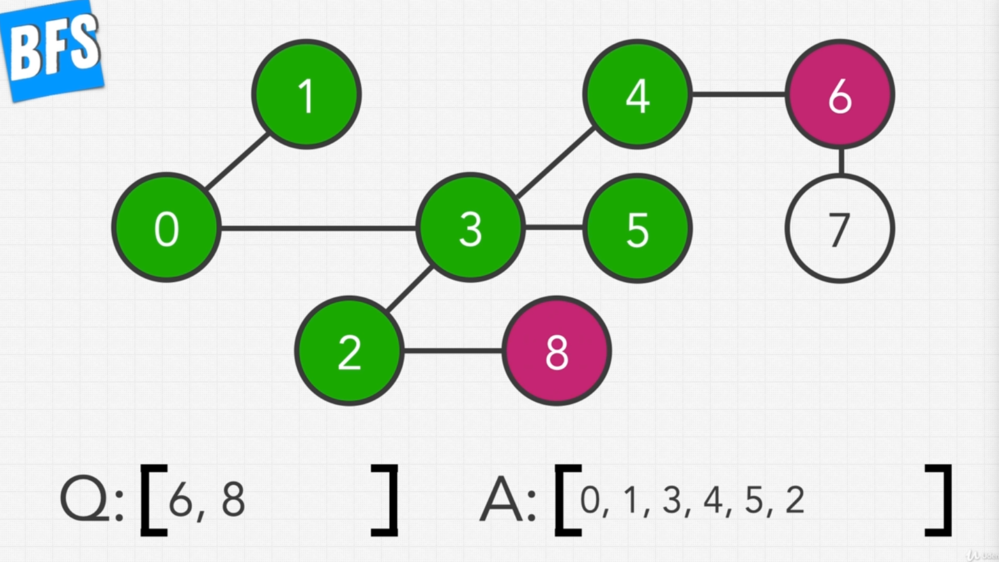
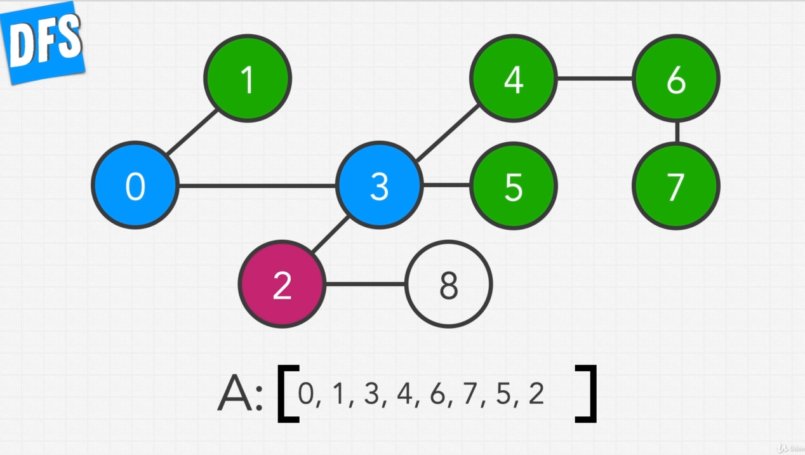

# Section 11 - Graphs

## Intro to Graphs - Representation & Traversal Algorithms

The complexity of **graphs** lies on the amount of variations of graphs that exist. We are going to learn some of the most important algorithms that are applied to the variations of graphs.

**Graphs** are basically collections of nodes, which are almost identical to the nodes we've used for binary trees, in which aech node has a value associated with it.

In a graph, each node can be connected with another node, and in graphs they are usually called **vertex**, or **vertices** for plural. The connection between nodes is called an **edge**:


**Vertices** can have multiple connection to multiple different nodes, and there's no limit to how many other nodes a vertix can be connected to.

**Vertices** can form a **cycle**: a way nodes can connect in which they form a circular connection, so that one can traverse from one node back to itself by passing through those connecting nodes.


Graphs that contain at least one cycle are called **cyclic**, while those with no cycles are called **acyclic**.

These types of graphs we've seen until now are called **undirected**: one can tranverse from one node to any of its connecting nodes in one direction and its opposite. This is because connections are not directed, the edges don't have a set direction which restricts movement from the connected node in that specific direction:


The case in which that indeed happens is in a **directed** graph, in which the direction that we can traverse is dictated by the direction that the edge permits (shown usually as an arrow in visual representations):


Another distinction that can be made for graphs is between **weighted** and **unweighted**. We have seen already all cases of unweighted ones; on the other hand, **weighted** graphs have **weights or costs** associated to their edges, and they usually represent the **"cost" of moving** along that edge.


**Remember**: any **undirected graph** can easily be transformed into a **directed graph** if we consider **all edges to allow movement in both directions.**

Another type of graph to take into account is **unconnected graphs:** these are graphs which have at least to groups of nodes that are not connected to each other by any of their nodes:


**Trees** and **2D-arrays** are very easily represented as graphs (trees are actually a special kind of graph).

In the case of 2D-arrays, a 2D-array can easily be visualized as a grid:

 => 

And each grid cell can easily be thought of as a vertex, which is connected to the other in the following way:


## Representing Our Graphs - Adjacency List and Adjacency Matrix

The two most common way of represnting our graps are the **adjacency list** and the **adjacency matrix**:

### Adjacency List

If I give each node an identifier, which is a numerical value starting from `0`, I can represent my graph as an array-shaped **adjacency list**, which has length that is equal to the amount of nodes in the graph, and every index points to the node that has that corresponding identifier:


The **value of each index** is going to be an **array** which will contain the **numerical identifier of any node** that is connected to the node represented by that index:


However, it's not always the case that we can use a numerical identifier starting with `0` to represent our nodes. What, for example, if we need to identify our nodes with **strings**?

In that case, we can **replace our use of an array with an object:**


**Adjacency list** allows for fast traversals, as we easily get the reference of a node's connection, and we can traverse down that connection in **O(1)** time, for both the array and the object variation.

### Adjacency Matrix

An **adjacency matrix** uses a 2D array or matrix. Each node is represented as the outer-array's indeces, and the inner array represents which nodes are connected to that specific node:


For example, when starting with node `0`, we see that it is connected only to `3`:


This means that in every position in the inner array, at the corresponding index, we are going to put a `0` if there is no connection, and a `1` if there is. That means that our inner array will be `[0, 0, 0, 1, 0, 0]`:


And we do exactly the same for the other nodes:


The **adjacency matrix** is a very dense data structure, in that it takes a lot of space to store: it will have a size of `N^2`, with `N` being the amount of nodes.

The size of an **adjaceny list** will vary in proportion top how many edges the graph has, but it ends to end up much smaller than the matrix representation.

## Breadth First Search in Graphs

To explain **BFS in graphs**, let's start with the following graph:


We most commonly start with the first node that shows up in our **adjacency list or matrix**, which in this case, is going to be the `0`.

Remember that in **BSF** we need to initialize two values:

- **queue**: for keeping pending nodes
- **answers (result) array**: which will hold all our values


The first step is **taking our first node and adding it to our queue:**


Once we have a value in our queue, we can start performing our traversal: so we take our `0` from the queue, push it into our `res` array, and add the node's neighbours to our queue:


The order in which those nodes are added to the queue follows the order in which they appear in the adjacency list.

So now, we move to our next value in our `queue`, the `1`. So we take it out of the queue, append it to `res`, and try to add its neighbours to the queue. However, we in this case, we notice that we have already explored the `0`, we don't want to go back to it:


So we simply don't add it.

Then we go to the next step: we take the `3`, push it into `res`, take `3`'s neighbours and push them into the `queue`, skipping the already-visited nodes:


Next step: we take the `4`, append it to `res`, take the node's neighbours (in this case, only `6`, since `3` is already visited) and append it to the `queue`:


Next step: we take the `5`, append it to `res`, try to take the nodes' neighbours, but we notice it only has `3` as neighbour, which has already been visited, so that's it:


Now we take `2`, append it to `res`, look for its non-visited neighbours (`8`), and append it to the queue:



We move on to `6`: append it to `res`, append its non-visited neighboures (`7`) to the queue:


Now we take `8`, append it to `res`, and have no non-visited nodes to attach to the queue:


Finally, we take `7`, append it to `res` and we have visited all nodes:


This is a very familiar pattern of traversal, since we have already done it with **trees** and **2D arrays**.

## Coding BFS

Let's first represent our graph as an **adjacency list**:

```py
  graph = [
    [1, 3],
    [0],
    [3, 8],
    [0, 2, 3, 5],
    [3, 6],
    [3],
    [4, 7],
    [6],
    [2]
  ]
```

Now let's think how to code out our **BFS**.

Here, in the context of our **BFS** we are going to receive the **adjacency list** that represents our entire graph. So when we define our traversal function, we are going to have the **adjacency list** as a parameter:

```py
  def traversalBFS(self, graph): # graph has the shape of our adj list
    # We first initialize our queue, with our initial value
    q = [0]
    # We also initialize our res array which will keep our values once processed
    res = []
    # We also need an object to keep track of the nodes that we have already
    # explored, so that we don't re-add them to the queue
    seen = {}

    # The while loop will drive our algorithm, with the usual condition of
    # looping while our queue has elements in it
    while len(q) > 0:
      # Pop the first value of the queue to begin processing it
      node = q.pop(0)
      # Add it to our res array
      res.append(node)
      # Track that we have already seen this node
      seen[node] = True

      # Get all nodes that are connected to our current node
      connections = graph[node]
      # Loop over each of them and add it to the queue if we haven't seen it before
      for n in connections:
        if n not in seen:
          q.append(n)
    
    # Return our res array
    return res
```

## Depth First Search in Graphs

**DFS in graphs** is conceptually the same as we know for **DFS** in trees.

First, we initialize our `res` array that will hold the values during our traversal:


In **DFS** we don't need a queue, because, as we know, our solution is mostly recursive.

We are going to start with `0`, just like we did with **BFS**:


And to start, we are going to scan and traverse through all of our current nodes neighbour vertices, and then we are going to search them using the same pattern recursively through completion.

So as we said, we start with `0` and add it to our `res` array:


We then take `0`'s first neighbouring value of `1` and add it to the `res` array:


After adding `1` to our `res` array, we try to explore it, but notice that it has no further neighbours other than `0`, which we have already explored. So that means we are finished with `1`.

So that means we can move to the next neighbour of our original node of `0`, which is `3`. We add that to our `res` array:


And now we take `3` neighbours: its first neighbour is `4`, so we add it to the array:


But now we explore this path all the way down to completion: we first add its first neighbour of `6`:


And then subsequently add `6`'s neighbour, which is `7` to the `res` array:


Since `7` has no neighbours to explore, we traverse back to `6`, then to `4` and back to `3`. From there we continue with `3`'s next neighbour which is `5`:


Since `5` has no further neighbours, we continue with `3`'s next neighbour, `2`. We add `2` to the `res` array:



And thus, we continue traversing to `2`'s only neighbour which is `8`, and add it to the array:


Since `8` is finished, has no further neighbours, we go back to `2`, whose neighbours have also been visited, then back to `3`, the same, and then finally back to `0`, which now has had all of its neighbours visited.

So that means that the **DFS** is done.

## Coding DFS