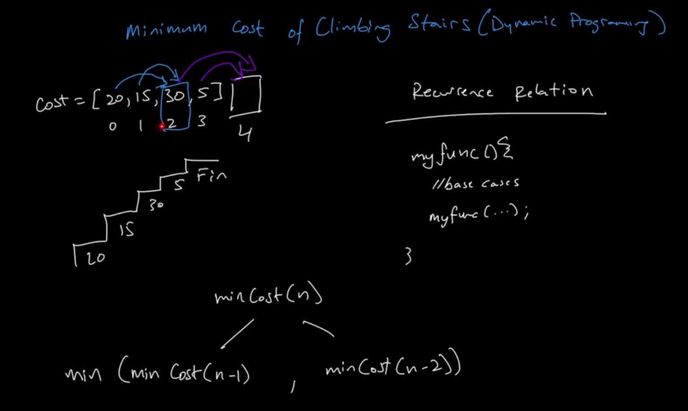
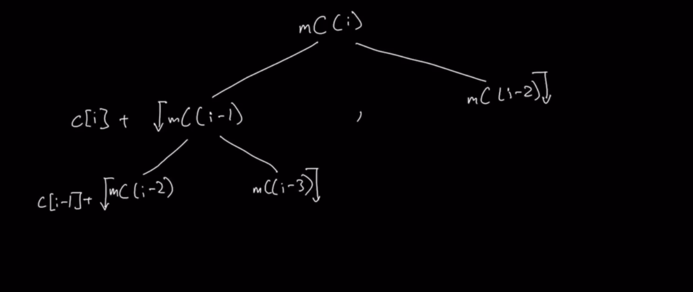
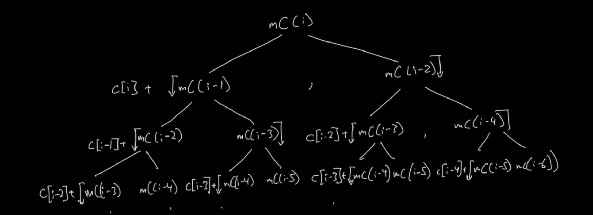
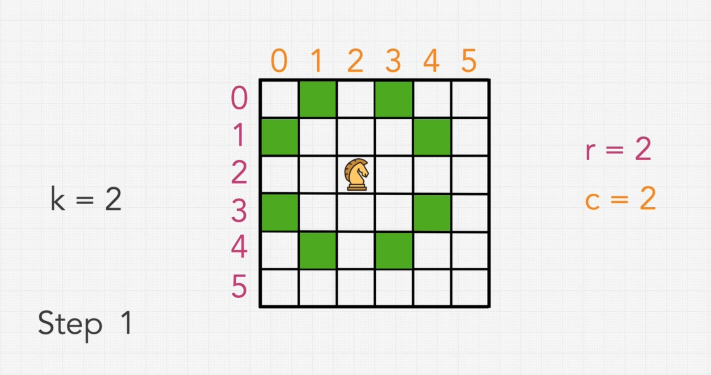
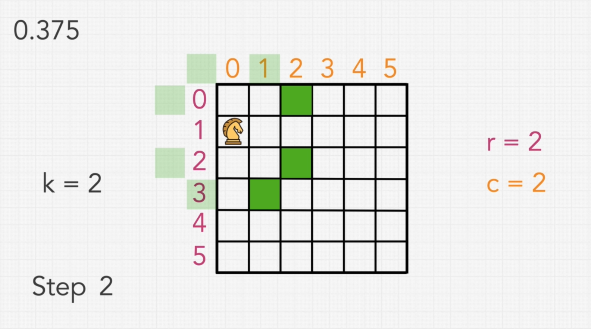
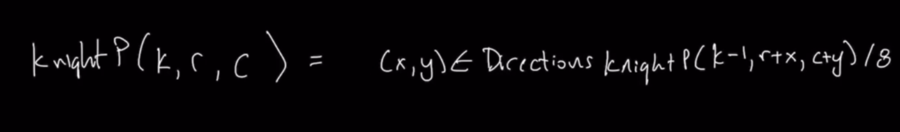

# Section 12 - Dynamic Programming

## Minimum Cost of Climbing Stairs (Easy)

## How to approach Dynamic Programming?

The key in dynamic programming is recognizing when the approach can help us come to a solution, as well as understanding the steps to complete a full dynamic programming solution. And there are many steps.

It is difficult to understand the steps without working in the context of a question, so let's start with a question:

```
For a given staircase, the i-th step is assigned a non-negative cost indicated by a cost array.

Once you pay the cost for a step, you can either climb one or two steps. Find the minimum cost to reach the top of the staircase.

Your first step can either be the first or second step.
```

From the first statement, we can deduce that the representation of the staircase can be done through an array. It will contain values that are **non-negative**, and correspond to the **cost of taking the step at that same index**.


While we have each of the steps represented in the array, we also have a `Fin` step, that stands for **finished**, which has no associated cost, and is the one we want to reach.

The number of steps we can take at each time is referenced in the second part of the question: once we pay the cost for taking a step, we can either climb one or two steps up.

We need to figure out the min cost to reach the top of the entire staircase, and the first step can be either the first or second step:


Knowing this, we want to keep track of the `cost` of taking steps.

Because in this example there are only three steps, there are a few variations that we need to keep track of in order to figure out the best solution. 

If we take the **first step** of `10` from here, we can on a subsequent step move up either to steps with cost of `15` or step with cost `30`:


The step with cost `15` is obviously smaller, so we take the it next, for a total cost of `25`:


From here, we can take one more step to the step with cost `30` or we can simply step up to `Fin`:


We obviously will prefer to step to `Fin`, so we step to it, and our final cost is `25`:


However, since the first step can be to the second step instead of the first, if we restart and step up straight to the second step, with weight of `15`, we first have a total cost of `15`:


And from there we will obviously prefer to step up to `Fin` with no associated cost, so our total cost will be `15`:


We can tell that this will be optimal solution in terms of what lowest cost path we can take to reach `Fin`. So `15` is what we should return for our solution.

Now that we understand what the question is asking us, let's break down how to solve it.

The first step is **recognizing that this is a dynamic programm problem**. Note, however, that not all problems that have dynamic programming as a potential solution require dynamic programming it to solve it; there can be alternative solution for them.

**Dynamic programming is a paradigm that can help you solve specific types of optimization questions or question that could lend themselves to some type of memoization to help solve it.**

Most of the time, though, around 95% of the time, **optimization questions that are min/max, based on calculating all available solutions and you picking the best one, those are going to be dynamic programming-based solutions.**

So remember, the question statement says: `Find the **minimum** cost to reach the top of the staircase.`

The moment you see minimum or maximum, you should realize that that is an optimization question. In this case, the statement implies there are multiple possible paths that we can take to climb the stairs, all with different cost values, and we want to figure out the one with the min cost.

What we know from **optimization questions** if that we need to generate **all possible paths** that we can take, and then picking the one with the min cost, as the only way of being 100% certain that that is the min value.

So let's now move to the actual **dynamic programming solution:**

One remark: **dynamic programming is very unique to other algorithmic paradigms.** There are multiple stages in a DP solution. At every stage, **you are indeed writing a viable solution**, meaning that it's able to accurately solve the problem. However, **every subsequent stage gets more optimized when it comes to space and time complexity**. So we are actually working through the stages trying to get to the most optimal solution. 

In order to understand how to begin at stage one, it is key to understand that the **DP approach has its bases on `recursion`.**

Let's remember the base for **recursion**:


Inside **DP** we will be trying to write our first solution as a recursive function. However, in order to identify what the **base cases** and what the **recursive calls** will be done, we need to **identify the `recurrence relation`**.

The **recurrence relation** is a formula that we need to derive, that gives us the basis of the recursive function that we are trying to write.

## Understanding and Identifying the Recurrence Relation

The recurrence relation is a formulta that helps us understand what the actual recursive function we're trying to write is going to be. 

A recursive function is a function that calls itself, and has base cases that determine when this self-calling nature has reached an end, because we want to take all of the values that we get back from these recursive functions and combine them together to create our final solution. 

What we want to frame this us is: we're trying to figure out what's the big problem that we're trying to solve. In our case, we're trying to solve what's the minimum cost it takes us to climb from start to end of the stairs. Of all of the traverse paths we can take, which one yields the minimum cost?

If we face this from a recurrence standpoint, what this means is: that this **fourth step** (the `Fin` step), is the place that I finally want to get to, just right outside of our `costs` array:


**Is there a way that we can redefine this problem as a repeated problem that we can combine together in order to get a final answer?**

We know that in order to reach the step, we can come to `Fin` from either the last step, or the second to last step, since those are the two permitted movements, `1` or `2` steps:


Let's redefine the minimum cost of getting to step **N**, with **N** being the `Fin` step, and also being the `length of the array`.

The cost of getting to `minCost(N)` is equal to the minimum cost of **step 2** and **step 3**. because we know that if we reach **step 2**, then whatever the minimum cost it took to reach there will give us the answer if we just take a step into `Fin` (which has no associated cost). And the same from **step 3**: if we have reached it, then we can just take a single no-cost step to `Fin`, and the final answer will be the cost it took us to take to **step 3**:


However, once we have those two values, **do we want both? No, we want the lesser of those two values.** So we take the **min**, the lesser of those two values:


And then we can take this a step further: what is the cost of reaching **step 2**? It's the minimum cost of getting to **step 2**, from either **step 0** or from **step 1**, since those are the only two steps that can reach there:



So we can update that in our tree, like so:


If we look at the cost of `minCost(N - 1)`, it's the same thing: if we're trying to find how to reach **step 3**, we can only reach it from **step 1** or from **step 2**:


And thus, we can also define it in our tree, as the minimum between the min cost of **N - 2** and the min cost of **N - 3**:


Once thing we should not, that **is different between the step to N and the steps to all other steps that are not N** is that all other steps **include the cost of the steps themselves**. In comparison, the step to **N** does not have a cost associated to it. So you can visualize it as if `steps[N] == 0`:


And we can update our tree, saying that our second layer should be added the `steps[N]`:


And in the third layer, the left branch should be added the `steps[N - 1]` and the right branch should be added the `steps[N - 2]`:


So a **pattern is emerging:** notice that **we are starting from the very end value**; we want to visualize the question as overarching from the final step that we want to reach. This is the **top-down approach**.

This **top-down approach** helps us figuring out how this **top-down recursion pyramid will look like**. So we need to define a problem that **gets repeatedly called into some kind of subsequent smaller subproblem**. And the solution to those is what we will use to build up the answer to our main problem.

This problem gets repeated at every level: it's the exact same formula, but with the arguments changing. But what we care is that we are determining the **recurrence relation**.

We see that we are determining the relationship between the function call, given its arguments, and its internal subsequent recursive function calls, and the arguments that they receive. That's the **relationship that we have to discover and define**.

In this case we see that for each function call we have:

1. two subsequent function calls
2. each subsequent function call is called with the function argument of `N` substracted by `1` and substracted by `2`
3. after getting those two values, we caclulate the `min` of the two and we `add` up the cost associated at the value that we are checking for.

This relation is the formula that we are trying to derive.

If we want to think about how far down the tree we can go, we can take the value and carry it down intil `N = 0`:


That's the very last step that we can be on (the first in the staircase), and this is the bottoming out of our recurrence relationship.

Now, we want to **redefine the tree we have built into a generic formula that gives us an idea of what this definition is for any given step**.

So, for any index value that we receive inside of the `steps` array, we want to get the definition of what that would look like as a recursive function.  So we can say:

```py
minCost[i] = steps[i] + min(minCost[i - 1], minCost[i - 2])
```

This is our **recurrence relation formula**, which applies for all steps in our problem. And from it we can now build our actual **recursive function**.

So building this tree, out of which we can define our recurrence relation formula is the hardest part: in our case, it took us understanding that at each step you could have only reached the current step from two other paths. And that that same problem gets repeated all the way to the final step. And that along the way, as we traversed up, we've been accumulating the lowest possible cost, so that when get there, we're just choosing the lesser of the two.

And that gives us the solution to the final problem.

The last thing to do is **think about our base cases:** they are going to essentially depend on the arguments that come into our recursive function. 

In our formula above, we defined that the argument that we will receive is `i`, the index of the step we're on. So what are the different conditions that we can get for `i` that might change what the calculation ends up being? 

```py
minCost[i] = steps[i] + min(minCost[i - 1], minCost[i - 2])
```

The calculation above works for every `i` value, except for **a couple of instances**:

We can end up calling the index at `0`, the index at `1` and possibly the index below `0`.  That will happen for example, when we evaluate the function above at index `0`, so `minCost[0]`.

Let's see what can happen at each:

- **i < 0**: return `0`. Because if `i` is less than `0`, there should be no impact on the `minCost`, as there are no values there, the `steps` array is not even defined for those values of `i`.
- **i == 0**: return `cost[0]`. Because the `minCost` to reach the first step is `0`, because there are no previous steps that could be taken to reach this first step, which would make us pay a cost.
- **i == 1**: return `cost[1]`. Because, if you are at `step[1]`, there's only two position you could have come from: from step[0] or from the start, where there's no value associated to it. Since we know all of the values in the array are non-negative, that means that there's no possible way that starting from `step[0]` is going to have this value be lower than starting from nothing. There's no possible value lesser than nothing. We can just assume we started from nothing, or the beggining.


## First Step - Recursive Solution from Recurrence Relation

Let's utilize our recursive relation formula to first get to our brute force solution, with no memoization.

We first want to call our minCost function defined above on whatever is the variable **N**, with **N** being the length of the entire array.

```py
class Solution:
    def minCostClimbingStairs(self, cost: List[int]) -> int:
      # First we will create that N variable, defined as the length of our cost array
      n = len(cost)
      # Return our final solution here. Since we don't have a cost associated with N
      # we will start our recurrence evaluating the costs of N - 1 and N - 2.
      return min(self.minCost(n - 1, cost), self.minCost(n - 2, cost))

    # Define the recursive function
    def minCost(self, i, cost):
      # Define the base cases
      if i < 0:
        return 0
      if i < 2:
        return cost[i]
      
      # Otherwise return the recursive formula
      return cost[i] + min(self.minCost(i - 1, cost), self.minCost(i - 2, cost))
```

While this solution is techincally correct, it is very unoptimal. 

If we take a look at the **time complexity** we see that: in our main function, we start with two recursive calls. Then, the definition of the recursive function calls itself twice, which will continue calling itself twice until the base cases are reached. This means **it doubles for every single value of N**, which is equivalent to **O(2 ** N)**, which is a horrendous time complexity.

The **space complexity is also 2 ** N**, as there are 2 ** N values on the call stack waiting to be resolved.

## Second Step - Memoizing our Redundant Recursive Calls

To understand now what we should **memoize** to get our space and time complexity down, we should **draw out our state tree**.

Let's use `i` and keep going until we see a pattern. We'll use `c` for `cost` and `mC` for `minCost`. Our initial call is `mC[i]`. From there, we branch off to two recursive calls: `mC[i - 1]` and `mC[i - 2]`:


We know that we want the `min` of those two, so we draw arrow beside them, representing that it's the min between those:


And we want the `c[i]` added to the `min` between those two:


Now we branch out in the same way from the branch on the left:



The same with the right:


And we continue:


And more:



All of these will keep going downwards until we reach our **base cases**, in which `i == 0` or `i == 1`:


Here we can already notice that we are calculating many value **over and over again**. 

For example, see how many times we calculate `mC(i - 3)`:


It happens that we recalculate the same values in many different branches of the tree. For example, also, `mC[i - 4]`:


So we want to **memoize these values**, so that if we calculate a branch once, and that function gets called again, we already have the solution calculated, and can just return that. 

so, looking at our current solution, we see that **we need to initialize some type of data structure that will hold the cost at a certain index**. 

Two main things to now here.

1. **the data structure to use in memoization should match the one we receive as an argument.** In this case, `cost` is an array, so it should also be an array. So we should initialize an empty array.
2. **it should start as an empty array** that gets filled up as we calculate the cases that have reached the base cases.

## Coding our Memoization Optimization

```py
class Solution:
    def minCostClimbingStairs(self, cost: List[int]) -> int:
      # First we will create that N variable, defined as the length of our cost array
      n = len(cost)
      # Create our cache to store our precalculted values --- NEW
      cache = [False for i in range(n)]
      # Return our final solution here. Since we don't have a cost associated with N
      # we will start our recurrence evaluating the costs of N - 1 and N - 2.
      return min(self.minCost(n - 1, cost, cache), self.minCost(n - 2, cost, cache))

    # Define the recursive function
    def minCost(self, i, cost, cache):
      # Define the base cases
      if i < 0:
        return 0
      if i < 2:
        return cost[i]
      if cache[i]:
        return cache[i]
      
      # Otherwise caclulate the recursive formula, record it in the cache and return it 
      costAtLevel = cost[i] + min(self.minCost(i - 1, cost, cache), self.minCost(i - 2, cost, cache))
      cache[i] = costAtLevel
      return costAtLevel
```

**How does this impact our space time complexity?**

Since with the **memoization** improvement we get to reduce th recalculation of all our branches, we essentialy just calculate everything from `i` all the way down to `0`, **just one time.**

This means that our time complexity goes down to **O(N)**, where **N** is the size of our array.

**Space complexity** also goes down to **O(N)**, because our recursion stack will only grow to the size of **N**, as well as our **cache**.

## TODO TO-DO: Finish videos 7, 8, 9 that explain "bottom up" approach


# Knight Probability in Chessboard (Medium)

The following question is more complex, and **is not an optimization question**, as there is no minimum or maximum value that we're looking for.

Instead, we going to explore all the possible options and combining them together. So the only difference, is that instead of picking the right answer after you've generated all of the possible solutions, we have to generate all of the available solutions and just combine them together.

The process of thinking about how to optimize the generation of all of these possible solutions is the exact same, which is how you recognize that it's a dynamic programming question.

This question also has a much more complex data structure, but the DP approach also works for it.

Let's take a look at the question:

```
On a given NxN chessboard, a knight piece will start at the r-th row and c-th column. The knight will attempt to make k moves.

A knight can move in 8 possible ways. Each move will choose one of these 8 at random. The knight continues moving until it finishes k moves or it moves off the chessboard. Return the probability that the knight is on the chessboard after it finishes moving.
```

Let's break that down.

We know that we will get the **N** value, which tells us how many **rows** and **columns** exist within our chessboard.

So if we get `N = 6`, we'll get a `6x6` chessboard (notice that we are still 0-indexing):


We also get an `r` value that gives us the starting row, and a `c` for the starting column. Also a `k` value for the movements that the knight will make:


Also, we know that the knight can move in 8 possible ways at random. Let' see how they look like:


Next, we know that the knight will move until it finishes the `k` moves. **But** if the knight moves out of the board **before reacking the `k` moves, it will immediately stop moving**.

Let's break this down, starting from **Step 1**:



From the graph above, we can see that no matter how the knight moves, there `0% probability` that the knight will move off the board. So we need to explore what all the subsequent steps could be, basing the knight from all its possible new positions:

So let's examine the **first** new possible position for **Step 2**:


From here, there are `3` possible steps that it can take, where **it won't move off the chessboard**, and `5` where it will. So this means there is a `3 / 8`, or `0.375` chance that it will stay on the chessboard on **step 2**:



However, that just one possible path, out of `8` that can be taken in **Step 1**.

So let's analyze the others. Let's keep the `0.375` probability, and mark the first position as visited painting it blue.


Now, taking the the **second** possible position for **Step 2**, we see that there are three possible positions it could move to remain in and `5` out. So the probability is the same: `0.375`:


And we go back to **Step 1**:


And off to the next possible position for **Step 2**. Here we see that the probability of staying inside is `0.5`:


Back to **Step 1**:


And next possible for **Step 2**. Here, we also have a probability of `0.5`:


Back to **Step 1**:


And next possible for **Step 2**. Here, we also have a probability of `0.5`:


Back to **Step 1**:


And next possible for **Step 2**. Here, we also have a probability of `0.5`:


Back to **Step 1**:


And next possible for **Step 2**. Here, we also have a probability of `0.5`:


Back to **Step 1**:


And next to the **last** possible for **Step 2**. From here, we gave `6` possible positions that would leave the knight inside the chessboard. So the probability is `6/8` or `0.75`:


And we come back and we have finished moving through all the possible steps from this starting point and for each probable path we have generated a probability of staying within the chessboard, after walking through `K` steps:


So now we need to combine all these values together to give us an overall probability of randomly picking any of these possible steps that we could take from this knight every single time and tells us what the probability value is that we stay in the chessboard, regardless of the path that we take.

So what we want to do is think about each of these possible paths: **what is the probability will walk in any of those paths?**

They are **actually all even** , they have an `1/8` chance each, as we can uniformly pick any movement at random:


So we can divide them all by `8` and sum them all up, **basically taking out their average**:


For a total of `0.53125`.

Here we have the additional complexity that those probability can only be taken if the knight stays in the chessboard, and every step that it takes is `1/8`.

Now that we understand what the question is asking us, let's go through our **dynamic programming process**.

### Step 1: Verify the Constraints

**How many decimals do we round to?**

Don't round, leave the answer as is.

### Step 1: Write out some Test Cases

Note: for this problem it is really hard to calculate a test case, because of the math needed, so this problem should come with included test cases.

Let's take the first one:


Also, what happens if we have an empty board, where `N = 0`? Then the other values don't really matter, the probability is always going to be `0`:


If we have `N = 2`, no matter the starting position, our knight will always land outside of our chessboard in the first position, so the probability will always be `0`:


If we have `N = 2`, no matter the starting position, but we have `K = 0`, so the knight doesn't have to do any movements, the probabilty that the knight will stay inside the board is `1`:


## Identifying the Recurrence Relation

Let's use our first test case to find out our **recurrence relation**:


The first step to addres is **how to realize that this is a dynamic programming question**. Our last question involved finding out all the possible solutions and picking the one with the minimum value. Here there's no min or max to choose. 

Instead, the reason it's still **dynamic programming** is because **DP** still optimizes the process of generating all the possible solutions that exist. 

We're looking for the overall probability of the knight staying on the chess board after making `k` moves. As we can see above, there is one of eight directions that we can take, and they are uniformly selected (equal path of taking each path). And the knight can take extremly numerous paths, after which we have to combine all of their results into one overall probability that is the answer to the question.

The fact that **we need to generate all these paths and their solutions should tell you that dynamic programming will probably help you.** The main thing to see here is **whether or not there is an overlap in the paths that we can take**.

The best way to do this is to **run through a simulation and try to force the knight to take an overlapping path along its way of taking different unique paths.**

Let's first imagine our knight first moves to `(0, 1)`:


And from there, the knight can move to the following three squares:


If our knight was to move **back to the start**, then we would already have an **overlapping path**, because from there our **step 3** could be back into `(0, 1)`.

So from here you can tell that there's going to be "wasted" calculations for some steps that we will make. And here we can see that **DP will help us out**.

The second step is **breaking down the recurrence relation**, to first code our brute force solution to this problem.

So, can we break our problem into smaller but repeated subproblems? And each of our subproblems should look like a reflection of our main problem.

The easiest way to think about that is to define some type of function that represents a recursive function. So we're going to call it `knightProbability` or `knightP` for short. Our arguments will have a relationship between the arguments that we get into our recursive function, and the ones we pass into our subsequent recursive calls.

First, we know that our `N` value will be static, at no point will the size of the chessboard change. So we are not going to use it as an argument to be passed down to our recursive calls, since it won't be ever modified.

Also, given our other arguments, `k`, `r` and `c`, we know that our knight has a certain probability of staying on the board based on where it is currently positioned. (If the current position is `(2, 2)`, the probability of staying inside with the next move is **100%**. However, if the current position is `(0, 1)`, that probability drops to `0.375`).

So already we can notice that the `r` and `c` values **have an impact in the probability**, which is the main thing we're trying to calculate. The `r` and `c` values will change on the subsequent recursive calls, but they will also be based on their current values. This tells us automatically that `r` and `c` are definitely arguments taht we want to consider.


Next thing to think about is `k`, the number of steps. As we've seen, `k` can completely affect the probabilty result. For example, if `k` is `0` and we're inside the board, then we're guaranteed that the probability will be `1` (it can't move outside of the board). If `k` is not `0`, we cannot guaarantee that the probability will be `1`. So by default we have to consider `k` as having an impact in the calculated probability. **It is definitely an argument in our recursive call.**


We know also that for each recursive call, `k` will be reduced by `1`, because it means one step has been consumed.

Let's think now about **the actual logic that we need to define for our probability function**: what our logic represents, for our internal recursive function call inside of our original function call, is us **taking a step from our initial position**.

Our position is represented by our `k, r and c` values that we pass into the function. The step that we take is represented by the actual internal recursive function call that we make. 

So how do we represent them based on these arguments?

The **position**, of course, is going to modify based on our current `r` and `c` values. So we need to represent what our directional changes can be, and we can do that with an `array` of `movements`, which will have `8` possible movements:

```py
movements = [
  [-2, -1],
  [-2, 1],
  [-1, 2],
  [1, 2],
  [2, 1],
  [2, -1],
  [1, -2],
  [-1, -2]
]
```

Now let's think about our recursive function call: how many recursive function calls do we have to make that represent the steps we have to take? We have to make **as many recursive function calls as there are number of steps in our movements array, which is `8`.** 

So we can represent, for each movement in `movements` and `x` and `y` that represent that variation in that coordinate:


```
knightP(k, r, c) = (x, y) e movements
```

Once we have this, were going to, for each value of `x` and `y`, is recursively call `knightP`, with `k` modified to `k - 1` (because we have effectively taken one step), and `r` and `c` with its modifications for each of the movements:


```
knightP(k, r, c) = (x, y) e movements knightsP(k - 1, r + x, c + y)
```

This is all we need to do for one step - in all directions. But it still only one of eight possible directions, so regardless of what happens, we know we have to dived the answer by eight. 



```
knightP(k, r, c) = (x, y) e movements knightsP(k - 1, r + x, c + y) / 8
```

Let's think also of the different conditions that this could exist in, because we don't do this calculation if there are no steps left to take. That means this formula is entirely dependent on our `k` value.

We'll represent this with `sigma`:


`Sigma` represents the range of values for the given variable, in our case `k`. So for all the possible values of `k`, the ones that are significant to us are if `k = 0` and if `k > 0`: in those cases we want to run this calculation.

We want to recursively call and figure out what the steps could be that our knight can take and then take them. If `k = 0` though, and as long as we are on the chessboard, then this means that we return `1`, because it's guaranteed we'll stay on the board. If not, if we are still in the board, and `k < 0`, we are going to perform our recursive call.

We have to set our boundaries to know when we are on the chessboard, and when we are out:

```
0 <= r < N and 0 <= c < N
```

As long as the above conditions are true, the function representation set above is applied.

However, if we are off the chessboard:

```
r < 0 or r >= N or c < 0 or c >= N
```

If any of these conditions above are true, then no matter what you call, our **recursive function of knightP(...) will return 0**, because now we are outside of the board, and we don't want to make any more steps. 


And this is how the **recursive relation formula looks like**.


## First Step - Recursive Solution from Recurrence Relation

Let's code our recursive solution, with no memoization yet:

```py
movements = [[-2, -1], [-2, 1], [-1, 2], [1, 2], [2, 1], [2, -1], [1, -2], [-1, -2]]
class Solution:
  def knightProbability(self, n: int, k: int, row: int, column: int) -> float:
    # First, we make sure that we are within the boundaries of our board
    # Otherwise we just return 0 for the probability
    if row < 0 or row >= n or column < 0 or column >= n:
      return 0
    # Then we check if we have done all our steps. Since we are, at this point,
    # inside the checkboard, we can safely return 1 as probability
    if k == 0:
      return 1

    # Since we need to accumulate the probability that we're in the board for every
    # direction that we make, we need a variable where we can hold that
    res = 0

    # Now we loop through every direction
    for x, y in movements:
      # And we accumulate in res the recursive probability, stepping down k for each step
      # and also modifying the position of our knight as needed. Since it's 8 different
      # movements, we need to divide by 8
      res += self.knightProbability(n, k - 1, row + x, col + y) / 8

    return res
```

This is all the code we need, minus the needed **memoization**.

Now let's think about the **time and space complexity**. 

The crux of our performance will get bottlednecked inside of our for-loop. We are looping over 8 different directions, so we are performing 8 different recursive calls. We are going to perform `k` levels of these recursive calls, expanding by eight directions on each step. 

That means our performance **time complexity** is **O(8 ** k)**, which is huge.

As for our **space complexity**, the stack is equally going to be the size of our space complexity of **O(8 ** k)**.

## Second Step - Memoizing our Redundant Recursive Calls

First of all, we need to separate our solution into a `knightProbabilityRecursive`, because we need to initialize our `dp` cache somewhere and pass it down to the recursive call.

It is crucial to notice here that **the crux of the calculation is going to be dependent on `k`, `r` and `c`**.  However, how do we store that in a board state?

If we think about it in our recurrence calls from our initial level, let's say we step in for the first time: when `k = 3`, `r = 2` and `c = 2`. In this case: how many positions can our knight be in when `k = 3`? There's **only one, because our knight can only be at `(2, 2)`, as it still hasn't taken any steps yet.**

So, for anything at `k = 3`, our knight can only be in one position in the board state.

What about when `k = 2`? How many places can our knight be on the board? There could only be **8 places where it could be**, because the places that it could be at our first stp down into our `k` recursive calls **is equal to the previous number of steps that we could have made from all of the positions that were available.** In our example, there was only one, the starting position. Therefore, when `k = 2`, there are only eight possible spaces we could be in our board.

What about when `k = 1`? Here, we have to consider that from the previous `k = 2` there are eight positions. From those 8 positions, we could walk on any number of cells. If the board was bigger, this step could land on any cell that parted from any of those 8 positions. What we are thinking about, though, is **if there are any overlaps in these steps that we took from all the possibilites of every single one of these steps**. That is, is there any overlapping spots we stepped on.

From any of the following spots, marked in purple:


Are there any overlapping steps there? What we know is that if there is an overlapping step, from that step the probability of the remainder of the path we explore would be the exact same. It doesn't matter from where you come from to reach a spot. **As long as you reach there at the same `k` value**, the remaining paths that you explore are going to overlap.

And that is what we are going to store in our `dp`. We need to use our `k` value to determine the "version" of the grid that we're going to store. And on that grid, we're just building out those probabilities that we land on that square. And then from those remaining paths, whatever the probability is from that square for that `k` value is what we are going to store.

If we end up back at that spot in a later iteration and a later path, and the `k` values is the exact same, we know that we can trust the probability that stored there will end up being the exact same that we need to return back to that path. 

```py
movements = [[-2, -1], [-2, 1], [-1, 2], [1, 2], [2, 1], [2, -1], [1, -2], [-1, -2]]
class Solution:
  def knightProbability(self, n: int, k: int, row: int, column: int) -> float:
    # Create our dp three dimensional array: first dimension for K, second for rows, and third for columns
    dp = [[[False for c in range(n)] for r in range(n)] for _ in range(k + 1)]
    # Call our recursive function
    return self.knightProbabilityRecursive(n, k, row, column, dp)

  def knightProbabilityRecursive(self, n, k, row, column, dp):
    # First, we make sure that we are within the boundaries of our board
    # Otherwise we just return 0 for the probability
    if row < 0 or row >= n or column < 0 or column >= n:
      return 0
    # Then we check if we have done all our steps. Since we are, at this point,
    # inside the checkboard, we can safely return 1 as probability
    if k == 0:
      return 1

    if dp[k][row][column]:
      return dp[k][row][column]

    # Since we need to accumulate the probability that we're in the board for every
    # direction that we make, we need a variable where we can hold that
    res = 0

    # Now we loop through every direction
    for x, y in movements:
      # And we accumulate in res the recursive probability, stepping down k for each step
      # and also modifying the position of our knight as needed. Since it's 8 different
      # movements, we need to divide by 8
      res += self.knightProbabilityRecursive(n, k - 1, row + x, column + y, dp) / 8.0
    
    dp[k][row][column] = res

    return res
```

The main thing to realize here is that **we needed to initializa an array of 2D arrays. The array is going to hold the 2D array state at every given step of `k`.**

So we're saying that we're building when `k` is at is maximum step, but in order to figure out the probability of all of the different posititions the knight is, which is only the start position when `k = 3`, we need to calculate the probability of the other steps at `k = 2`. 

From `k = 2`, we have to figure out what are the probabilities of those steps by combining them with all of the probability of `k = 1`, of all of the differest steps that we could have reached when `k = 2`.

Once we go top-down, we figure out all those probabilities, we come back up, we add all those values together, we make sure not to duplicate any of our calculations by using `dp`.

The main thing to realize here is that **the crux of the calculation is dependent on `k`: it is what dictates that there are overlapping steps, because if you fall in the same palce on the board, but your `k` value is different, you can't guarantee that the probability is going to be the same**. Because, for example, if we have five remaining steps from a cell block, but only one step remaining from same cell, the probability of still being on the chessboard after those respective steps is vastly different.

### Time and Space Complexity

We are iterating over `k` different steps. At every step, how many recursive steps can we make? How many values can we fill for that given step? In the worst-case, when we have lots of case, we can imagine we propagate a bunch of steps down and we end up filling every single value in the 2D grid because every value might be able to be reached. If that's the case, then there are **N^2** different values we can fill for that grid. At the same time, we need to multiply it by `k`, because every single step down is represented by a brand new grid. 

So **time complexity is O(N^2 * k)**

As for **space complexity** it will also be **O(N^2 * k)**, because that's the size of our **dp**. It is of size `k`, and then inside of each `k` level there is a grid of **N^2**. 