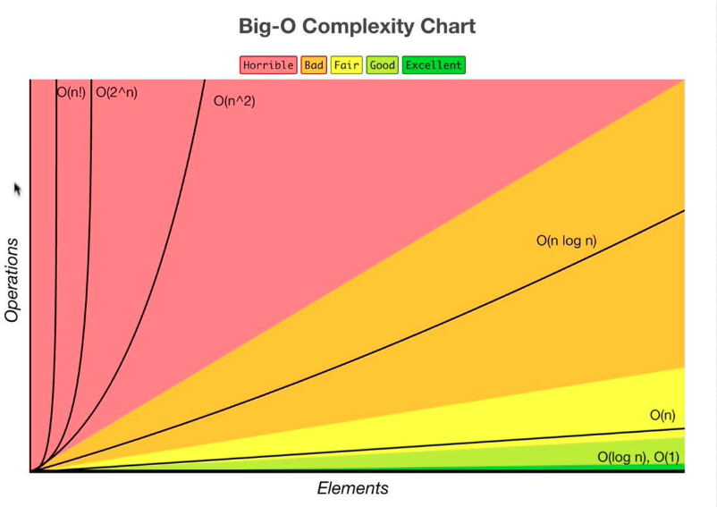

# Section 2 - Big O

## What is good code?

Good code is:

1. Readable: is it clean? Can others understand your code?
1. Scalable: can your code scale? Big O allows you to measure this.

Let's take for example a simple find algorithm.

```ts
const findNemo = (arr: string[]) => {
  for(let i = 0; i < arr.length; i++) {
    if(arr[i] === 'nemo') {
      console.log('Found nemo');
    }
  }
};

findNemo(['a', 'nemo'])
```

The **runtime** is how long it tkes to run a certain problem through a function or a task. How can we measure the efficiency or the Big O of this code?

What happens when the input gets larger and larger?

## Big O and Scalability

Let's measure the performance of this algorithm, by using JS `performance`:

```ts
const findNemo = (arr: string[]) => {
  const t0 = performance.now();
  for(let i = 0; i < arr.length; i++) {
    if(arr[i] === 'nemo') {
      console.log('Found nemo');
    }
  }
  const t1 = performance.now();
  console.log(`Algorithm took ${t1 - t0} miliseconds`);
};

findNemo(['a', 'nemo'])
```
```
Algorithm took 0.30000001192092896 miliseconds
```
How an we make sure that we measure the efficiency of code, when how long an algorithm takes to run depends on factors like CPU speed, how many other programs are running in the computer, etc?

Big O notation is the language we use for describing how long an algorithm takes to run. We can compare to algorithms using Big O and say which one is better (faster and more scalable) regardless of our computer differences.

Let's take a look at the Big-O complexity chart:



When we talk about Big 0 and scalibility of code what we mean is: when our input size grows bigger and bigger, how much does the algorithm slow down (take longer to solve the problem)? If the input size increases, how many more operations do we have to do?

This is what we call **algorithmic efficiency** and Big 0 allows us to explain these concepts.