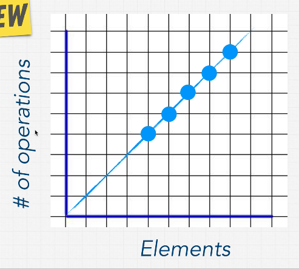
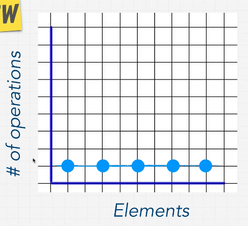
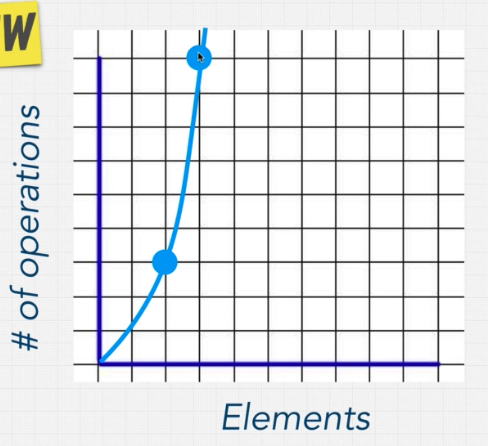
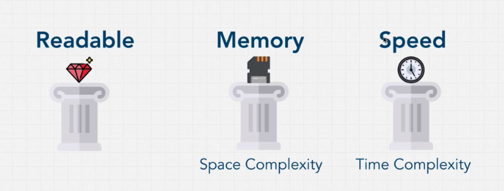

# Section 3 - Big O

## What is good code?

Good code is:

1. Readable: is it clean? Can others understand your code?
1. Scalable: can your code scale? Big O allows you to measure this.

Let's take for example a simple find algorithm.

```ts
const findNemo = (arr: string[]) => {
  for(let i = 0; i < arr.length; i++) {
    if(arr[i] === 'nemo') {
      console.log('Found nemo');
    }
  }
};

findNemo(['a', 'nemo'])
```

The **runtime** is how long it tkes to run a certain problem through a function or a task. How can we measure the efficiency or the Big O of this code?

What happens when the input gets larger and larger?

## Big O and Scalability

Let's measure the performance of this algorithm, by using JS `performance`:

```ts
const findNemo = (arr: string[]) => {
  const t0 = performance.now();
  for(let i = 0; i < arr.length; i++) {
    if(arr[i] === 'nemo') {
      console.log('Found nemo');
    }
  }
  const t1 = performance.now();
  console.log(`Algorithm took ${t1 - t0} miliseconds`);
};

findNemo(['a', 'nemo'])
```
```
Algorithm took 0.30000001192092896 miliseconds
```
How an we make sure that we measure the efficiency of code, when how long an algorithm takes to run depends on factors like CPU speed, how many other programs are running in the computer, etc?

Big O notation is the language we use for describing how long an algorithm takes to run. We can compare to algorithms using Big O and say which one is better (faster and more scalable) regardless of our computer differences.

Let's take a look at the Big-O complexity chart:


When we talk about Big 0 and scalibility of code what we mean is: when our input size grows bigger and bigger, how much does the algorithm slow down (take longer to solve the problem)? If the input size increases, how many more operations do we have to do?

This is what we call **algorithmic efficiency** and Big 0 allows us to explain these concepts.

## O(n) or Linear Time

If we take a look at the `findNemo` function:

```ts
const findNemo = (arr: string[]) => {
  for(let i = 0; i < arr.length; i++) {
    if(arr[i] === 'nemo') {
    }
  }
  const t1 = performance.now();
};
```

we can see that for each element in the input we'll have one operation performed by the computer (the algorithms does an equality check for each element). We can graph it so:



And we can see that as the number of elements in the input raises linearly, also the number of operations performed raises linearly. This is **Linear Time**, or **O(n)**.

## O(1) or Constant Time

For certain algorithms, no matter how large the iinput, the time complexity is always constant, and independent from the input size. This is what we call **Constant Time** or **O(1)**.

In a graph, it would look like so:



## Big O Rules

### Rule 1: Worst Case

When calculating time complexity, we only take account the **Worst Case**, that is, the maximum amount of time that a function might take for a given input.

### Rule 2: Remove Constants

Drop constants, as they do not affect the degree of our N input. For example:

- O(2N) --> O(n)

- O(50 + 4N) --> O(n)

- O(n/2 + 10) --> O(n)

- O(n^2/2000 + 10) --> O(n^2)

### Rule 3: Different Terms for Inputs

Consider the following function. Is this still **O(n)**?

```ts
const twoLoops = (n: number[], m: number[]) => {
  for (let i = 0; i < n.length; i++) {
    console.log(i)
  };
  for (let j = 0; j < n.length; j++) {
    console.log(j)
  }
}
```

The answer is: **no**. This algorithm loops over two different inputs, that have different size.

So the time complexity here is **O(n + m)**.

However, if the inputs were used in the following way:

```ts
const twoLoops = (n: number[], m: number[]) => {
  for (let i = 0; i < n.length; i++) {
    for (let j = 0; j < m.length; j++) {
      console.log(i)
      console.log(j)
    }
  };
}
```

The time complexity here would be **O(n * m)**.

### Rule 4: Drop Non-Dominant Terms

If we have a function with time complexity **O(n + n^2)**, we actually don't care about the non-dominant term, which in this case is **n**, and we simplify to the the dominant term, in this case **n^2**.

So:

- O(n^2 + 3n + 5) --> O(n^2)

## O(n^2)

In this case, the time complexity increases **quadratically** with respect to the input size.



Many interview question attempt to take a problem that is usually resolved in this time complexity (fairly bad) and take it to something lower, like **O(n log n)** or **O(n)**.

## What does this all mean?

If we take a look at certain methods provided by languages, for example, Javascript Array methods, suchs as **pop, push, shift, unshift**, they have a time complexity code attached to them. But understanding this will help us with the decision of why use one data structure instead of another to solve a specific problem.

- What is the right **data structure** to solve this problem?
- What is the right **algorithm** to solve this problem?

Being able to answer correctly these questions is what big companies with lots of scale are looking for.

## O(n!)

In this case, the time complexity increases **exponentially** with respect to the input size.

This is the equivalent to adding a **for loop** for every element in our input.

## 3 Pillars of Programming

Our previous definition for "good code" was:

1. Readable: is it clean? Can others understand your code?
2. Scalable

However, we can actually drill-down on what scalable means:

1. Readable: is it clean? Can others understand your code?
2. Scalable:
   1. Speed: how fast is our runtime? how much time does our function take to run?
   2. Memory: computers have a limited memory and we need to consider how much of it our program uses

So our **3 Pillars of Programming** turn out to be:



Most programming code solutions are a trade-off of memory and speed. If we want more, speed we'd have to sacrifice memory, and vice-versa.

## Space Complexity
When a program executes: it has two ways of remembering things:

**1. the heap**: where we store variables we assign variables to.
**2. the stack**: where the invokations of our function calls is kept track of.

Sometimes we wnat to optimize for using less memory instead of using less time.

The space complexity of an algorithm or a computer program is the amount of memory space required to solve an instance of the computational problem as a function of characteristics of the input. It is the memory required by an algorithm until it executes completely.[1]

Similar to time complexity, space complexity is often expressed asymptotically in big O notation, such as O(n), O(n log n) (n^2), O(2^n), etc., where n is a characteristic of the input influencing space complexity.

Memory complexity is determined by how large the data structures need to get to compute a solution.

[Memory complexity details](https://stackoverflow.com/questions/20793771/how-to-determine-memory-and-time-complexity-of-an-algorithm/20794101)

Let's see some examples:

```ts
function logTimes(n:number) {
  for(let i = 0; i < n; i++) {
    console.log('Hello World!');
  }
}
// Because no allocations take place (except for
// the i variable) and no data structures are created
// the space complexity is O(1)
```

```ts
function getArrayOfTimes(n:number) {
  let arr = [];
  for(let i = 0; i < n; i++) {
    arr[i] = 'Hello World!'
  }
  return arr;
}

//In this case we create the array data structure
// and it grows to be the size of the input, so the
// space complexity is O(n)
```