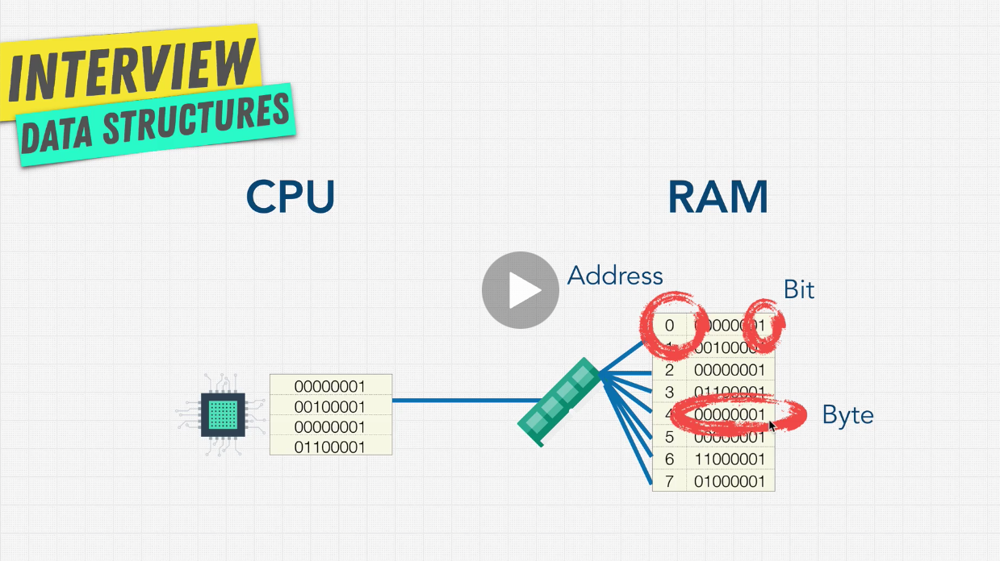
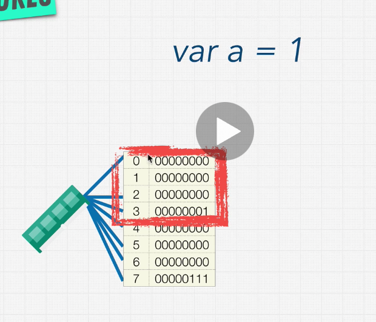
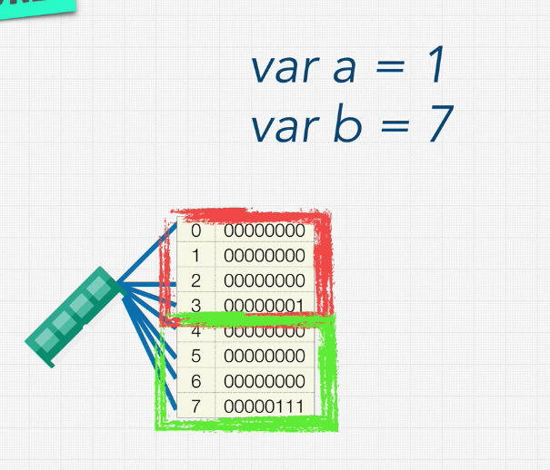
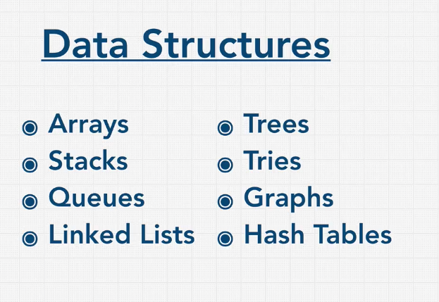
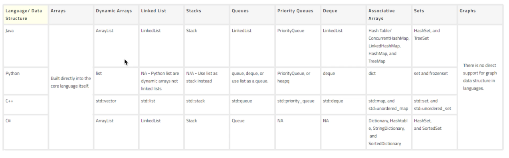

# Section 5 - Data Structures: Introduction

## Section Overview

- A data structure is a collection of values.

-An algorithm is a set of step or a process that manipulate this collection of values.

This is what allows us to write programs.

## What is a data structure?

A Data Structure is a collection of values, which can have relationships among them, and can functions apply to them. Each one is different in what it can do, and in what it is best used for.

Data Structures have also tradeoffs: one is better than others in some aspects, and the other way around in others.

There are two parts to understanding data structures:

1. How to build it
2. How to use it

## How computers store data

In order to truly understand the value of data structures, we have to go deep down into the working of computers at a fundamental level.

In order for a computer to run code, it needs to keep track of things like variables, like numbers, strings, arrays, etc.

These variables are stored in RAM, random access memory.

Apart from that we have Storage, where we store our files. This can be a disk drive, a flash drive or a solid state drive. This data is permanent of persistent, which means that when you turn off your computer, it won't get wiped.

Instad, when you do that, the RAM is completely wiped.

So why don't we just always use storage instead of RAM, to prevent any loses of data.

The problem is that persistent storage is slow.

A computer is run by its CPU: it's the worker that does all the calculations that you need, the actual work within the computer. And the CPU needs to access information located both in RAM and in storage, but it cann access the RAM and its information a lot faster.

RAM can be thought of as a massive storage area, like a data structure. This massivae strage area has shelves that are numbered. We call these **addresses**, and they help us hold the information organized so we can reach it up later.

Each of these shelves holds what we call eight **bits**. A bit is a tiny electrical switch that can be turned on or of, represented by a 0 or a 1.

Eight **bits** from one **byte**.



The **CPU** is connected to a **memory controller** that is in charge of reading and writing to memory.

This connection between the CPU and the RAM is important, because when the CPU asks the RAM what is in a specific address, it is the memory controller which actually has the individual connections to all of these shelves. This means the the CPU can directly and immediately access the seventh, or then thousend shelf, or any shelf in memory without having to go through all shelves in memory.

That's what the name Random Access Memory means: random pieces of memory can be accessed really fast because we have these direct connections, for which we only need to know the address of the shelf we want to retrieve or write to.

We can access the bits at any random address in memory right away. However, even though this memory controller can jump between very far apart memory addresses, programs tend to access memory pieces that is nearby: the closer the information is to the CPU, and the less it has to travel, the faster a program can run.

So computers are actually tuned to get extra speed boostas when reading memory addresses that are close to each other. 

To further optimize this, computers also have what we call a CPU cache, where the CPU has a tiny memory where it stores a copy of information that is really recent. A common hear you might have heard is the LRU cash.

### Why is this important for data structures?

Remember: data structures are ways for us to store and manipulate information.

For example, if we want to represent integers, the number one is 32 bits. That is the block size of RAM (now is 64 bits with recent uupgrades).



We can store the number 1 within this block of 32 bits, because we have 8 bits times 4 (four memory addresses with 8 bits each). In each block we can store 32 bits of information.

If for example, we want to store another variable with value 7, we would store it in the next block in memory:



Systems that are 8-bit can hold 255 bits of information.
Systems that are 16-bit can hold 65536 bits of information.
Systems that are 32-bit can hold 2147483647 bits of information.
Systems that are 64-bit can hold 9223372036854775807 bits of information.

In a 64-bit system, instead of a block being formed of 4 shelves, it is formed by 8, so 8 bits times 8 shelves equals 64 bits.

The bigger that block is, the more diverse that information can be. If we have an 8 bit system, we can store up to the number 255, but not 257.

Let's demonstrate this with Javascript by causing an integer overflow.

While JS doesn't actually have integers, but 64 bit floats, the idea is that you can only store a certain number of information.

If we use Math.pow() to try to get a real large number we get:

```js
Math.pow(10, 1000);
=> Infinity
```

Why does this happen? As the number becomes too large to be stored in our memory, we represent it with something tangible, so in JS we use Infinity.


All other data types other than numbers work the same way: each data type has a number of bits associated with it which needs to be stored in the system, and retrieved by the CPU for processing.

So, basically, a data structure is an arrangement of data, which you can define how to interact with and how it is arranged in RAM. Some data structures are organized next to each other in RAM, and others are apart from each others, and both approaches have pros and cons on the reading and writing procesess.

Our goal is to minimize the operation that we need to do for the CPU to get the information and to write it.

That's why data structures are so powerful: we're thinking about the low level of how a computer works.

## Data Structures in Different Languages

While there are a number of data structures that you might be asked in an interview, the list isn't actually that intimidating. You only need to learn the one in the following list:



These are used about 90% of the time.

There are specific data structures within each of these categories, and each have trade-offs .

Each language has their own data types built into it. Javascript, for example, has numbers, strings, booleans, and even some strange ones like undefined. These are the **primitives**.

Each language has data structures that help organizing this data types. In Javascript we have arrays and objects, but other languages have some other type of data structure out of the box:



## Operations on Data Structures

What are the various operations that can be performed on data structures?

As we learned, structures are just ways to organize our data on computers. Different DS are just variations of ways of storing information, and each have their trade-offs.

Some are good at certain type of information, othrs at others.

The main operation that we will carry out in DS are:

- **insertion**: adding a new data item into a given collection of items.
- **deletion**: delete a data item form our collection
- **traversal**: accessing each data item exactly once, so that it can be processed.
- **searching**: finding the location of a data item, if it exists, in a given collection.
- **sorting**: sorting a data collection according to a certain parameter.
- **access**: the most important one: how do we access (retrieve) a piece of data in our collection.

Each DS that we'll see in the course will have pros and cons for each of these operations.

