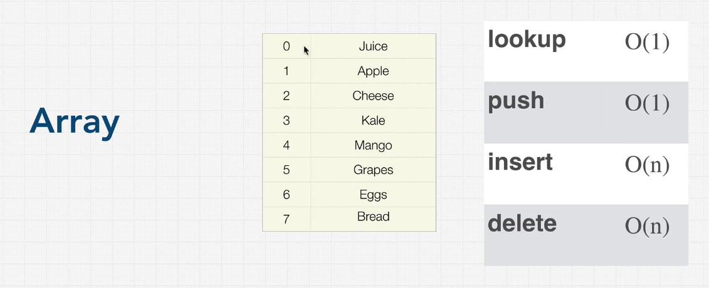
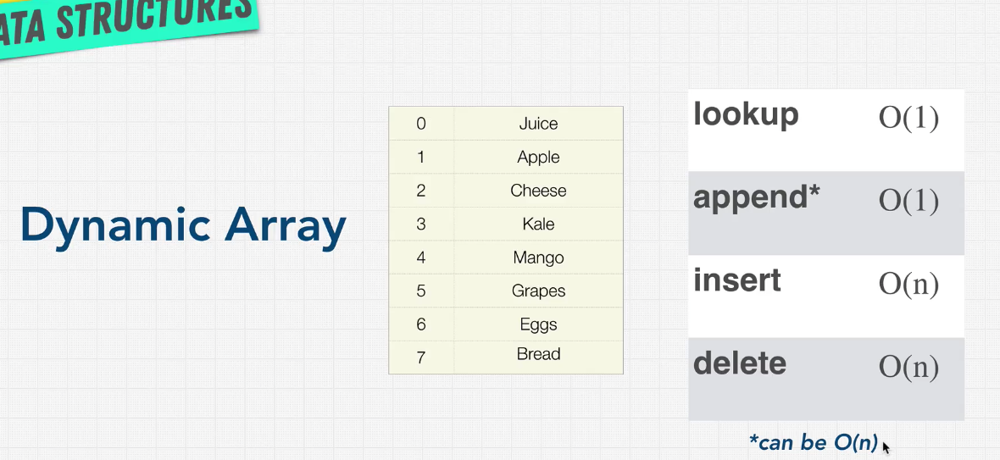

# Section 6 - Data Structures: Arrays

## Arrays Introduction

Arrays, sometime called lists, arrange items sequentailly, one after another in memory.



We are starting with arrays because they are the simplest data structure, have the least amount of rules, and, because they're stored in contiguous memory, they have the smallest footprint of any DS.

So, if all you need is to store some data and iterate over it, then arrays are a good choice. Especially if you know the indeces of each item.

Let's take a look at some characteristics of arrays:

```js
const letters = ['a', 'b', 'c', 'd'];
```

To store these 4 items, if we are in a 32-bit system (so we need 4 shelves of memory) to store each character, so we can simply multiply:

4 items * 4 shelves (bytes) in our memory = 16 bytes of storage

What is the time complexity of adding and deleting at the end of the array?
```js
const letters = ['a', 'b', 'c', 'd'];

letters.push('e'); // O(1)
// We know the length of the array, the indeces of the last 
// item, so adding a new item at the end is constant time

letters.pop(); // O(1)
// Same reason as push
```

But what if we want to add or delete from the beggining?
```js
const letters = ['a', 'b', 'c', 'd'];

// Unshift adds an item to the start of an array
letters.unshift('x'); // O(N)

// Why O(N)? If we think about how items in 
// an array are kept in memory
['a', 'b', 'c', 'd'];
  0    1    2    3

// When we add 'x' into our array, we need to
// shift all the indeces numbers:
['x', 'a', 'b', 'c', 'd'];
       0    1    2    3    <---- Before
  0    1    2    3    4    <---- Now

// To do this, we have to iterate
// over all our data to update the indeces,
// which means we have complexity of O(N)
```
So this already indicates that arrays are probably not the best data structures if we need to add lots of items to the start of an item collection.

Now, what if we need to add data to the middle of an array?
```js
const letters = ['a', 'b', 'c', 'd'];

// splice() allows to remove items from a
// position and replace them with new ones
// splice(startingIndces, deleteCount, itemsToAdd)
letters.splice(2, 0, 'alien');

console.log(letters);
=> ['a', 'b', 'alien', 'c', 'd'];
    0    1              2    3    <---- Before
    0    1       2      3    4    <---- Now

// In this case, we did half of the operations, so
// time complexity of this specific case is O(N/2).

// However, worst case is O(N), so that is our time complexity.
```

## Static vs Dynamic Arrays

There are actually two types of arrays:

- **static**
- **dynamic**

What are the differences between the two?

1. **Size**

Static arrays are fixed in size. This means that the number of items that the array will be able to hold has to be specified ahead of time, at creation.

Because arrays are allocated in contiguous blocks of memory at creation, there's no guarantee that we can continue to add items to it after we allocated all items that the array was capable of.

This issue is solved in static arrays with dynamic arrays, because they allow us to copy and rebuild an array at a new location with more memory, if we need it.

So for example, if we have an array capable of holding 7 items, and then we want to add an 8th items, then the entire array will be copied, 14 new memory blocks will be allocated to it (usually the size is doubled), then the original 7 items will be copied into them, and the new items will be added in the 8th position.

While in C++ this copy procedure would be needed to do by hand, Javascript handles it automatically for us. We never even allocated memory for an array.

And that's because in languages like JS and Python, the out-of-the-box arrays work like dynamic arrays. They automatically allocate memory and then increase it as needed.

The catch of that is the following:



Why does `append()` can be O(N) instead of O(1)?

If underneath the hood, JS or Python needs to dynamically expand (usually dobule) the size of the array by allocating new memory and copying the current values, in order to add a new item, then we have to loop over all our current values, and the operation becomes O(N).

## Implementing an array

This is not crucial for interviews, but it's good to understand how arrays work and are built. We'll create one with JS's `class` syntax.

Heads up: in JS, arrays are just objects with integer keys. Other languages may implement it differently.

```js
// Javascript

class MyArray {
  constructor() {
    this.length = 0;
    this.data = {};
  }

  get(index) {
    return this.data[index];
  }

  push(item) {
    this.data[this.length] = item;
    this.length++;
    return this.length;
  }

  pop() {
    const lastItem = this.data[this.length - 1];
    delete this.data[this.length - 1];
    this.length--;
    return lastItem;
  }

  delete(index) {
    const item = this.data[index];
    // We need to call shiftItems, which loops over our
    // items (worst case all of them), so delete is O(N)
    this.shiftItems(index);
    return item;

  }

  shiftItems(index) {
    for (let i = index; i < this.length - 1; i++) {
      // Shift items to the left: [3,7,9] --> [7, 9, 9]
      this.data[i] = this.data[i+1];
    }
    // We haven't touched the last item, so we need to delete it
    // [7, 9, 9] --> [7, 9]
    delete this.data[this.length - 1];
    this.length--;
  }
}

const newArray = new MyArray();
newArray.push("Hello");
newArray.push("how");
newArray.push("are");
newArray.push("you");
newArray.pop();
newArray.delete(1);
console.log(newArray);
```

TODO: Write the above code in Python

## Strings and Arrays

Common interview trick: **treat any string question as an array question.**

**Strings are just an array of characters.**

## Excercise: Reverse a string

Create a function that reverses a string it gets as an input.

My solution:
```js
// Javascript
function reverseString(str) {
  const splitString = str.split("");
  return splitString.reverse().join("");
}
```

```python
def reverseString(str):
	return "".join([char for char in str][::-1])

def reverseString(str):
	strList = list(str)
	strList.reverse() # Reverses in place!
	return "".join(strList)

print(reverseString("hello"))
```

## Solution: Reverse a string

```js
// Javascript
function reverseString(str) {
  // First check inputs
  if(!str || typeof str !== "string") {
    return "Input should be a string";
  }

  const backwards = [];
  for (let i = str.length - 1; i >= 0; i--) {
    backwards.push(str[i]);

  }
  return backwards.join("");
}
```

## Excercise: Merge Sorted Arrays

```js
// Javascript
// Only two arrays
const mergeSortedArrays = (arr1, arr2) => {
 return [...args].sort();
}
// Time complexity: O(n log N)

// Infinite number of arrays
const mergeSortedArrays = (...args) => {
  return args.reduce((acc, current) => [...acc, ...current])
}
// Time complexity: O(n log N)
```

## Solution: Merge Sorted Arrays
```js
// Javascript
// Time Complexity: O(N+M)
const mergeSortedArrays = (arr1, arr2) => {
  if(arr1.length === 0) {
    return arr2;
  }
  if(arr2.length === 0) {
    return arr1;
  }

  const mergedArray = [];
  let [pointer1, pointer2] = [0, 0];
  while(arr1[pointer1] || arr2[pointer2]) {
    if(!arr1[pointer1]) {
      mergedArray.push(arr2[pointer2]);
      pointer2++;
    } else if(!arr2[pointer2]) {
      mergedArray.push(arr1[pointer1]);
      pointer1++;
    } else if(arr1[pointer1] <= arr2[pointer2]) {
      mergedArray.push(arr1[pointer1]);
      pointer1++;
    } else {
      mergedArray.push(arr2[pointer2]);
      pointer2++;
    }
  }

  return mergedArray;
}

const mergeSortedArrays = (arr1, arr2) => {
  const mergedArray = [];
  const n1 = arr1.length;
  const n2 = arr2.length;
  let i = 0;
  let j = 0;

  // Loop through both arrays while both have numbers
  while(i < n1 && j < n2) {
    if(arr1[i] <= arr2[j]) {
      mergedArray.push(arr1[i]);
      i++;
    } else {
      mergedArray.push(arr2[j]);
      j++
    }
  }

  // Complete remaining from arr1 when arr2 is over
  while(i < n1) {
    mergedArray.push(arr1[i]);
    i++;
  }

  // Complete remaining from arr2 when arr1 is over
  while(j < n2) {
    mergedArray.push(arr2[j]);
    j++;
  }

  return mergedArray;
}
```

```python
# Python
# Time Complexity: O(N+M)
def mergeSortedArrays(arr1, arr2):
  mergedArray = []
  n1 = len(arr1)
  n2 = len(arr2)
  i = 0
  j = 0

  while i < n1 and j < n2:
    if arr1[i] < arr2[j]:
      mergedArray.append(arr1[i])
      i = i + 1
    else: 
      mergedArray.append(arr2[j])
      j = j + 1

  while i < n1:
      mergedArray.append(arr1[i])
      i = i + 1
  
  while j < n2:
      mergedArray.append(arr2[j])
      j = j + 1
  
  return mergedArray
```