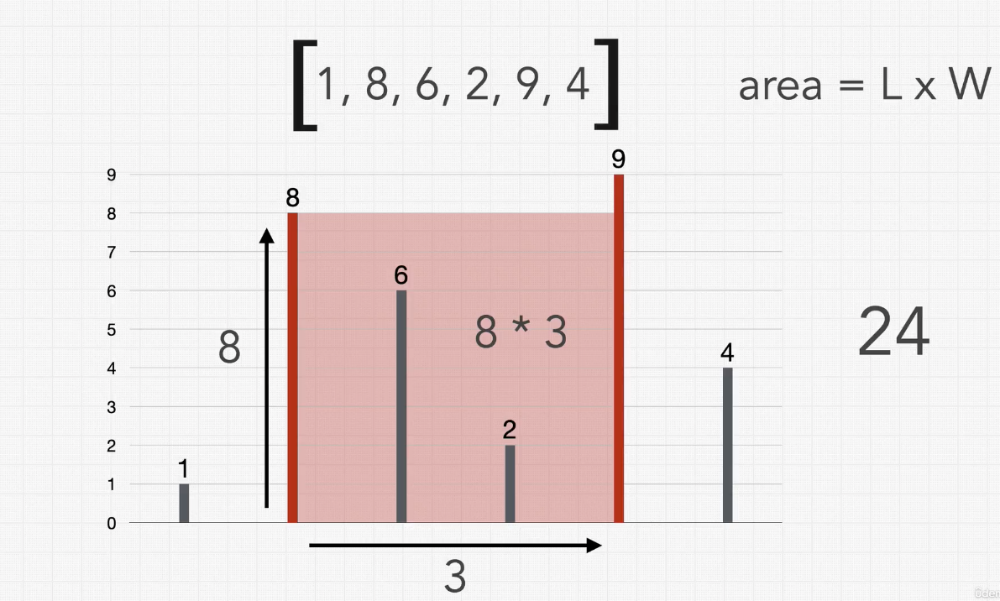
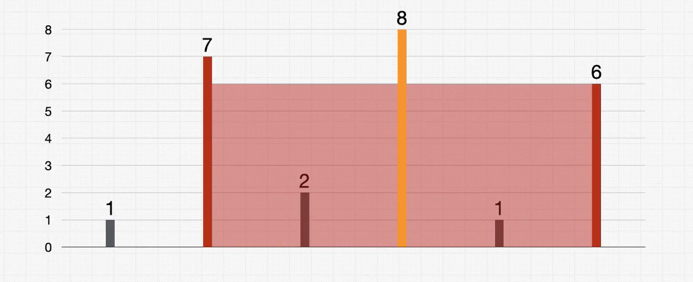
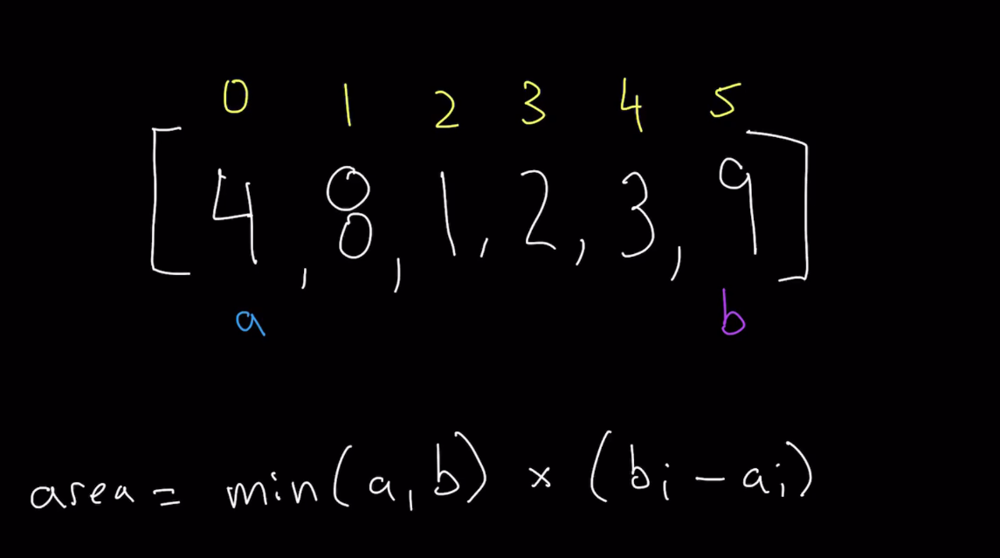
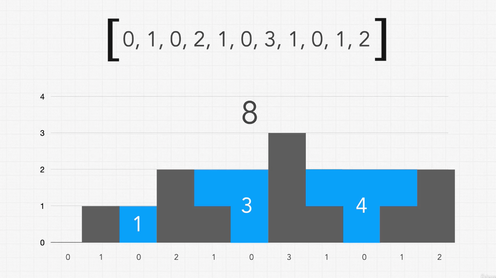
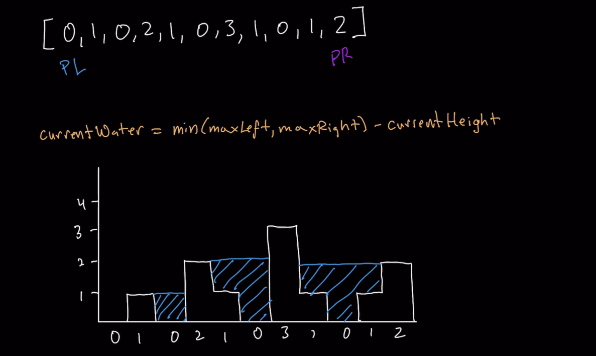
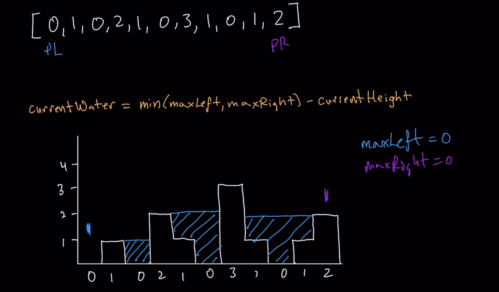
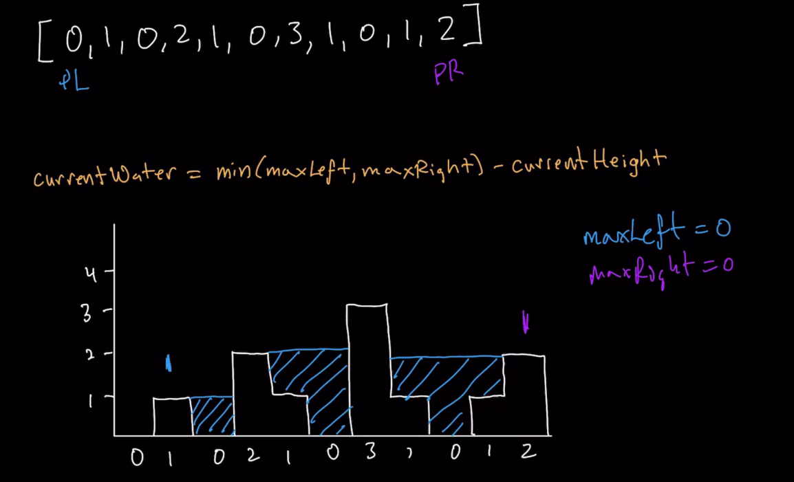
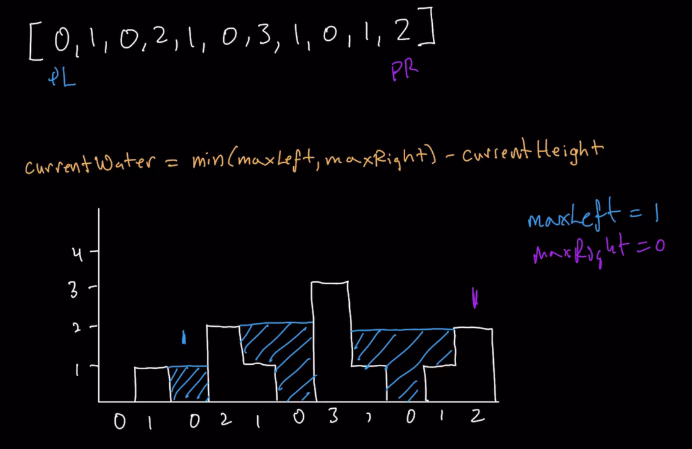
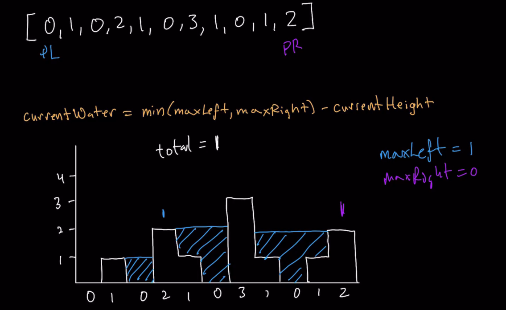

## Two Sum

Given an array of integers `nums` and an integer `target`, return indices of the two numbers such that they add up to `target`.

You may assume that each input would have **exactly one solution**, and you may not use the same element twice.

You can return the answer in any order.

Example 1:

```
Input: nums = [2,7,11,15], target = 9
Output: [0,1]
Output: Because nums[0] + nums[1] == 9, we return [0, 1].
```

Example 2:
```
Input: nums = [3,2,4], target = 6
Output: [1,2]
```

Example 3:
```
Input: nums = [3,3], target = 6
Output: [0,1]
``` 

Constraints:
```
2 <= nums.length <= 104
-109 <= nums[i] <= 109
-109 <= target <= 109
Only one valid answer exists.
```

### Two Sum Solution

For explanation of the solution, see [Section 4 - How To Solve Coding Problems](./../Section%204%20-%20How%20to%20Solve%20Coding%20Problems/Section%204%20-%20How%20to%20Solve%20Coding%20Problems.md)

```ts
// Typescript
// Time Complexity: O(N)
const twoSum = (nums: number[], target: number): number[] => {
   const seen = new Map();
   for(let i = 0; i < nums.length; i++) {
     const num = nums[i];
     const complement = target - num;
     if(seen.has(complement)) {
       return [i, seen.get(complement)]
     }
     seen.set(num, i)
   }
}
```

```python
# Python
# Time Complexity: O(N)
def twoSum(nums, target):
  seen = {}
  for index, number in enumerate(nums):
    complement = target - number
    if(complement in seen):
      return [index, seen[complement]]
    seen[number] = index
```


## Maximum Subarray

Given an integer array `nums`, find the contiguous subarray (containing at least one number) which has the largest sum and return its sum.

A subarray is a contiguous part of an array.

Example 1:
```
Input: nums = [-2,1,-3,4,-1,2,1,-5,4]
Output: 6
Explanation: [4,-1,2,1] has the largest sum = 6.
```

Example 2:
```
Input: nums = [1]
Output: 1
```

Example 3:
```
Input: nums = [5,4,-1,7,8]
Output: 23
```

Constraints:
```
1 <= nums.length <= 105
-104 <= nums[i] <= 104
```
˚˝˝˚
### Max Subarray Solution
Solution from [BackToBackSWW:](https://www.youtube.com/watch?v=2MmGzdiKR9Y&ab_channel=BackToBackSWE)
```
nums = [-2, 1, -3, 4, -1, 2, 1, -5, 4]
         0  1   2  3   4  5  6   7  8
```         

When we get a question that asks us for the maxiumum of an array or a group of items, we think of dynamic programming to think of a global solution based on smaller subproblems.

THe first go-to idea, the brute force solution, is to find all the possible contiguous subarrays that the array might have find and then find which of those has a larger sum of its values. However, this will result in an O(N^2) or even O(N^3) time complexity, depending on how the algorithm is implemented.

The difference between the quadratic and and the cubic time solutions is that for each window (left and right limits), in the cubic time solution we will add all numbers in that window every single time, while in the quadratic, we will take advantage of the sum we already have and then add the new element on the last every time the window changes:

```python
# Python
# Cubic Time
def maxSubArrayCubic(nums):
  n = lens(nums)
  #  Arbitrary minimum value for Python
  max_sum = -10000

  for left in range(0, n):
    for right in range(left, n):
      # Investigate the first window
      window_sum = 0

      # Add all items in window
      for k in range(left, right + 1):
        window_sum = window_sum + nums[k]

      # Did we beat the bust sum seen so far?
      max_sum = max(max_sum, window_sum)

  return max_sum


def maxSubArrayQuadratic(nums):
  n = lens(nums)
  max_sum = -1000000

  for left in range(0,n):
    running_sum = 0
    for right in range(left, n):

      # Add the current element to the
      # previous computed value to get
      # the subarray sum
      running_sum = running_sum + nums[right]

      # Compare
      max_sum = max(max_sum, running_sum)
  
  return max_sum
```

Who can we solve this in linear time (O(N))?
In order to do that, we need to think in terms of dynamic programming and sub problems. The most important thing to discover when doing dynamic programming is "what is the subproblem?". And that is always slightly different.

In this case, let's start thinking what the sub problem is. What is the subproblem for each element of the array:

```python
         0  1   2  3   4  5  6   7  8
nums = [-2, 1, -3, 4, -1, 2, 1, -5, 4]
```
What is the subproblem for index 3 (if I'm standindg on index 3, i.e. my right bound is on index 3)?

The subproblem for this case is: what is the max contiguous subarray I can get when standing on index 3?

And the contiguous subarrays I can get for index 3 are:
```python
         0  1   2  3   4  5  6   7  8
nums = [-2, 1, -3, 4, -1, 2, 1, -5, 4]
                   _
                ____
            ________
        ____________
```

And the same is true for all other indeces. If we have a subarray that **ends** on index 8 (the last one in this case), what is the best subarray that we can achieve that end in that index.

So each of these cells "asks us" what is the best subarray that we can achieve with subarrays ending at each of those cells or indeces.

So the answer to the whole question is going to come out of whichever of the indices that "performs the best", i.e. whichever of those indeces which has a subarray that ends in it that has the largest value (the max sum).

The key to understanding this to understand, at each point of our iteration, what does the item "contribute", i.e. what are the choices that we have at each element.

We have two choices:

1.  We can start a new subarray at a certain item, which means that that subarray ends at itself. We would cut all our previous progress short and say: the best I can do that ends here is just myself.
2.  Continue the max subarray coming before us, with the item we are standing on.

Let's see an example: let's pretend we have a maximum subarray that ends on index 2 that is -9.

```js
          0   1   2   3   4   5   6   7   8
nums = [ -2,  1, -3,  4, -1,  2,  1, -5,  4 ]
       [    |   |-9 |   |   |   |   |   |   ]
```

Then, when we are on index 3, does its value of 4 extend the previous best we've done in terms of a maximum contiguous sub-array or does 4 cut off the progress that we had, and just take itself? These are our two choices:

```js
const startNewItem = 4; // Our new value in itself
const extendSubarrayWithNewItems = maxSubarrayAtPreviousElement + startNewItem = -9 + 4 = -5;

const bestSolutionAtCurrentIndeces = max(startNewItem, extendSubarrayWithNewItems)
                                   = max(4, -5) = 4
```

Therefore, for index 3, taking 4 (option 1, taking the element's value) is a better choice than making 4 or index 3 an extension of the best subarrays we had before us. That why we choose 4, we can do better with just the 4.

This is the essence of the problem and the two choices that we have for each element.

The key to understand here is that **when we look back at the previous element to see what was the best subarray we could get, we don't know exactly what subarray had that sum, but we know that the best we could get is the number we got there.** (in this case, for example, -9)

So, let's do this decision from every element in the array, sequentially from left to right. Because in the first element we have nothing to compare again, we just say that the best "ending" that we have at that index, is itself:

```js
          0   1   2   3   4   5   6   7   8
nums = [ -2,  1, -3,  4, -1,  2,  1, -5,  4 ]
       [ -2 | 1 |-2 | 4 | 3 | 5 | 6 | 1 | 5 ]
```

Let's code it:
```python
# Python
# Time Complexity: O(N)

def maxSubArraySumLinear(nums):
  # Default to say the best max seen so far is the first element
  max_so_far = nums[0]

  # Also default to say the best max ending at the first element
  # is the first element itself
  max_ending_here = nums[0]

  # Loop through the rest of the array (index 0 is already considered)
  for i in range(1, len(nums)):
    """
    For each element we have 2 choices:

    1. Just take the item we are standing on: nums[i]
       (which means: subarray start an end at the index)

    2. Let the item we are standing on contribute to the
       best max we have achieved ending at i - 1: max_ending_here + nums[i]
       (which means: exten the previous subarray best, whatever it was)
      
    The max of these 2 choices will be the best answer to the subproblem.
    """
    max_ending_here = max(nums[i], max_ending_here + nums[i])

    # Check if the calculated max_ending_here is greater than the global max_so_far
    max_so_far = max(max_ending_here, max_so_far)

  return max_so_far

```

## Max Subarray Problem

Same problem as before, but this time, return the start and ending indeces of the subarray as well.

```python
"""
          0   1   2   3   4   5   6   7   8
nums = [ -2,  1, -3,  4, -1,  2,  1, -5,  4 ]
       [ -2 | 1 |-2 | 4 | 3 | 5 | 6 | 1 | 5 ]
start         _       _      
"""

def maxSubarray(nums):
  max_so_far = nums[0]
  max_ending_here = nums[0]

  begin = end = 0

  # Iterate from index 1 to the end, so cut the array.
  # This is why we also need to treat our indeces as index + 1
  # when tracking begin and end (so they align with original nums array)
  for index, value in enumerate(nums[1:]):
    # Check if my current best subarray is the one I'm standing on
    # This happens when it's better to take the current value
    # than extending my previous array (Take option 1 from above)
    if value > max_ending_here + value:
      begin = end = index + 1 
    # Check a subcondition of extending the subarray: all of the cases
    # when option 2 from above is taken end here, but we need to do
    # another check, that's why the else if. And the check is:
    # Did I find a new global maximum? Notice that this happens on
    # indeces 5 and 6, but does not happen on index 4, although the
    # maxSubarray is from 3 to 6. 
    elif max_ending_here + value > max_so_far:
      end = index + 1
    
    # Do the logic as usual to find the new local max and
    # the new global max.
    max_ending_here = max(value, max_ending_here + value)
    max_so_far = max(max_so_far, max_ending_here)
  
  return [begin, end, max_so_far]

```

## Move Zeroes

Given an integer array nums, move all 0's to the end of it while maintaining the relative order of the non-zero elements.

Note that you must do this in-place without making a copy of the array.

Example 1:
```
Input: nums = [0,1,0,3,12]
Output: [1,3,12,0,0]
```

Example 2:
```
Input: nums = [0]
Output: [0]
 ```

Constraints:
```
1 <= nums.length <= 104
-231 <= nums[i] <= 231 - 1
```

### Move Zeroes - Solution

```python
# Time Complexity: O(N)
class Solution:
  def moveZeroes(self, nums: List[int]) -> None:
    """
    Do not return anything, modify nums in-place instead.
    """
    zeroes = 0
    other = []
    
    # Get amount of zeroes and an array with the other numbers
    for i in nums:
        if i == 0:
            zeroes = zeroes + 1
        else:
            other.append(i)
    
    # Replace the first elements until length of other
    # with the other numbers
    for i in range(0, len(other)):
        nums[i] = other[i]
    
    # Replace the reamining ones with zeroes
    for i in range(len(other), len(nums)):
        nums[i] = 0
```

### Rotate Array (Medium)

Given an array, rotate the array to the right by k steps, where k is non-negative.

Example 1:
```
Input: nums = [1,2,3,4,5,6,7], k = 3
Output: [5,6,7,1,2,3,4]
```
Explanation:
rotate 1 steps to the right: [7,1,2,3,4,5,6]
rotate 2 steps to the right: [6,7,1,2,3,4,5]
rotate 3 steps to the right: [5,6,7,1,2,3,4]

Example 2:
```
Input: nums = [-1,-100,3,99], k = 2
Output: [3,99,-1,-100]
```

Explanation: 

rotate 1 steps to the right: [99,-1,-100,3]
rotate 2 steps to the right: [3,99,-1,-100]
 

Constraints:
```
1 <= nums.length <= 105
-231 <= nums[i] <= 231 - 1
0 <= k <= 105
```

### Rotate Array (Medium) - Solution

```python
# Time Complexity: O(N)
# Space Complexity: O(N)
class Solution:
    def rotate(self, nums: List[int], k: int) -> None:
        """
        Do not return anything, modify nums in-place instead.
        """
        length = len(nums)
        # Correct k if it is greater than length of array
        if k > length:
            k = k - length
        beforeK = nums[0:length-k]
        afterK = nums[length-k:length]
        newArray = afterK + beforeK
        for i in range(0, length):
            nums[i] = newArray[i]
```

Follow up:

- Try to come up with as many solutions as you can. There are at least three different ways to solve this problem.
- Could you do it in-place with O(1) extra space?

## Continer with Most Water

You are given an array of positive integers where each itneger represents the height of a vertical line on a chart. Find two lines which together with the x-axis formas a container that would hold the greatest amount of water. Return the area of water it would hold.



As you can see from the graph, we would need to return the are of the container held between the lines with height 8 and 9 (but only using height 8).

height = 8
width = 3

area = height x width = 8 x 3 = 24

### Step 1 : Verify the constraints?

**Does the thicknes of the liens affect the area?**

No, assume they take up no space.

**Do the left and right sides of the graph count as walls?**

No, the sides canot be used to form a container.

**Does a higher line inside our container affect our area?**

No, lines iside a container don't affect the area.



### Step 2: Coming up with test cases

1) If we get an array:

```
 ⬇           ⬇ 
[ 7, 1, 2, 3, 9]
  0  1  2  3  4
```
Then we know the biggest area is formed by the 7 and 9, with a height of 9 and a width that is **the difference between the indexes for the border of the container**, (in this case, 7 and 9, with indeces 0 and 4).

area = height * width = min(7, 9) * (index 1 - index 0) = 7 * (4 - 0) = 28

2) If we get an empty array or an array with a single value, no area can be formed, so the answer will be 0.
```
[] -> area = 0
[5] -> area = 0
```

### Step 3: Thinking through a logical brute force solution

This is a maximum-value question. This means that finding an area of water that can be hold doesn't mean that it is the greatest amount of water. So the only way to know if it is the greatest area (or smallest, depending on the question) we'd have to calculate all areas and then return the max area.

Let's take the first input:
```
[ 7, 1, 2, 3, 9]
  0  1  2  3  4
```
And using our formula:
```
area = height * width = min(a, b) x (bi - ai)
```

We can calculate the area for all pairs within the input, store the maximum area and update it when we find a higher value. This brute force soltuon will have a O(N^2) time complexity.


### Coding our Brute Force Solution

```python
# Time Complexity: O(N^2)
# Space Complexity: O(1)
def containerWithGreatestArea(arr):
  length = len(arr)
  maxArea = 0
  if length == 0 or length == 1:
    return 0

  for i in range(0, length):
    for j in range(i + 1, length):
      newArea = min(arr[i], arr[j]) * (j - i)
      if newArea > maxArea:
          maxArea = newArea
  
  return maxArea
```
```js
const containerWithGreatestArea = (arr) => {
  const len = arr.length;
  let maxArea = 0;
  if(len === 0 || len === 1) {
    return 0
  }

  for(let i = 0; i < len; i++) {
    for(let j = i + 1; j < len; j++) {
      const newArea = Math.min(arr[i], arr[j]) * (j - i)
      maxArea = Math.max(newArea, maxArea)
    }
  }

  return maxArea;
}
```

### Step 5: Thinking about our Optimal Solution

Notice that, having Time Complexity: O(N^2) -thanks to our nested for loop- and Space Complexity: O(1), we could sacrifice a little more space to achieve a better time performance, like we did in the findSum excercise of the Google interview.

So, if we wanted to look for a similar solution, we'd need to udnerstand what are we doing on our curent solution. So what are we doing?

First, we are storing the max area that we find so far, for every area that we calculate for i and j. That means that the double for-loop does not separate: we need i and j together in order to figure out the area, so there is no additional step within the for-loops, which means there is no additional cacheing we can do for i (the first index or for loop).

And what about the second for loop? Is there some way we can improve or even eliminate the second for-loop using more memory? The answer is no: we are just using memory to store the new calculated area, then comparing it to our max area, and then we just throw it away. So the improvement of using a hashmap, like in the findSum excercise, won't help us here.

What we actually need to use is the **shifting pointers technique**.

Instead of starting with `i` and `j` at positions 0 and 1, let's replace them with `a` and `b`, and place them at the start and end of the array, and let's re-write our formula for area:



In the findSum excercise, the distance between the pointers doesn't matter, it doesn't affect the end result: as soon as we find a pair that sums to our target we can return it. If those numbers are located at a distance of 1 index or 10 indeces doesn't modify the check to do if they are a valid answer for the excercise (which is only summing them up).

However, in our current question, the width (distance between `a` and `b`) has a direct impact on the actual area, therefore, on the solution to our problem.

We don't know, however, whether **increasing** or **decreasing** the distance between `a` and `b` will our area increase or decrease (it can have both effects).

Let's take a look:
```
 0  1  2  3  4  5
[4, 8, 1, 2, 3, 9]           area = min(a, b) x (bi - ai)
 a              b                 = min(4, 9) x (5  -  0) =   4 x 5 = 20


 0  1  2  3  4  5
[4, 8, 1, 2, 3, 9]           area = min(a, b) x (bi - ai)
    a           b                 = min(8, 9) x (5  -  1) =   8 x 4 = 32 
```

From the above example, we see that shrinking our width resulted in a greater area. But if we think what really happened  we can realize that **the total area is impacted by the lesser or smaller of the values of `a` and `b`**. 

We saw that shrinking the distance between `a` and `b` we ended up with a smaller area: this tells us that **the only value in the height part of the equation that has some impact on the outcome of the area equation is the smaller value.** Why? Because by taking the `min` of `a` and `b` the larger value is virtually ignored (has no impact at all in the calculation). And because the distance between `a` and `b` (the width part of the equation) can increase **or** decreasing depending on each case -there's no guaranteed change towards a greater or smaller area- we know that the key is making the smaller of `a` and `b` larger on each step.

As a counter-proof, let's see an example of what happens if we decided to modify the **largest** of our `a` and `b` values:

First, let's see what happens when `b`, our largest, **gets bigger**. In this case, `b` turns from a 9 to a 12.
```
 0  1  2  3  4  5
[4, 8, 1, 2, 12, 9]           area = min(a, b) x (bi - ai)
 a               b                 = min(4, 9) x (5  -  0)
                                   =      4    x     5       = 20


 0  1  2  3  4  5
[4, 8, 1, 2, 12, 9]           area = min(a, b) x (bi - ai)
 a            b                    = min(4, 12) x (5  -  1)
                                   =      4     x     4      = 16
```

As you can see, even if the bigger value gets bigger, it doesn't have any impact on the total area, because the `min` operation "neutralizes" that change, and the height is still 4 (while the width got reduced).

Now, let's see what happens when `b`, our largest, **gets smaller**. In this case, `b` turns from a 9 to a 3 (our original example):

```
 0  1  2  3  4  5
[4, 8, 1, 2, 3, 9]           area = min(a, b) x (bi - ai)
 a              b                 = min(4, 9) x (5  -  0)
                                   =      4    x     5       = 20


 0  1  2  3  4  5
[4, 8, 1, 2, 3, 9]           area = min(a, b) x (bi - ai)
 a           b                    = min(4, 3) x (5  -  1)
                                   =      3     x     4      = 12
```

In this case, it did have an effect, but in this case particulary, reducing the total area because the new `b` is 3 and that reduced the height to a 3. Even if our new `b` had beed reduced, but still greater than our `a`, for example, reduced to 6, then the minimum between `a` and `b`, that is 4 and 6, would still be 4. That would mean a total area of 4 x 4 or 16, which is still a reduction from 20.

So now we can conclude that the only thing that matters is **moving the smaller of `a` and `b` forward** when updating our pointers, as that is the only way we can attempt to get a larger area as in the previous step. That is the key for this algorithm.

Therefore, we will start our shifting pointers at the extremes of our array (as we want to calculate for our maximum possible width), and then start shifting our pointer that has the smaller value on each step.

By going through the array once, with our shifting poitners, we can guarantee a time complexity of O(N), or linear.

But the key with **shifting pointers** is realizing **when and how they should be updated** which will be different in every excercise.

So to sum up, in this case, each update step was: "Shrink our width on each step, but the decision on wether to shrink from the left or from the right is based on wether `a` (left) or `b` (right) is smaller. For each step, we move inwards whichever of `a` and `b` is smaller."

### Step 6: Coding our Optimal Solution

```python
# Time Complexity: O(N)
def containerWithGreatestArea(arr):
  length = len(arr)
  # Early return for edge cases
  if length == 0 or length == 1:
    return 0

  # Define my pointers and initial maxArea
  a = 0
  b = length - 1
  maxArea = 0

  # Loop while the pointers don't overlap
  while a != b:
    newArea = min(arr[a], arr[b]) * (b - a)
    maxArea = max(maxArea, newArea)
    # Conditionally update the pointers
    if arr[a] > arr[b]:
      b = b - 1
    else:
      a = a + 1
  
  return maxArea
```


## Trapping Rainwater

Given an array of integers representing an elevation map where the width of each bar is 1, return how much rainwater can be trapped.



### Step 1: Verify the Constraints

Do the left and right sides of the graph count as walls?

No, the sides are not walls.

Will there be negative integers?

No, assume all positive integers.

### Step 2: Test Cases

```
[0, 1, 0, 2, 1, 0, 3, 1, 0, 1, 2] -> 8

[] -> 0

[3] -> 0

[3, 4, 3] -> 0
```

### Step 3: Figure out a solution without code

By looking at a diagram, we can deduct that, the amount of water trapped at each element can be calculated by the following formula:
```
amount of water at i = min(maxLeft, maxRight) - value at i
```
where:
- maxLeft: maximum value of the array to the left of i
- maxRight: maximum value of the array to the right of i

So we can loop through our array and do this calculation for each element, summing up the water that can be held at each element:

```python
# Time Complexity: O(N^2)
def trappingRainwater(heights):

  # Variable to store trapped water
  water = 0
  for i in range(0, len(height)):
      # Get array to the left of current element and find max
      left = height[0:i]
      maxLeft = max(left) if len(left) > 0 else 0

      # Get array to the right of current element and find max
      right = height[i+1:len(height)]
      maxRight = max(right) if len(right) > 0 else 0

      #Calculate the waterColumn at that element and sum only if positive
      waterColumn = min(maxLeft, maxRight) - height[i]
      if waterColumn > 0:
          water = water + waterColumn
  return water
```

This solution, however, has a quadratic time complexity, which is not ideal. This time complexity comes from the fact that we loop for all elements, and for each element we use max, which itself has a linear time complexity.

Let's try to find a way in which we can get down our time complexity to O(N).
## Optimal solution

Let's think of a solution that uses the **shifting pointers technique**, like in the previous problem. In that case, we had two pointers starting at the edges of the array and moving inwards.

In order to do the same in this problem, we need to find the rationale to know when to move the pointers inwards at each step.

What are the two things about the pointers that we have to realize?

1. We need one pointer starting at each extreme of the array, and we need to move them conditionally inwards on each step. At each iteration -each pair of pointers- we should have access to the values provided by the pointers.
2. We also need to know the values that we have seen before with each pointer.

We can think of the process of finding the trapped water in the whole array as follows: we loop through the array with one pointer. On each element, this pointer "sends" an additional pointer to the left, and an additional pointer to the right, in order to find the two walls that form the container for each element.

How can we apply this knowledge to our two pointers?



Having the two pointers at the extremes, with data to know if we have a wall in each, what can we derive using them?

Technically, we can't figure anything out, because, when we have our pointers placed so, we know nothing about the content inside the walls formed by those two pointers. The water content can be affected by any other walls inside the container. So we cannot use the poitners to single-handedly figure out how much water would be trapped inside of the walls formed by them.

What we can keep track of are **the maximum values that they have seen respectively for each side**. So as `maxLeft` moves inward we keep track of the maximum value it has seen, and the same with `maxRight` as it moves inwards also.

But what do we do with those max values? How do we decide which one to move?

We also know that we had a similar approach using these two pointers, in which we moved inward the pointer of the smallest wall (or value) because it was the only one that had a chance of making the amount of water that was being stored bigger.

We are going to follow the same logic in this question, but it's going to go a step further. The 
reason why we want to move pointer that has the smaller value is because, when looking at the equation

```
currentWater = min(maxLeft, maxRight) - currentHeight
```

we know that it is calculating for some current value which before we represented with some pointer (the i with which we looped through the array in the brute force solution). Now that we don't have that looping pointer any more, we need to have one of the two pointers (which we placed at the extremes) to take the responsability of measuring the currentWater where it is positioned.

We need to get these two ideas together: firstly, our logic still says that we have to moved the pointer with the smaller value inwards, while at the same time we need to use the smaller value as the actual current height to do the calculation. (we'll see why once we step into the logic)

Let's first initialize a `maxLeft` and a `maxRight` variables with value `0`.



In the example above, with the pointers set positions `0` and `len(heights) - 1`, which of those elements have a smaller value? The value at position `0` is `0` and is smaller than the value at the last element, which is `2`. So the first element is the smaller value, and that's the one we need to start operating on. 

But now we have to decide: **do we try to calculate the amount of water for this value, or do we try to update our maxLeft?**

The reason why we need to decide this is because, in order to calculate the water for that element and value, we need to have a `maxLeft` that is bigger than our current value: our current element **can only have water trapped above it if some wall to the left of it is actually greater than itself.**

This logic is not exactly the same for the right side because we knew that this right value (of the right pointer) was bigger than the value of the left pointer. That means that we know that the right value (wherever it is) can be a wall to our left pointer, simply because it is larger than the value of our left pointer.

But we don't know yet if there is a wall on the left side of our current element yet, and the only way we can figure out if there is one is to compare our current value to our `maxLeft` value, which keeps the values of the max heights that we have seen to the left.

In the first iteration, we see that our current value of `0` is not bigger than our value of `maxValue` which is also `0`. So all we do is update our `maxLeft` (in this case stays at 0 anyways because the new max is also 0), and we move the left pointer inwards .



Now, with the pointers at the new position, between `heights[a] = 1` and `heights[b] = 2`, which one is smaller? `a`, our left pointer, points to a smaller value, so we will use that one to operate. 

Now, the second question: do we calculate how much water is trapped on our current position? We know that this position has a right wall (because of the check we did in the immediately previous step, the value of `heights[b]` is higher than `heights[a]`), but do we have a left wall? To know that, we can check if our `maxLeft` is greater than our current value. In this case `maxLeft` is smaller than our current value (0 vs 1), so we know we don't have a left wall.

So we update our `maxLeft` to our new max value of `1` and move our left pointer `a` inwards again.



And we start the check again. Which of `heights[a]` and `heights[b]` has the smaller value? `heights[a]` still is smaller with 0 vs 2. So we operate on that one.

Now we look if we have a wall to our left, so we can decide if we should calculate the trapped water. In this case, `maxLeft` of 1 is greater than our current value of 0, so we should do the calculation with our formula:

```
currentWater = min(maxLeft, maxRight) - currentHeight
```

Notice that we already know that our `maxLeft` is smaller than our `maxRight`, because, as long as we keep moving the pointer with the smallest value inwards, we are always working with the smaller of `maxLeft` and `maxRight` (because in order for that pointer to be moving, any value that we have iterated through must be smaller than the other side. That's why can spare the calculation of the minimum between the two, and just substract (in this case) `maxLeft` minus our `currentHeight`

```
currentWater = maxLeft - currentHeight
                  1    -      0         =   1
```

Then we move the pointer inwards (while `maxLeft` doesn't get updated because its previous value if greater than our current value).



In the case in which `heights[a]` and `heights[b]` are equal, we can just decide with which to operate, it will make no difference. We'll continue operating with, and moving pointer `a`.

So do we calculate the water? `maxLeft` is 1 and is smaller than the current value of 2, so we don't calculate the water. Instead, since our current value is larger than `maxLeft`, we updated `maxLeft` to be our current value of 2.

And we continue doing this calculation until our pointers `a` and `b` overlap.
## Coding our Optimal Solution
https://leetcode.com/problems/trapping-rain-water/submissions/

```python
# Time Complexity: O(N)
def trappingRainwater(heights):
  maxLeft = maxRight = accumulatedWater = 0
  a = 0
  b = len(heights) - 1

  while a != b:
    # If the value at pointer a is less than the value at pointer b
    # we operate with a, otherwise we operate with b
    if heights[a] <= heights[b]:
      # If we have a wall to our left (i.e. our maxLeft 
      # is greater than our current value) calculate water
      if maxLeft > heights[a]:
        accumulatedWater += (maxLeft - heights[a])
      else:
        # Otherwise, update our current maxLeft
        maxLeft = heights[a]
      # Once that is done, move pointer inwards
      a = a + 1
    # If the value at pointer b is less than the value at pointer a 
    else:
      if maxRight > heights[b]:
        accumulatedWater += (maxRight - heights[b])
      else:
        maxRight = heights[b]
      b = b - 1
  
  return accumulatedWater
```
No comments version:
```python
# Time Complexity: O(N)
def trappingRainwater(heights):
  maxLeft = maxRight = accumulatedWater = 0
  a = 0
  b = len(heights) - 1

  while a != b:

    if heights[a] <= heights[b]:
      if maxLeft > heights[a]:
        accumulatedWater += (maxLeft - heights[a])
      else:
        maxLeft = heights[a]

      a = a + 1

    else:
      if maxRight > heights[b]:
        accumulatedWater += (maxRight - heights[b])
      else:
        maxRight = heights[b]
      b = b - 1
  
  return accumulatedWater
```