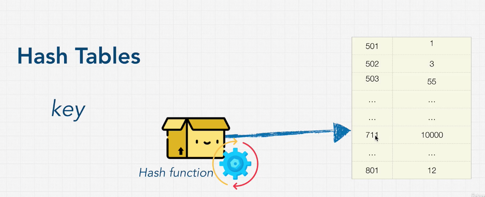
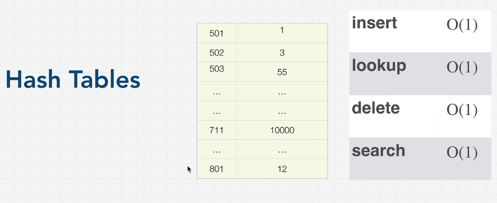
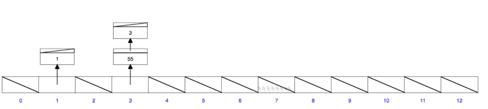
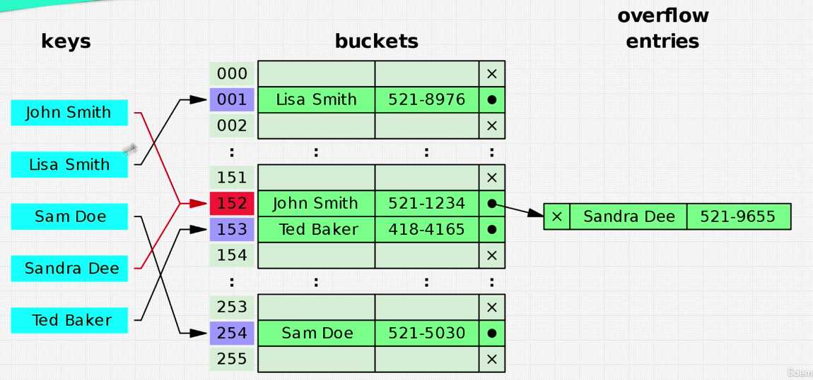
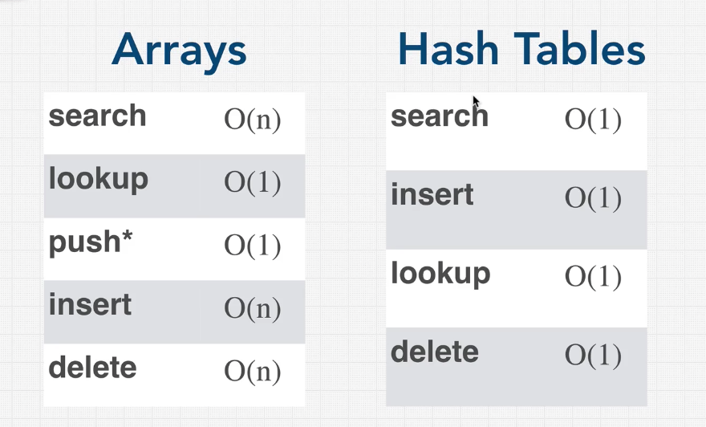

# Section 7 - Data Structures: Hash Tables

## Hash Tables Introduction

There are many different variations on hash tables, and different languages implement them and name them in different ways: Hash Tables, Maps, Unordered Maps, Objects.

But where does the "hash" come from?

In hash tables, we have a **key** which is used as an index on where to find a value in memory. This is done via a **hash function** that receives our key as input and processes it into the index in which we have stored the value in memory.



## Hash Function

A **hash function** is a function that creates a value of fixed length for each input that it gets.

An example: and md5 hash generator.

Important:

1. Hashing is one way. By having the hash, one does not know what the input was and it's practically impossible to reverse it into the original input.
2. **Idempotent**: Always exactly same output for same input. But as soon as it is barely modified, the output is completely different.

The benefit of using hashed keys as indeces is that we get really fast data access: all we have to do is pass the key into the hash function and look it up in memory using the output index. (In reality, the output hash is converted into an index base or an address that it has, based on that output index).

But why do we use this has function? Doesn't it slow things down when saving or retrieving data?

Languages implement this hashing with a very fast algorithms (in comparison to other hashing algorithms like SHA-256 which are used for cryptographical purposes and are really slow).

We typically assume a time complexity of **O(1)** for reading and writing in hash tables.

## Hash Collisions

The four main operations have a time complexity of O(1):



However, one of the main problems of hash tables are **hash collisions:**

Our computer has limited memory, and as we create an object or a hash table, our computer allocates a piece of memory for it.



If we have assigned 12 pieces of memory and we keep on inserting data, there is bound to be a collision in which the hash of the key for two different pieces of data are the same. This is a **collision**:



Notice than "Sandra Dee" gets hashed into 152, which was also the hash result of "John Smith". because of this collision we need a way to store both pieces of data in the same memory address space. In the graph above, this is solved through the use of a **linked list**, but different languages implement this solution in different ways.

This collisions cannot be completely avoided. With enouigh data and limited memory, they are bound to happen.

## Implementing a Hash Table

```js
class HashTable {
  constructor(size) {
    this.data = new Array(size)
  }

  _hash(key) {
    let hash = 0
    for (let i = 0; hash < key.length; i++) {
      hash = (hash + key.charCodeAt(i) * i) % this.data.length;
    }
    return hash
  }


  // Set the value to the key index (index being from 0 to size - 1)
  // by pushing the data (value) into that key address array
  // Time Complexity: We are only pushing into an array,
  // so it is always constant time, O(1)
  set(key, value) {
    let address = this._hash(key);
    if(!this.data[address]) {
      this.data[address] = [];
    }
    this.data[address].push([key,value]);
    return this.data[address];
  }

  // Get can be O(N) if there is a hash collision and we have to
  // loop through the bucket to find the bucketKey which corresponds
  // to the key which we are looking for.
  get(key) {
    let address = this._hash(key);
    const currentBucket = this.data[address];
    if(currentBucket) {
      // Alternative 1
      for(let i = 0; i < currentBucket.length; i++) {
        if(currentBucket[i][0] === key) {
          return currentBucket[i][1]   
        }
      }
      // Alternative 2
      const [bucketKey, value] = currentBucket.find(([bucketKey]) => bucketKey === key);
      return value;
    }
  }

  // They keys() method should return us a list of all the keys
  // used to store data in the hash table
  keys() {
    const keysArray = [];
    for (let i = 0; i < this.data.length; i++) {
      // If we have data stored in our bucket
      if(this.data[i]) {
        // Add the key to our keysArray
        keysArray.push(this.data[i][0][0])

      }
    }
  }
  // Notice that to get our keys, we need to loop through the
  // whole size of the data structure, which is O(N)

  keysWithHashCollisionPrevention() {
    if (!this.data.length) {
      return undefined
    }
    let result = []
    // loop through all the elements
    for (let i = 0; i < this.data.length; i++) {
        // if it's not an empty memory cell
        if (this.data[i] && this.data[i].length) {
          // but also loop through all the potential collisions
          if (this.data.length > 1) {
            for (let j = 0; j < this.data[i].length; j++) {
              result.push(this.data[i][j][0])
            }
          } else {
            result.push(this.data[i][0])
          } 
        }
    }
    return result;    
  }
}
```

## Hash Tables vs. Arrays



Notice the difference of **searching being O(1) in hash tables**. That's why it's a data structure so often found in databases.

**Insert and Delete** are also O(N).

## Excercise: First Recurring Character

Given an array:

```
array = [2, 5, 1, 2, 3, 5, 1, 2, 4];
```

Find the first recurring character. The above array should return 2.

```python
def findFirstRecurring(nums):
  seen = {}
  for val in nums:
    if val in seen:
      return val
    seen[val] = 1
  return None
```
