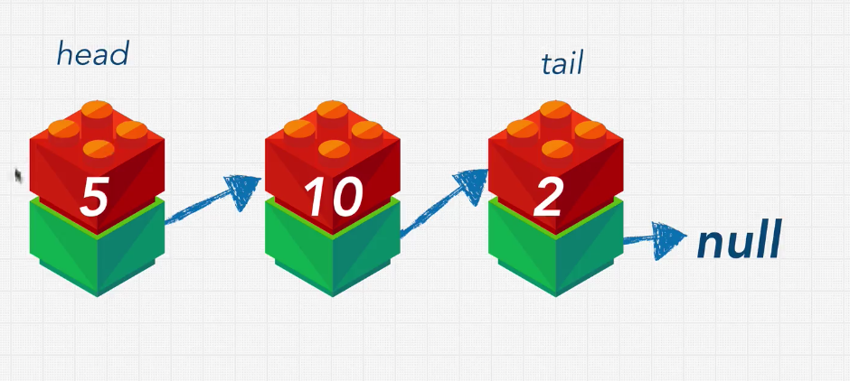

# Section 8 - Data Structures: Linked Lists

## Linked Lists Introduction

We are ging to gro throught two types of linked list: singly and doubly linked lists.

What problems do we encounter with arrays?

With static arrays, we only have a certain amount of memory that can be allocated next to each other. 

Both static and dynamic arrays can increase their data size once they reach a certain limit and double up their size in another location. This operation takes place once every certain amount of time (when the array is about to be full) and has a performance implication: it costs us O(N).

Additionally, arrays have bad performance for operations like insertion or delete which have to shift indeces over, for example at the middle or at the beggining.

Hash table addresses many of this problems but with one big caveat: they don't keep our data in order.

This is where **linked lists** come in to play.

## What is a linked list?

A linked list is a list that is linked.



A linked list is formed by a set of **nodes**. Each **node** has two elements:

- **value**: the data held by the node
- **pointer**: points to the next node in the list.

The first node is called the **head** and the last one is called the **tail**.

Linked lists are **null-terminated**, which means that we know which is the tail node bacause is points to `null`.

Nodes in a list can be sorted, unsorted and they can hold pretty much any data type.

## Why Linked Lists?

Why do you think, from what we know up to know, that linked lists can be better than arrays or hash tables?

Linked Lists have a "loose" structure, that allows you to insert a value into the middle of the linked list, by simply resetting a few pointers. 

In an array, our data is indexed, so retrieving a value from the middle of an array is simple by using the index and has a linear time complexity. However, when trying to find a value somewhere in the linked list, we have to do "traversal" of the whole data structure, starting from the head and following down the pointer to the subsequent nodes until we find our desired value.

Another advantage that arrays might have, is that most computers have cacheing system that makes reading data from sequential memory addresses faster than reading scattered addresses.

So iterating or traversing through a linked list is quite a bit slower than doing so through an array, even though they are techincally both O(N). However, the inserts that we can do in the middle or beggining of the data structure are a lot better than in an array.

The main advantage that linked lists have over hash tables is that we can keep an order for our data values. 

Let's take a look at the time complexity of the main operations for linked lists:


## What is a pointer?

A pointer is a reference to another place in memory.

In Javascript we can see this in action simply:

```js
const object1 = { a: true };

// object2 is a reference to object1
// it does not copy the object, there is only one in memory
const object2 = object1;

object1.a = "New value";
console.log(object1); // { a: "New value" }
console.log(object2); // { a: "New value" }

// If I delete object1
delete object1;
console.log(object1); // undefined
console.log(object2); // { a: "New value" }

// Because object2 is still a pointer to object1,
// even though we deleted object1 itself, the data
// at the memory address of object1 is not garbage
// collected by JavaScript, becuase there is a pointer
// still pointing at it.
```
In other non-garbage collected languages you would have to do this garbage collecting yourself.

## Our First Linked List

Let's create our first linked list with the shape: `10 --> 5 --> 16`.

```js
let myLinkedList = {
  head: {
    value: 10,
    next: {
      value: 5,
      next: {
        value: 16,
        next: null
      }
    }
  }
}

class LinkedLink {
  constructor(value) {
    this.head = {
      value,
      next: null
    }
    this.tail = head;
    this.length = 1;
  }
}

const myLinkedList = new LinkedList(10);
```

```python
class Node:
  def __init__(self, data):
    self.data = data
    self.next = None

class LinkedList:
  def __init__(self, node):
    self.head = node
    self.tail = node
    self.length = 1
  
  def __repr__(self):
      node = self.head
      nodes = []
      while node is not None:
          nodes.append(node.data)
          node = node.next
      nodes.append("None")
      return " -> ".join(nodes)

llist = LinkedList(Node("a"))
print(llist)
```

## Adding append()

```js
class LinkedLink {
  constructor(value) {
    this.head = {
      value,
      next: null
    }
    this.tail = this.head;
    this.length = 1;
  }

  append(value) {
    let newNode = {
      value,
      next: null
    }
    this.tail.next = newNode;
    this.tail = newNode;
    this.length++;
    return this;
  }
}

const list = new LinkedLink(5).append(3);
list.append(6);
list.append(99);
console.log(JSON.stringify(list))
```

```python
class Node:
  def __init__(self, data):
    self.data = data
    self.next = None

class LinkedList:
  def __init__(self, node):
    self.head = node
    self.tail = node
    self.length = 1
  
  def __repr__(self):
      node = self.head
      nodes = []
      while node is not None:
          nodes.append(node.data)
          node = node.next
      nodes.append("None")
      return " -> ".join(nodes)

  def append(self, newNode):
    self.tail.next = newNode
    self.tail = newNode
    self.length = self.length + 1
    return self

llist = LinkedList(Node("a")).append(Node("b")) # a -> b -> None
print(llist)
```

## Adding prepend()

```js
class LinkedLink {
  constructor(value) {
    this.head = {
      value,
      next: null
    }
    this.tail = this.head;
    this.length = 1;
  }

  append(value) {
    let newNode = {
      value,
      next: null
    }
    this.tail.next = newNode;
    this.tail = newNode;
    this.length++;
    return this;
  }

  prepend(value) {
    let newNode = {
      value,
      next: this.head
    }
    this.head = newNode;
    this.length++;
    return this;
  }
}

const list = new LinkedLink(5).append(3);
list.append(6);
list.append(99);
list.prepend(-1);
console.log(JSON.stringify(list))
```

```python
class Node:
  def __init__(self, data):
    self.data = data
    self.next = None

class LinkedList:
  def __init__(self, node):
    self.head = node
    self.tail = node
    self.length = 1
  
  def __repr__(self):
      node = self.head
      nodes = []
      while node is not None:
          nodes.append(node.data)
          node = node.next
      nodes.append("None")
      return " -> ".join(nodes)

  def append(self, newNode):
    self.tail.next = newNode
    self.tail = newNode
    self.length = self.length + 1
    return self

  def prepend(self, newNode):
    newNode.next = self.head
    self.head = newNode
    self.length = self.length + 1
    return self

llist = LinkedList(Node("a")).append(Node("b")).prepend(Node("z")) # a -> b -> None
print(llist)
```

## Node Class

In Javascript, we should also have a Node class:
```js
class Node {
  constructor(value) {
    this.value = value;
    this.next = null;
  }
}
class LinkedLink {
  constructor(value) {
    this.head = new Node(value);
    this.tail = this.head;
    this.length = 1;
  }

  append(value) {
    let newNode = new Node(value);
    this.tail.next = newNode;
    this.tail = newNode;
    this.length++;
    return this;
  }

  prepend(value) {
    let newNode = new Node(value);
    newNode.next = this.head;
    this.head = newNode;
    this.length++;
    return this;
  }
}

const list = new LinkedLink(5).append(3);
list.append(6);
list.append(99);
list.prepend(-1);
console.log(JSON.stringify(list))
```

## Adding insert()

```js
class Node {
  constructor(value) {
    this.value = value;
    this.next = null;
  }
}
class LinkedLink {
  constructor(value) {
    this.head = new Node(value);
    this.tail = this.head;
    this.length = 1;
  }

  append(value) {
    let newNode = new Node(value);
    this.tail.next = newNode;
    this.tail = newNode;
    this.length++;
    return this;
  }

  prepend(value) {
    let newNode = new Node(value);
    newNode.next = this.head;
    this.head = newNode;
    this.length++;
    return this;
  }

  printList() {
    const array = [];
    let currentNode = this.head;
    while(currentNode !== null) {
      array.push(currentNode.value);
      currentNode = currentNode.next;
    }
    return array.join(" --> ");
  }

  insert(index, value) {
    if(index > this.length) {
      return "Error: New index out of bounds."
    }
    if(index === 0) {
      this.prepend(value);
      return this.printList();
    }
    let currentNode = this.head;
    for(let currentIndex = 0; currentIndex < index - 1; currentIndex++) {
      currentNode = currentNode.next;
    }
    const newNode = new Node(value);
    newNode.next = currentNode.next;
    currentNode.next = newNode;
    return this.printList();
  }
}

const list = new LinkedLink(5).append(3);
list.append(6);
list.append(99);
list.prepend(-1);
console.log(list.printList())
list.insert(0, 999)
```