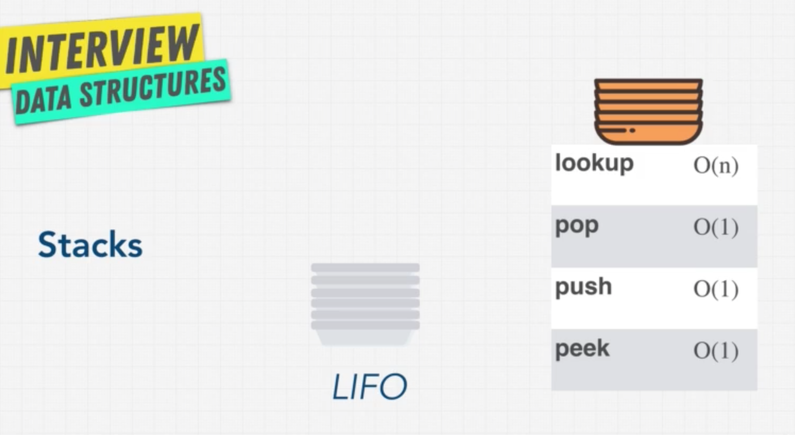
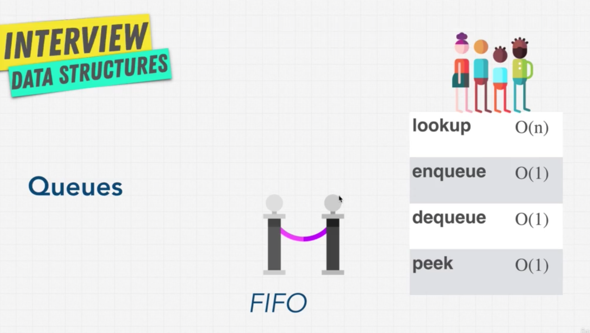

# Section 9 - Data Structures: Stacks and Queues

## Introduction

Stacks and Queues are very similar, and that is why they are learnt together. They are what is called **linead data structures**. They allow us to go through data sequentially, transverse it sequentially, that is, one by one, but only one item can be reached at a time.

Unlike an array, there is no random access of items. One uses commands like push, peep and pop, all of which deal exclusively with the element at the beggining or at the end of the data structure.

If this actually **limits** what we can do with a data structure like an array, why would we use a stack or a queue instead of an array? The thing is, we are actually **limiting the available operations on purpose**: it's a benefit, an advantage, because we can guarentee that whoever uses our data structures uses the right operations, which are efficient for the given use case.

## Stacks



Stacks is a type of data structure which can be thought of as a pile or stack of plates. Items or pieces of data are stacked one on top of the other vertically, so that only the top plate can be "touched" or operated upon. There's no random access of items in the middle of the stack; if a particular item needs to be retrieved, all data items on top of it need to be retrieved first.

This is called **LIFO: last in - first out**: because the last item that comes in is the first one to go out.

When is this useful? They have actually a wide array of use cases: for example, when you need to keep track of the last value that was seen or added. 

They are also very used in language specific engines: that's where the term "stack overflow" comes from. Most programming languages are modelled according to the stack data structure, and when functions get called the follow the **LIFO** model: a function within a function gets called, and then the language starts popping those functions until we get to the very beggining of the stack.

The browser history and the do-undo functionality in many software tools is another example of usage of stacks: the current state of the browser or of your work is stored in a stack so that the latest state appears first.

Stacks usually come and use three main operations, all of which have time complexity of O(1):

* **pop**: removes the last item (placed on top)
* **push**: add an item to the top
* **peek**: view the top most data item

## Queues

Queues can be thought as the lines or queue to a bank. The first person in the line is the first to go out of the queue, then the second, then third, etc. This is called **FIFO: first in - first out.**

In this way, it is the opposite of stacks: the first item in the queue gets acces`sed first (and not last, like in stacks).

Queues are also used a lot in computer science: for example, any kind of waitlist app (for example to buy tickets, or check in at a restaurant, grab at ride at Uber). Also, a printer connected in a network has a queue of pending jobs.



The three main operations of a queue also have a constant time complexity:

* **dequeue**: removes an item from the beginning of the qieie (analogous to pop)
* **enqueue**: adds an item to end of the qieie (analogous to push)
* **peek**: view the beginning of the queue.

Notice why **queues** are not built using arrays: if you dequeue an item, you are removing it from the beginning of the queue (of the array in this case). That's **unshifiting** an array, which, as we have seen, has a time complexity on O(N), while we should strive for O(1).

## Builduing Stacks and Queues

There's two ways we can create stacks and queues:

* with **arrays**
* with **linked lists**

A **stack** can be built using both arrays and linked lists and both will work fairly well as regards performance. However, arrays allow **cache locality** which makes accessing it data faster because they are located one next to another in memory. (This does not happen in a linked list). 

Also, a linked list has extra memory assigned because we need to keep the poitner references from one node to the next. 

On the other hand, the management of data may be more efficient because, depending on how the programming language handles arrays, once the preallocated memory gets filled, it may double the space assigned to add a new item (and copy all values over), which does not happen on linked lists.

So we must think what kind of problem we are facing and which operations we will do in order to decided if we want to build our stack with arrays or linked lists.

For **queues**, on the other hand, there is a simple answer: we would never build them with arrays. As we have said, in order to remove the first in the queue (as it happens), we would need to unshift all values "to the left", which is a linear operation (O(N)), when we should aim for O(1). That is something we can easily achieve with linked lists.

## Stack Implementation

Implementing a **stack** using a linked list:

```python
class Node:
  def __init__(self, data):
    self.data = data
    self.next = None

class Stack:
  def __init__(self, value):
    self.top = None
    self.bottom = None
    self.length = 0
  
  def __repr__(self):
    node = self.top
    nodes = []
    while node is not None:
        nodes.append(node.data)
        node = node.next
    nodes.append("None")
    return " -> ".join(nodes)

  def peek():
    if self.length == 0:
      return None
    return self.top

  def push(value):
    newNode = Node(value)
    if self.length == 0:
      self.bottom = newNode
      self.top = newNode
      self.length += 1  
      return self
    newNode.next = self.top
    self.top = newNode
    self.length += 1  
    return self
  
  def pop():
    if not self.top:
      return None
    if self.top == self.bottom:
      self.bottom = None
    returnNode = self.top
    self.top = returnNode.next
    self.length -= 1
    return returnNode
```

Implementing a **stack** using an array:

```python
class Stack:
  def __init__(self):
    self.data = []

  # Notice how this method is different to llists
  def __repr__(self):
    if len(self.data) == 0:
      return "Empty stack"
    return " <- ".join(self.data)

  def peek(self):
    if len(self.data) == 0:
      return None
    return self.data[len(self.data) - 1]

  def push(self, value):
    self.data.append(value)
    return self
  
  def pop(self):
    if len(self.data) > 0:
      self.data.pop()
    return self

stack = Stack()
print(stack.push("1").push("2").push("2").push("4").pop().pop().pop().pop().pop().peek())
```

## Queue Implementation

Implementing a **queue** using a linked list:

```python
class Node:
  def __init__(self, value):
    self.data = value
    self.next = None

class Queue:
  def __init__(self):
    self.first = None
    self.last = None
    self.length = 0

  def __repr__(self):
    data = []
    node = self.first
    while node is not None:
      data.append(node.data)
      node = node.next
    data.append("None")
    return " -> ".join(data)
  
  def peek(self):
    return self.first

  def enqueue(self, value):
    newNode = Node(value)
    if self.length == 0:
      self.first = self.last = newNode
      self.length += 1
      return self
    self.last.next = newNode
    self.last = newNode
    self.length += 1
    return self

  def dequeue(self):
    if not self.first:
      return self
    if self.length == 1:
      self.first = self.last = None
      self.length -= 1
      return self
    self.first = self.first.next
    self.length -= 1
    return self
```

## Implementing queues using stacks

### Approach using one stack and a marker

```python
class Stack:
    def __init__(self):
        self.data = []

    def __repr__(self):
        return " <- ".join(self.data)

    def peek(self, frontPos):
        return self.data[frontPos]

    def push(self, value):
        self.data.append(value)
        return self

    def length(self):
        return len(self.data)  
  
    def pop(self):
        self.data.pop()
        return self


class MyQueue:
    def __init__(self):
        self.stack = Stack()
        # Track what is the position
        # of my actual front
        self.frontPos = 0

    def push(self, x: int) -> None:
        self.stack.push(x)
        
    def pop(self) -> int:
        # Move the marker forward
        self.frontPos += 1
        # But get the front of the array
        return self.stack.peek(self.frontPos - 1)

    def peek(self) -> int:
        if self.stack.length() == 0:
            return None
        return self.stack.peek(self.frontPos)
        
    def empty(self) -> bool:
        # To know if it's empty, take the length of
        # the array, but substract how many items
        # we have "removed" items from the front.
        if self.stack.length() - self.frontPos == 0:
            return True
        return False
```

### Approach using two stacks

Time complexity:
**Push:** O(1)
**Pop:** Amortized O(1)

```python
class MyQueue:
    def __init__(self):
        self.s1 = []
        self.s2 = []
        
    def push(self, value):
        self.s1.append(value)
        
    def peek(self):
        if not self.s2:
            while self.s1:
                self.s2.append(self.s1.pop())
        return self.s2[-1]
    
    def pop(self):
        self.peek()
        return self.s2.pop()
    
    def empty(self):
        if not self.s2 and not self.s1:
            return True
        return False
```