# System Design Interview

# Forward

System design itnerview questions require interviewees to design an architecture for a software system, whcih could be a news feed, Google serach, chat system, etc. The questions are intimidating and there is usually no certain pattern to follow. The questions are big-scoped and vague, and the procesess open-ended and unclear, without a standard or correct answer.

Companies widely adopt system design interviews vecause the communication and problem-solving skills tested in these interviews are similar to those requried by a software engineer's daily work: how she analuys a vague problem and solves the problem step by step.

System design questions are open-ended and there are many differences and variations in the system. **The desired outcomes is to come up with an architecture to achieve system design goals.**

The discussions can go in different ways depending on the interviewer: some may choose high-level architecture to cover all aspects; other focus on one or more areas.

Typically, **system requirements, constraints and bottlenecks should be well understood** to shape the direction of both the interviewer and the interviewee.

The objective of the book is to provide a reliable strategy to approach the system design questions, and it provides solid knowledge in building a scalable system.

The book also provides a step by step framework on how to tacke a system design question, and many examples to illuestrate the systematic approach with detailed steps that you can follow.

# Chapter 1: Scale from Zero to Millions of Users

In this chapter, we build a system that supports a single user and gradually scale it up to serve millions of users.

## Single Server Setup

Let's start with a system where everything is running on a single server - a single server setup:

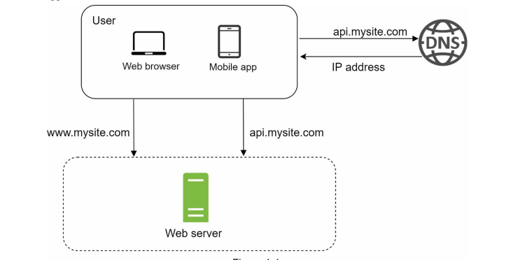

To understand this setup, let's investiage the request flow and traffic source:

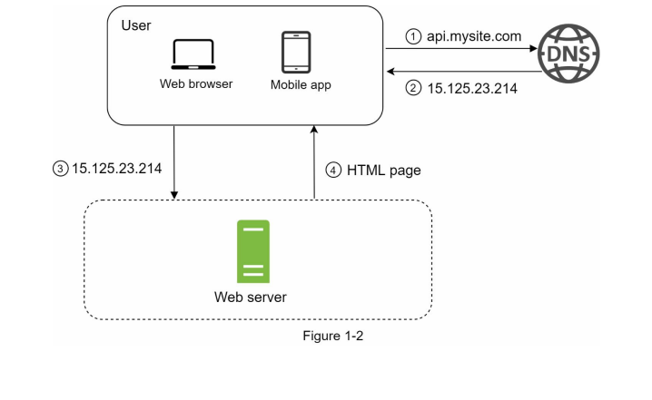

1. Users access websites through **domain names**, such as `api.mysite.com`. Most usually, the **DNS** is a service provided by 3rd parties and NOT hosted by our servers.
2. The **IP address (Internet Protocol Address)** is returned to the browser or mobile app (or any other client).
3. The IP address is used to make **HTTP requests directly to our webserver**.
4. The web server returns **HTML pages and other resources or a JSON response**.

Now let's examine **traffic source**. The traffic to your web server comes from two sources:

- **web application**: uses a combination of server side languages to handle business logic, storage, etc., and client-side languages for view presentation.
- **mobile application**: communicates with the webserver via the HTTP protocol using most commonly JSON as the API response format, due to its simplicity.

## Database

With the growth of the user base, one server will not longer will be enough, which is why we will ned multiple servers: one for web/mobile traffic, the other for the database.

**Separating web/mobile traffic (web tier) and database (data tier) servers allow them to be scaled independently.**

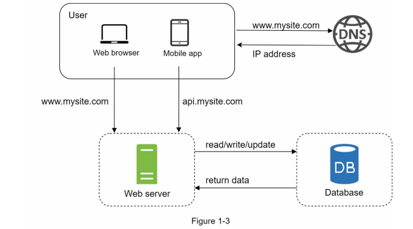

### Which databases to use?

One can choose between traditional relational database and non-relational databases.

**Relational databases** are also called **relational database management system (RDBMS)** or simply **SQL databases**, being the most popular MySQL, Oracle database, PostgreSQL. They store and represent data in tables and rows. **Join operations** can be performed to retrieve data across diferent tables.

**Non-relational databases** are also called **NoSQL databases**. Popular examples are CouchDB, Neo4J, Cassandra Amazon DynamoDB, etc. These databases are grouped into four categories:
- **key/value stores**
- **graph stores**
- **column stores**
- **document stores**

Join operations are usually not supported in NoSQL operations.

For most developers, realtional databases are the best option because they have been around for over 40 years and they are a proved solution. However, if relational databases are not suitable for you specific use case, alteernatives ca be explored.

Non-relational databases might be the right choice if:

- The application requires **super-low latency**
- The application data is unstructured, or the data is not relational.
- We only need to serializa and deserialize data (JSON, XML, YAML, etc).
- We need to store a massive amount of data.

### Latency, Bandwith and Throughput

**Water Analogy:**

**Latency**: the amount of time it takes to travel through the tube.
**Bandwidth**: how wide the tube is.
**Throughput**: the rate of water flow.

**Vehicle Analogy:**

**Latency**: Vehicle travel time from source to destination.
**Bandwidth**: Types of roadways.
**Throughput**: Number of vehicles traveling.

## Vertical scaling vs horizontal scaling

**Vertical scaling**, referred to as a "scale up", means the process of adding more computing power (CPU, memory, etc.) to your servers.

**Horizontal scaling**, referred to as a "scale out", is the process of adding more servers into our pool of resources.

When trafiic is low, vertical scaling is a great option, as it has the advantage of being relatively simple. However, it has serious limitations:
1. **it has a hard limit**: it not possible to add unlimited CPU and memory to a single server.
2. **it does not offer redundancy and failover**: if one server goes down, the application goes down with it completely

> **Redundant**: using two computers when one would be sufficient. The redundant server is there in case the other computer fails.
> 
> **Failover**: the automatic transfer of workload from a failed computer to another working computer.

**Horizontal scaling** is more desirable for large scale applications due to these limitations. For example, in the previous design, users are connected to the web server directly. If it goes offline, they will be unable to access the website. 

In another scenario, if many users attempt to access the web server simultaneously, and it reaches the web server's load limit, users generally experience slower responses or fail to connect to the server. A load balancer is the best techinque to address this issues.

## Load Balancer

A **load balancer** evenly distributes incoming traffic among web servers that are defined in a load-balanced set. The following figure shows how they work:

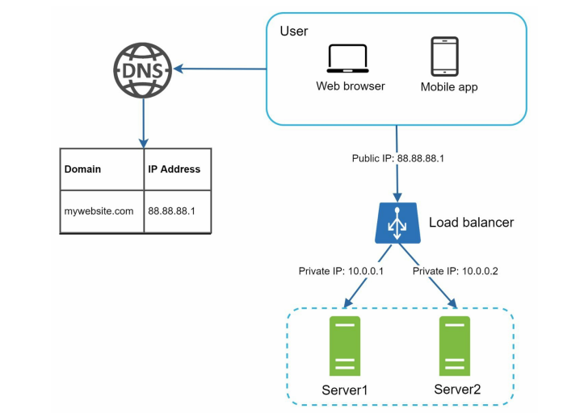

Users now connect to the public IP of the load balancer directly. With this setup, **web servers are not directly reachable by clients** anymore. For better security, private IP are used for communication between servers, and between servers and load balancers.

> Private IPs are IP addresses reachable only between servers in the same network, but unreachable over the internet.

In the above confiuration, with a second web server added, and a load balancer in place, we have successfully solved the no failover issue and improved the availability of our web tier:

- If server 1 goes offline, all the traffic will be routed to server 2. This prevent the application from going offline. This gives us tome to add a new healthy web server to the server pool to balance the load.
- If the website traffic grows rapidly, and two servers are not enough to handle the traffic, the load balancer can handle the problem gracefully: we only neww to add more server to the web server pool, and the LB will automatically start to send request to them.

## Database replication

While the configuration above improved the availability of our web tire, the data tier does not support failover and redunancy. **Database replication** is a common techinque to do exactly that.

**Database replication** can be used n many database management systems, usually with a master/slave relationship between the original (master) and the copies (slaves).

A **master database** generally only supports **write operations**. A **slave database** gets copies of the data from the master database and only supports **read operations**.

So all data-modifying operations like insert, delete or update are sent to the master database. Since most applications require a much higher ratio of reads to write, the number of slave databases in a system is usually larger than the number of master databases:

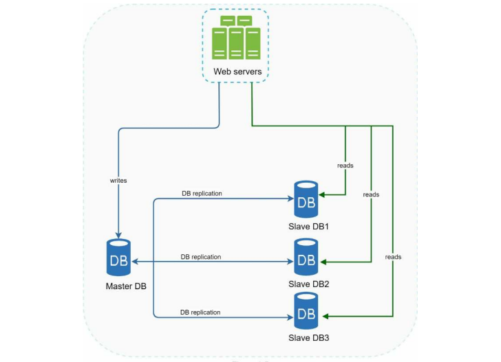

### Advantages of database replication

1. **Better performance**: in the master/slave model, all writes and updates happen in the master node; whereas read operations are distributed across slaves nodes. This improves performance because it allows more queries to be processed in parallel.
2. **Reliability:** if database servers are lost, data is still preserved,, as data is replicated across multiple locations.
3. **High availability**: with data replicated across different locations, a website remain in operation even if a database is offline by accesing data stores in another database.

### How is high availability in the database tier achieved?

- If only one one **slave database** becomes unavailable, read operations will be redirected to other healthy slave databases (while the unavailable is recovered). If there are no more healthy slave databases, the read operations are temporarily redirected to the master database, while new slaves are spun up.
- If the **master database** goes offline, a slave database will be promoted to the new master, and all write operations will be operated (temporarily) on it. A new slave database will be spun up to replace the slave that was promoted. In production systems, promoting a slave to master is often more complex, as the data in a slave might not be up to data, and needs to be updated by running recovery scripts. However, other replication methods like multi-masters and circular replication can help avoid that.

The following diagram shows the system after adding the **load balancer** and **database replication**:

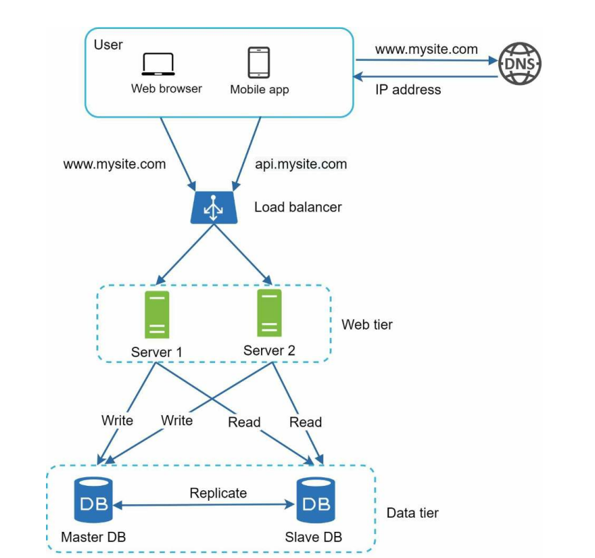

Let's go over the flow:
- A user get the IP address of the load balancer from DNS.
- A user connects to the laod balancer with it.
- User makes an HTTP request, which the laod balancer routes to either Server 1 or Server 2.
- The web server reads user data from a slave database.
- The web server routes any data-modifying operations to the master database. This includes write, update and delete operations.

We can no attempt to improve the load/response time of to the user. We can do this by adding a cache layer and shiftig static content like JS, CSS, image and video files to a CDN (content delivery network).

## Cache

A **cache** is a temporary storage area that stores the result of expensive responses or frequently acessed data in memory, so that the subsequen requests can be served more quickly. As seen in the figure below, every time a new web page load, one more database calls are executed to fetch data. This repeated calling of the DB can affect performance, and the cache layer can help mitigate the problem.

### Cache tier

The **cache tier** is a temporary data store layer, which is much faster than a database. The benefits of having a separate cache tier include:
- better system performance
- reduced database workloads
- ability to scale the cache tier independently

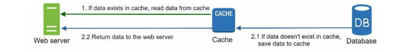

As seen in the figure above, when receiving a request, a web server first checks if the cache has the response for that request persisted and available. If it does, it directly sends it back to the client. If it doesn't, it queries the database, stores the response in cachem and sends it back to the client.

This **cache strategy** is called **read-through cache**, but other strategies exist that depend on data type, size and access patterns.

Interacting with cache servers is simple, as most of them provide APIs for common programming languages. For example, the following is the Memcached API:

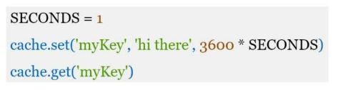

### Considerations for using cache

- Decide **when** to use cache. Consider using cache when **data is read frequently but modified infrequently**. Since cached data is stored in volatile memory, a cache server is not ideal for persisting data. For instance, if a cache server restarts, all its data is lost. Therefore, important data should be saved in persistent data stores.
- Implement an **expiration policy**: once cached data is expired, it is removed from the cache. When there is no expiration policiy, cached data will be stores in the memory permanently. The expiration policity should not be too long (data might become stale) nor too short (will cause the system to reload data from the DB too often, defeating the purpose).
- **Consistency**: the information stored in the data store and the cache should stay in sync. Inconsistency can happen because data-modifying operations on the data store and cache are not in a single transaction. When scaling across multiple regions, maintaining consistency can prove challenging.
- **Mitigating failures**: A single cache server can represent a potential single point of failure (SPOF: a part of a system that, if fail, will stop the entire system from working). Therefore, multiple cache servers across different data centers are recommended to avoid them being SPOFs. Alternatively, memory can be overprovisioned on the cache server to serve as a buffer as the memory usage increases.
- **Eviction Policy**: determines what happens when a cache server reaches its memory limit, i.e. becomes fully. To make room for new data, older data is evicted (removed), according to the selected policy. "Least-recently-used" (LRU) is the most popular policy, but other such as "least-frequently-used" (LFU) or FIFO can apply to other use cases.

## Content Delivery Network (CDN)

A **CDN** is a network of geographically distributed servers used to deliver static content. CDN servers cache static content like images, videos, CSS and JS files, etc.

When a user visits a website, a CDN server physically closest to the user will deliver static content. Intuitively, the further away users are from CDN servers, the slower the website will load.

**A CDN works by fetching static assets from your web server and caching them on their geographically distributed servers.** When a browser makes a request to visit your site, the static contents are served via the CDN rather than your server. This is faster because CDN servers are globally distributed and serve as proxies that determine which server is located physically closest to your visitor.

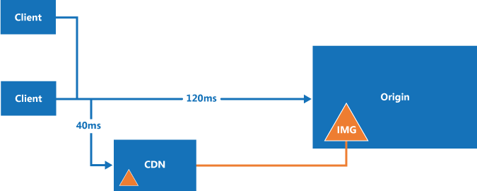

So **how does the browser know to get the resources from the CDN instead of your server?** The URL of your static resources are replaced to point to the CDN server instead of the URL of your own server.

Let's go over that flow, following the diagram below: 

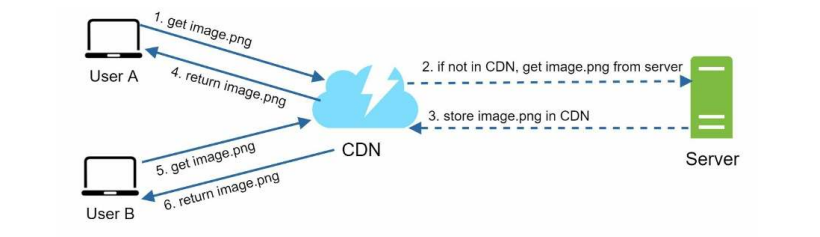

1. User A tries to get the image `duck.png` by using an image URL. The URL's domain is provided by the CDN provider, something like: `https://mysite.akamai.com/image-manager/img/duck.png`
2. If the CDN server does not have the image in its cahce, the CDN server request the file from **origin**, which can be our webserver or an online storage like Amazon S3.
3. The origin return `duck.png` to the CDN server, which optionally includes the **HTTP header Time-To-Live (TTL)**, which describes how long the image is cached.
4. The CDN caches the image and returns it to User A. The images remains cached in the CDN until TTL expires.
5. User B send a request to get the same image.
6. The image is returned from the cache, as long as the TTL hasn't expired.

### Considerations when using a CDN

- **Cost**: CDNs are run by third party providers, and you get charged for data transfers in and out of the CDN. Caching infrequently used assets provides no significant benefits, so you should consider moving them out of the CDN.
- **Setting an appropiate cache expiry**: for time-sensitive content, setting a cache expiry time is important. It shouldn't be too long (content might be stale or no longer up to date), nor too short (would cause repeat reloading of content from origin servers to the CDN)
- **CDN fallback**: consider how our application copes with CDN failure. In teh case of an otuage, clients should still be able to request and get server resources from the origin.
- **Invalidating files**: a file can be removed from a CDN before it expires by:
  - Invalidating the CDN object using the CDN's API.
  - Use object versioning to serve a different version of the object, for example, by adding a parameter to the URL, such as a version number. `duck.png?v=2`

The following figure shows our system design with CDN and cache added:

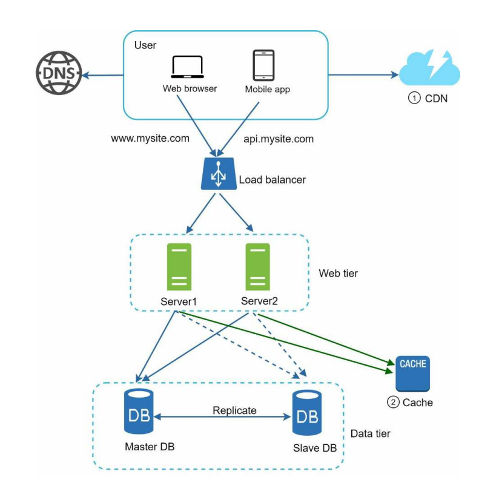

## Stateless Web Tier

How do we **scale our web tier horizontally?** In order to do this, we need to move state (such as user session data), out of the web tier. A good practice is to store session data in persistent storage, such as a DB/ Each web server in the cluster can access state data from the DB. This is called a **stateless web tier.**

Let's compare a **stateful architecture** with a **stateless architecture**.

### Stateful architecture

A **statful server** remembers client state in a session from one request to the next. Let's see an example:

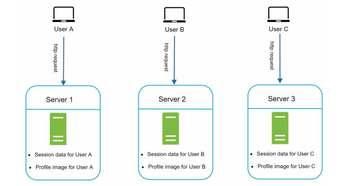

In the figure above, **user A**'s session data and profile image are store in **server 1**. To authenticate **user A**, HTTP request must be routed to **server 1**, because that is where the user's session data is store. If the request is sent to other servers, like **server 2**, authentication would fail.

Similarly, all HTTP requests sent from **user B** must be routed to **server 2**, and **user C** moust be routed to **server 3**.

So the issue is that every request from the same client must always be routed to the same server. This can be done via **sticky sessions** in most load balancers, but implementing and mainting this is additional overhead. Also, **adding and removing servers is much more difficult** with this approach. It also makes more difficult to **handle server failures.**

> **Sticky sessions**: (also called **session persistance**) involves directing a user's requests to one application or backend web server for the duration of a "session". The session is the period that it takes a user to complete a transaction or tasks, including multiple requestes. [More info.](https://avinetworks.com/glossary/session-persistence)

### Stateless architecture

In a **stateless architecture**, HTTP requests from users can be redirected by the load balancer to any web server, all of which fetch state data from a shared data store, like a DB. This state date is thus purposely kept out of web servers.

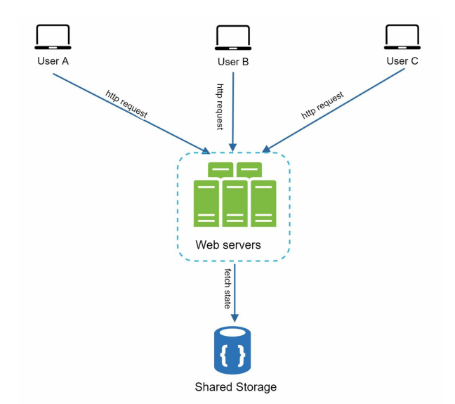

This makes stateless systems **simple, more robust and scalable.**

The figure below shows our system design with a stateless web tier:

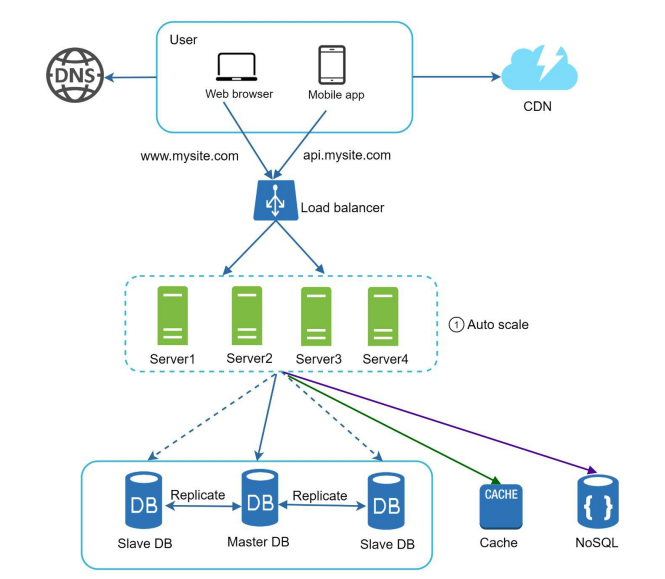

In the figure above, wee have moved the session data out of the web tier and stored it in persistent data store. Whiel it could be a relational DB, Redis, NoSQL, in this case we went for a NoSQL data store as it is easy to scale.

**Autoscaling means adding or removing web servers automatically based on the traffic load.**

After the state data is removed out of the web servers, auto-scaling of the web tier is easily achieved by adding or removing servers based on traffic load.

## Data Centers

Our website grows rapidly and attracts a significant number of users internationally. To improve availability and provide a better user experience across wider geographical areas, supporting multiple data centers is crucial.

The figure below shows an example setup with two data centers. In normal operation, users are **geo-routed or geoDNS-routes to the closest datacenter**, with a split in traffic between US-East and US-West. 

**geoDNS** is a DNS service that allows domain names to be resolved to IP addresses based on the physical location of the user.

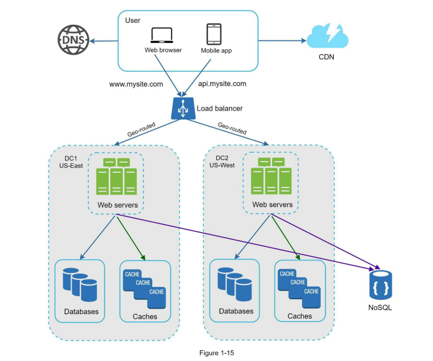

In the event of a mjor dta center outage, for example of US-East, all traffic will be directed to US-West, while the first datacenter gets put into availability again.

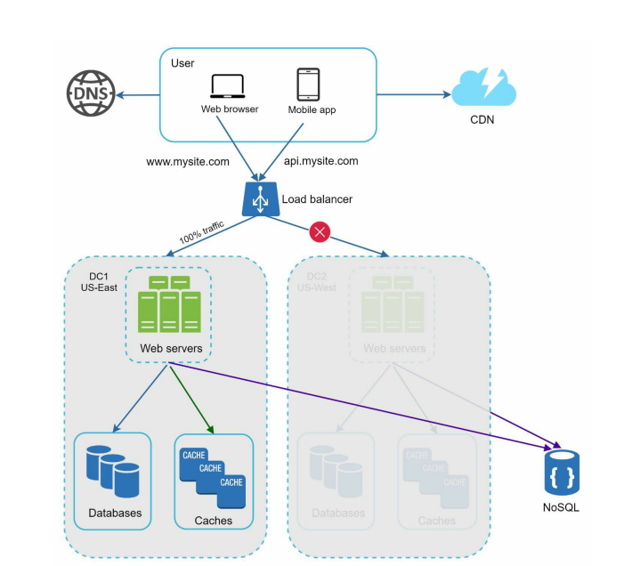

Several techincal challenges must be resolved to achieve a successful multi-datacenter setup:

- **Traffic redirection**: we need tools to direct incoming traffic to the appropiate data center. **GeoDNS** is the [indicated tool for that.](https://www.cloudns.net/blog/what-is-geodns-and-how-does-it-work/)
- **Data synchronization**: users from different regions will consume different sets of region-specific databases or cahces. In failover cases, or in case of a user moving physically, traffic might get routes to a data center where that user's data is unavailable. A strategt to solving data is **replicating the data across the data centers.**
- **Testing and deployment**: with a multi datacenter setup, it is important to test your website/application at different location. **Automated deployemnt tools** are vital to keep services consistent through all data centers.

## Message queues

To further scale our system, **we need to decouple different components of the system** so that they can be scaled independently. **Message queues** are a key strategy used to solved this issue.

A **message queue** is a durable component, stored in memory, that supports asynchronous communication. It serves as a buffer and distributes asynchronous requests.

Input services, called generically **producers or publishers**, create messages and publish them to the **message queue**. Other services or servers, called generically **consumers or subscribers**, connect to the queue and perform actions defined by the messages.

The model is shown in the figure below:

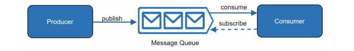

**Decoupling between components makes the message queue a preferred architecture for building a scalable and reliable application.** With a message queue, the producer can post a message to the queue when the consumer is unavailable to proccess it. At the same time, the consumer can read messages and process them from the queue when the producer is unavailable.

Let's take a look at an example: our application supports photo customization, like cropping, sharpening, blurring etc, all operations which are async, i.e. take time to complete.

In the diagram below, we can see how web servers, our producers, publish photo processing jobs to the message queue. Photo processing workers then pick ups those jobs from the message queue and asynchronously process them.

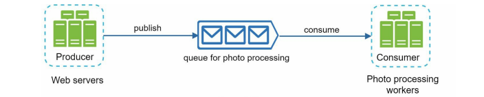

**The producer and consumers can thus be scaled independently.** If the size of the queue becomes too large, more consumers/subscribers can be added to reduce the processing time. If the queue is empty most of the time, the number of consumers/subscribers can be reduced.

## Logging, metrics and automation

While logging, metrics and automation support are a good practice, but not a necessity, when running a small site, they become essential when running a large business or a complex system.

### Logging

Monitoring error logs helps to identify errors and problems in the system. Logging can be done at a per-server level, or use tools to aggregate them to a centrilized service for easy seach and viewing.

### Metrics

Collecting different types of metrics help us to gain business insights and understand the health status of our system:

- **Host-level metrics**: CPU usage, memory consumed, disk I/O operations, etc.
- **Aggregated-level metrics**: performance of the entire web tier, database tier, cache tier, etc.
- **Key business metrics**: daily active users, retention, revenue, etc.

### Automation

When a system gets too complex, it is recommended to build or leverage automation tool to improve productivity. CI/CD is a good practice, helping us verify code check-ins through automation, allowing teams to detect problems early. Also automating the build, test and deployment process impreves developer productivity significantly.

The figure below shows our updated design (with only one data center). It now includes:
- a message queue
- logging, metrics and automation

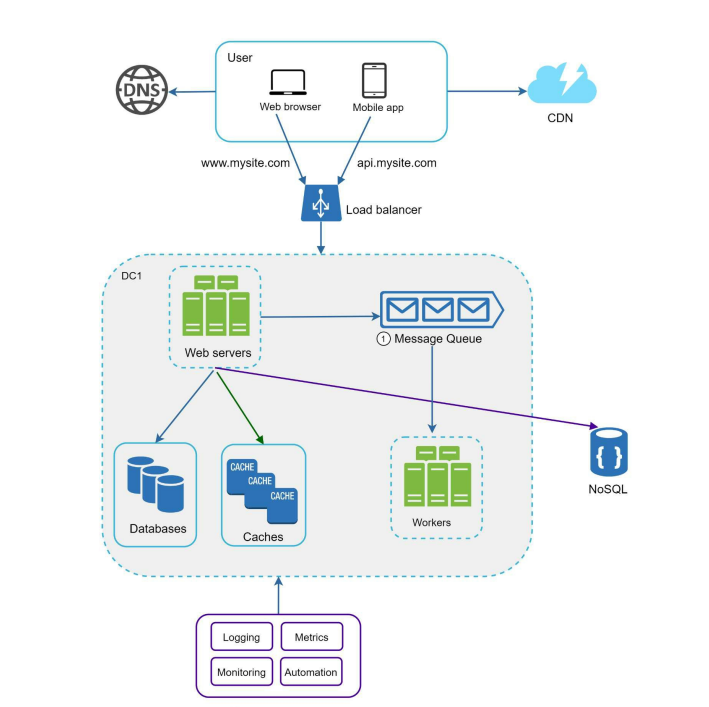

## Database scaling

As the volume of data in our application grows, our databases might get overloaded. How can we scale our data tier?

There are two broad approaches for database scaling: **vertical scaling and horizontal scaling.**

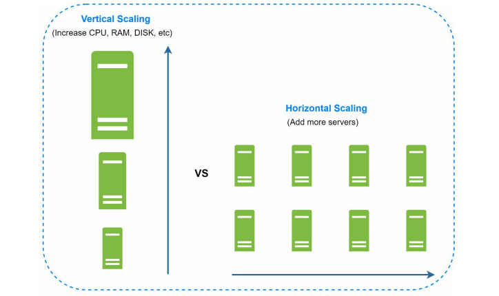

### Vertical scaling

**Vertical scaling**, also known as scaling up, is the scaling by adding more power/resources (CPU, RAM, storage space) to an existing database store. 

Some really powerful database servers can be provisioned: Amazon RDS (Relational Database Service) allow to provision a database server with 24 TB of RAM. Such a powerful DB server can store and handle huge amounts of data.

> In 2013, StackOverflow had over 10 million unique visitors, but only 1 master database.

However, using **only** vertical scaling for your database tier can have some serious drawbacks:

- **Hardware limits**: resources such as CPU, RAM and disk space cannnot be increased indefinitely.
- **Cost**: provisioning extremely powerful instances becomes really expensive.
- **Greater risk of single point of failure**

### Horizontal scaling

**Horizontal scaling**, also known as **sharding**, is the practice of adding more dtabase servers.

**Sharding** separates large databases into smaller, more easily managed parts called shards. *Each shard shares the same schemas, but the actual data on each shard is unique to it.*

The figure below shows an example of sharded databased. User data is allocated to a database server, based on user IDs. Anytime you access data, a hash function is usted to find the corresponding shard where to write to.

In our example, `user_id % 4` is used as hash function. If the result of the function equals 0, shard 0 is used to store and fetch data. If the result equals 1, shard 1 is used, and so on.

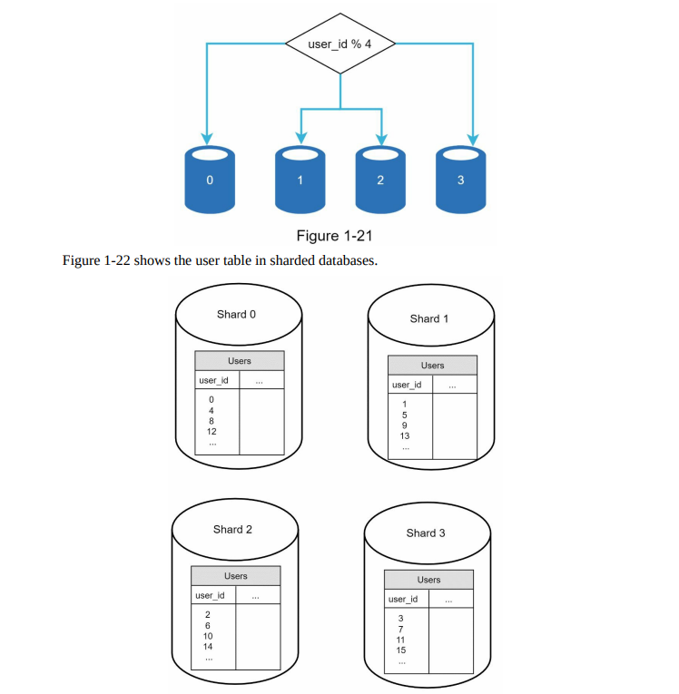

The most important factor to consider when implementing a **sharding strategy** is the **choice of the sharding key**. 

The **sharding key (also known as partition key)** consists of *one or more columns of our schema that determine how data is distributed*. In the example above `user_id` is our sharding key. 

When choosing a sharding key, one of the most important criteria is choosing one that can evenly distribute data:

**Sharding** is a great techine to scale the database tier, but it introduces complexities and challenges:

1. **Resharding data**: this is needed when:
   1. a single shard can no longer hold more data
   2. certain shards experience shard exhaustion faster than others do to uneven data distribution. When this happenes, *updating the sharding function and moving data around is required.* **Consistent hashing** is often used to solve this problem.
2. **Celebrity or hotspot key problem**: excessive access to a specific shard could cause server overload. For social applications, the shard which contains data for a celebrity will be overloaded with read operations. To solve this problem, we may need to allocate a shard for each celebrity.
3. **Join and de-normalization**: once a database has been sharded across multiple servers, it is hard to perform join operations across database shards. A common workaround is to denormalize the datbase so taht queries can be performed in a single table.

In the figure below, we see our system with sharded database to support rapidly increasing data traffic. At the same time, some of the non-relational functionalities are moved to a NoSQL data store to reduce the database load.

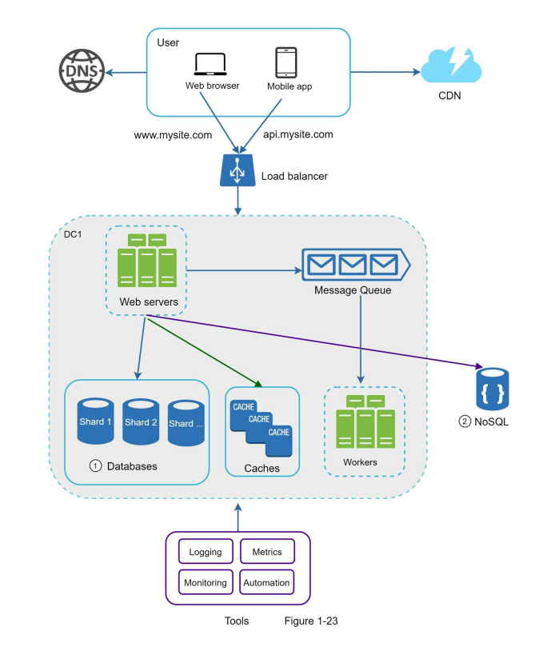

## Millions of users and beyond

Scaling a system is an iterative process. While iterating on what we have seen in this chapter might get us far, more fine tuning and additional strategies are needed to scale beyond millions of users.

For example, we might need to optimize our system and decouple it to even smaller services.

So, a summary to scale our application to millions of users:

- Keep web tier stateless
- Build redundancy at every tier
- Cache data as much as you can
- Support multiple data centers
- Host static assets in CDN
- Scale your data tier by sharding
- Monitor your system and use automatic tools

# Chapter 2: Back-Of-The-Envelope Estimation

