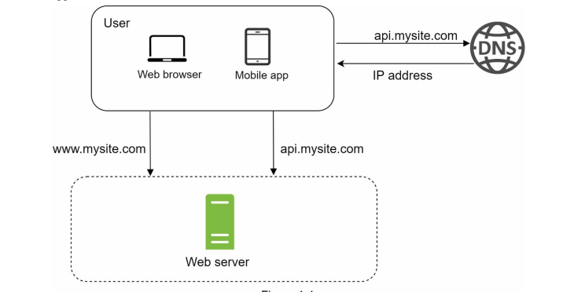
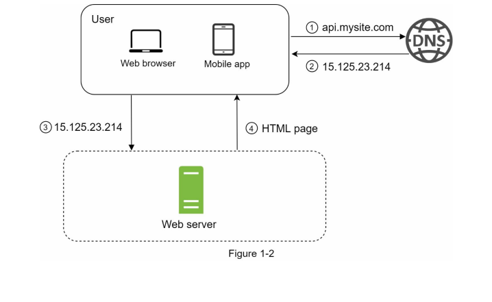
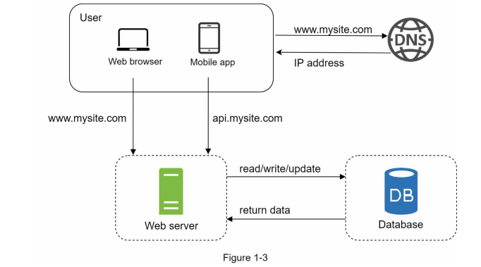

# System Design Interview

# Forward

System design itnerview questions require interviewees to design an architecture for a software system, whcih could be a news feed, Google serach, chat system, etc. The questions are intimidating and there is usually no certain pattern to follow. The questions are big-scoped and vague, and the procesess open-ended and unclear, without a standard or correct answer.

Companies widely adopt system design interviews vecause the communication and problem-solving skills tested in these interviews are similar to those requried by a software engineer's daily work: how she analuys a vague problem and solves the problem step by step.

System design questions are open-ended and there are many differences and variations in the system. **The desired outcomes is to come up with an architecture to achieve system design goals.**

The discussions can go in different ways depending on the interviewer: some may choose high-level architecture to cover all aspects; other focus on one or more areas.

Typically, **system requirements, constraints and bottlenecks should be well understood** to shape the direction of both the interviewer and the interviewee.

The objective of the book is to provide a reliable strategy to approach the system design questions, and it provides solid knowledge in building a scalable system.

The book also provides a step by step framework on how to tacke a system design question, and many examples to illuestrate the systematic approach with detailed steps that you can follow.

# Chapter 1: Scale from Zero to Millions of Users

In this chapter, we build a system that supports a single user and gradually scale it up to serve millions of users.

## Single Server Setup

Let's start with a system where everything is running on a single server - a single server setup:

To understand this setup, let's investiage the request flow and traffic source:

1. Users access websites through **domain names**, such as `api.mysite.com`. Most usually, the **DNS** is a service provided by 3rd parties and NOT hosted by our servers.
2. The **IP address (Internet Protocol Address)** is returned to the browser or mobile app (or any other client).
3. The IP address is used to make **HTTP requests directly to our webserver**.
4. The web server returns **HTML pages and other resources or a JSON response**.

Now let's examine **traffic source**. The traffic to your web server comes from two sources:

- **web application**: uses a combination of server side languages to handle business logic, storage, etc., and client-side languages for view presentation.
- **mobile application**: communicates with the webserver via the HTTP protocol using most commonly JSON as the API response format, due to its simplicity.

## Database

With the growth of the user base, one server will not longer will be enough, which is why we will ned multiple servers: one for web/mobile traffic, the other for the database.

**Separating web/mobile traffic (web tier) and database (data tier) servers allow them to be scaled independently.**

### Which databases to use?

One can choose between traditional relational database and non-relational databases.

**Relational databases** are also called **relational database management system (RDBMS)** or simply **SQL databases**, being the most popular MySQL, Oracle database, PostgreSQL. They store and represent data in tables and rows. **Join operations** can be performed to retrieve data across diferent tables.

**Non-relational databases** are also called **NoSQL databases**. Popular examples are CouchDB, Neo4J, Cassandra Amazon DynamoDB, etc. These databases are grouped into four categories:
- **key/value stores**
- **graph stores**
- **column stores**
- **document stores**

Join operations are usually not supported in NoSQL operations.

For most developers, realtional databases are the best option because they have been around for over 40 years and they are a proved solution. However, if relational databases are not suitable for you specific use case, alteernatives ca be explored.

Non-relational databases might be the right choice if:

- The application requires **super-low latency**
- The application data is unstructured, or the data is not relational.
- We only need to serializa and deserialize data (JSON, XML, YAML, etc).
- We need to store a massive amount of data.

### Latency, Bandwith and Throughput

**Water Analogy:**

**Latency**: the amount of time it takes to travel through the tube.
**Bandwidth**: how wide the tube is.
**Throughput**: the rate of water flow.

**Vehicle Analogy:**

**Latency**: Vehicle travel time from source to destination.
**Bandwidth**: Types of roadways.
**Throughput**: Number of vehicles traveling.

## Vertical scaling vs horizontal scaling

**Vertical scaling**, referred to as a "scale up", means the process of adding more computing power (CPU, memory, etc.) to your servers.

**Horizontal scaling**, referred to as a "scale out", is the process of adding more servers into our pool of resources.

When trafiic is low, vertical scaling is a great option, as it has the advantage of being relatively simple. However, it has serious limitations:
1. **it has a hard limit**: it not possible to add unlimited CPU and memory to a single server.
2. **it does not offer redundancy and failover**: if one server goes down, the application goes down with it completely

> **Redundant**: using two computers when one would be sufficient. The redundant server is there in case the other computer fails.
> 
> **Failover**: the automatic transfer of workload from a failed computer to another working computer.